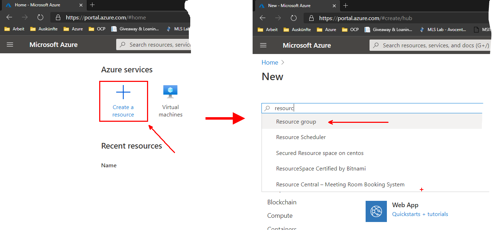

# Challenge 0: Networking: Create a Virtual Network (IPv4) for your first VM.

[back](../../README.md)

## Here is what you will learn ##

- Create your first Azure resources using the portal
- Learn how to navigate through the marketplace using search
- Experience the wizard / templates for creating azure resources
- See the unified deployment status page.

## Logon to your [azure subscription](https://portal.azure.com)  and create some resources: ##
**Tip:** It sometimes helps to **start the browser in private | incognito mode**  
to avoid SSO with the wrong account landing in the wrong subscription  
especially if your are working on a domain joined device.  

 
**Click on the '+' symbol and use the search to find the corresponding Azure Resource Type, e.g. like:**  

  
**Create all resources according to the table:**  

| Resource Type |  Name | Values  |
|---|---|---|
| Resource Group  |  rg-firstvm |  <ul><li>_location_ : North Europe</li><li>_Tag_: e.g. **owner** : %yourName%</li></ul>|
| Virtual Network  | azurevnet  | <ul><li>_resource group_  : rg-firstvm</li><li>_location_  : North Europe</li><li>_addressSpace_ : 10.1.0.0/16</li><li>_**One** Subnet_: '**snet-firstvm**' with _addressPrefix_: 10.1.0.0/24</li></ul> |
| Public IP address |  pip-firstvm | <ul><li>IPv4</li><li>_SKU_ : Basic</li><li>_IP address assignment_: dynamic</li><li>_DNS name label_ : _%Try unique value%_</li><li>_resource group_  : rg-firstvm</li><li>_location_  : North Europe</li></ul> |

[back](../../README.md)