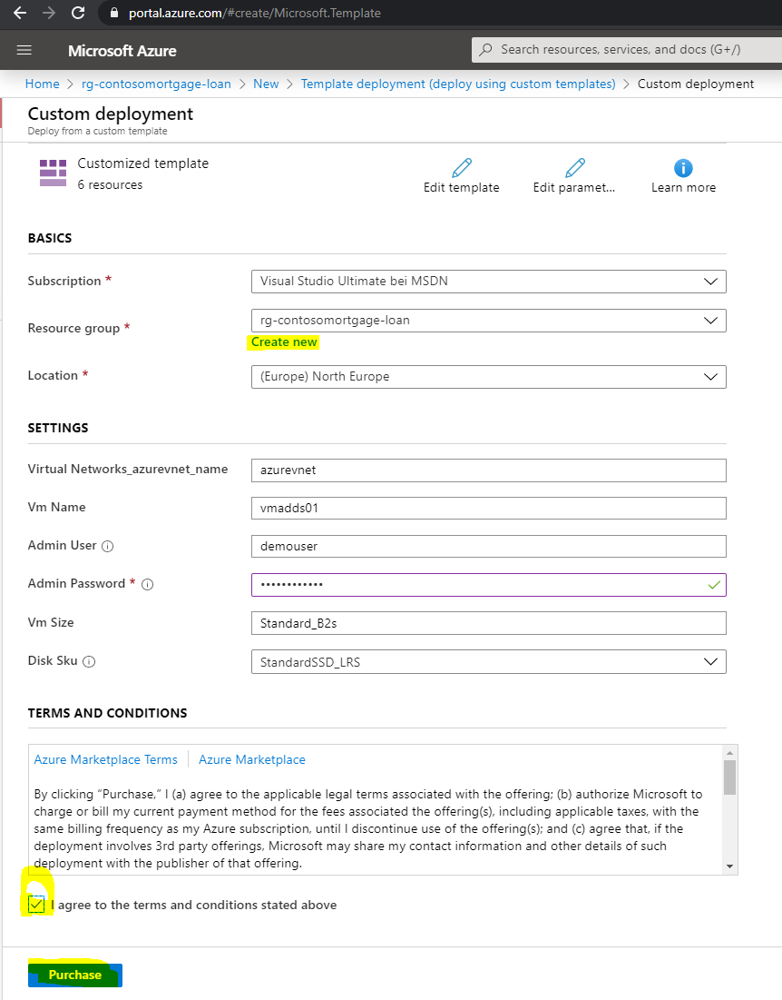
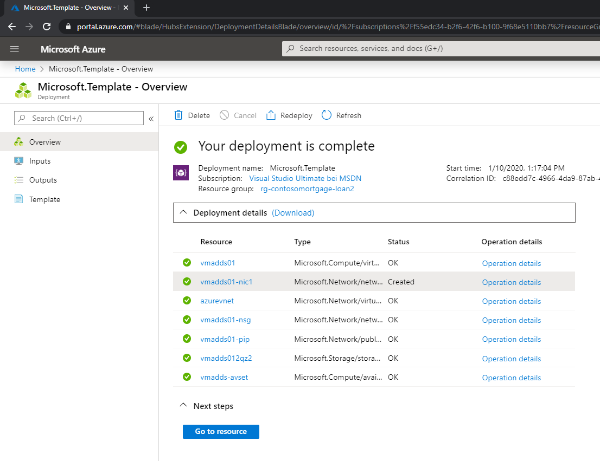

# Challenge 2: Create Azure Resources using an ARM Template 
[back](../../readme.md)  

In this module you will **not learn** how to build an ARM template yourself. We'll do this at a later point in time.  
**What you need** to know / understand is that an **ARM template is a txt file** (in a **machine readable json format**) that **describes** which **azure resources** you want.  
ARM templates can be used as a **building plan** for fast azure resource creation.  
ARM _'powered'_ deployments are:  
- Less error prone - than clicking
- Few typing required
- No reading through (inaccurate) documentation with screenshots and try to replay it manually.

## Here is what you will learn ##

- Creating azure resources using an ARM template and the portal.

## Deploy an ARM template using the portal

1. Please **cleanup** all resources that have been created in this workshop e.g. by deleting the resource groups.  

2. Login to your azure subscription **and search the marketplace for 'Template Deployment'**    

  
3. Create -> select '**Build your own template in the editor**'
4. Copy the RAW view of [this ARM template](ARMOne.json) and paste it into the editor **clear first** window.  
->Save  
5. **Create a resource group and set the location**  

| Resource Type |  Name | Values  |
|---|---|---|
| Resource Group  |  rg-contosomortgage-loan |  _location_ : North Europe |

  
and hit **Purchase** to trigger the deployment.

6. **Once finished your deployment should look like**:
[Azure Portal] -> Resource Group -> 'rg-contosomortgage-loan' -> Deployments -> 'Microsoft.Template' -> 'Deployment details'

  

**Is this deployment fast? Redeployable? Replayable in another subscription?**

[back](../../readme.md)