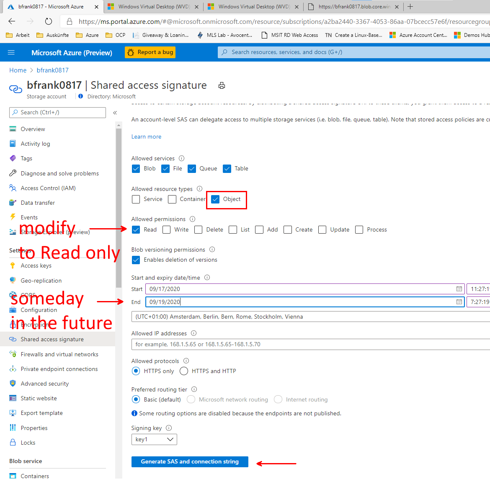

# Challenge 5: Storage Account: Creating a Data Storage for VMs and Applications
[back](../../readme.md)  

## Here is what you will learn ##
- how to create an azure storage account using the portal
- enable access to the storagage account data (e.g. blobs) using Shared Access Signatures
- create a SAS policy to enable permission modification after SAS tokens have been issued.
- use AAD credentials as 'better' way for storage account authorization
- create a file share and attach it to your azure virtual machine

## Create a storage account and a container using the azure portal

1. Login to your azure subscription **and search the marketplace for 'Storage Account'**  
  
Create the sa with the following values:

| Name | Value |
|---|---|
| Resource Group  |  **(new)** rg-sachallenge |
| Storage account name  |  _%unique lowercase value%_ |
| Location | **North Europe** |
| Account kind  |  StorageV2 |
| Performance  |  Standard |
| Replication  |  **Locally-redundand storage (LRS)** |
| Access tier  |  Hot |


2. Once the sa is created - **generate a new "container"** within the storage account:  
```
[Azure Portal] -> %Your Storage Account% -> Containers -> "+ Container"
```
| Name | Value |
|---|---|
| Name  |  **secured** |
| Public access level  |  Private (no anonymous access) |

Now **upload a small file**.  
  

**Can you download the file** using its URI in another browser session? [No]  

  

3. Create a Shared Access Signature [via the portal] to enable blob access. 
```
[Azure Portal] -> %Your Storage Account% -> Shared access signature -> "Generate SAS and connection string"
```
**Copy the Blob Service SAS URL to the clipboard**
  

**Edit the SAS URI**: You need to add the path to uploaded file - it should look similar to:  

> https://**%Your Storage Account Name%**.blob.core.windows.net/**secured/HelloWorld.txt**?sv=2019-02-02&ss=bfqt&srt=sco&sp=rwdlacup&se=2020-01-26T00:03:42Z&st=2020-01-25T16:03:42Z&spr=https&sig=Pehc....  

**Can you now download the file** in the browser [Yes]

4. [optional] **Revoke the storage account's access key1**.
```
[Azure Portal] -> %Your Storage Account% -> Access keys -> key1 -> 'regenerate'
```
Can you still download the file in the browser using aboves URL [No]  
Why? Because the SAS key was generated using the previous key1 -> which is no longer valid.


define a stored access policy on the container "securedap" (write)
create a SAS using storage explorer - on the container -> based on stored access policy "securedap"
edit the SAS URI -> add the path to uploaded file -> can you now download the file in the browser [No]
edit the stored access policy 'securedap' to allow READ access
edit the SAS URI -> add the path to uploaded file -> can you now download the file in the browser [Yes]
-------
->stored access policies help to modify permissions to a container after the SAS has been issued to users / apps


answer the following questions.

If a SAS is leaked, it can be used by anyone who obtains it, which can potentially compromise your storage account.
If a SAS provided to a client application expires and the application is unable to retrieve a new SAS from your service, then the application's functionality may be hindered.


Authorize access to blobs using AAD
https://docs.microsoft.com/en-us/azure/storage/common/storage-auth-aad?toc=%2fazure%2fstorage%2fblobs%2ftoc.json
```PowerShell
#create service principal with null rights in AAD
$servicePrincipalName = "bfrank0818SAServicePrincipal"   #must be unique within AAD tenant
$sp = New-AzADServicePrincipal -DisplayName $servicePrincipalName -Role $null
#save password for later use.
$BSTR = [System.Runtime.InteropServices.Marshal]::SecureStringToBSTR($sp.Secret)
$UnsecureSecret = [System.Runtime.InteropServices.Marshal]::PtrToStringAuto($BSTR)

#now assign this service principal storage account contributor rights in the Portal.
#[Azure Portal] -> RG -> Storage Account -> Container -> Access rights -> Add Role Permissions....

#now Sign in as this service principal
$tenantID = '72f988bf-86f1-41af-91ab-2d7cd011db47' #$((Get-AzContext).Tenant.Id)
$passwd = ConvertTo-SecureString $UnsecureSecret -AsPlainText -Force
$pscredential = New-Object System.Management.Automation.PSCredential($sp.ServicePrincipalNames[0], $passwd)
Connect-AzAccount -ServicePrincipal -Credential $pscredential -Tenant $tenantID

$ctx = $null
$ctx = New-AzStorageContext -StorageAccountName "bfranksa0815" -UseConnectedAccount
$container = Get-AzStorageContainer -Context $ctx -Name 'secured'
Get-AzStorageBlob -Container $($container.Name) -Context $ctx
#in case of error - do you have the correct role permissions? (e.g. Storage Blob Data Contributor)
#Get-AzRoleAssignment -ServicePrincipalName $sp.ServicePrincipalNames[0]
Get-AzStorageBlob -Container $($container.Name) -Context $ctx | out-gridview -Title 'Select a small blob' -OutputMode Single | Get-AzStorageBlobContent -Destination 'c:\temp'

Logout-AzAccount -Username $sp.ServicePrincipalNames[0]


#cleanup
Remove-AzADServicePrincipal -DisplayName $servicePrincipalName -Force
Remove-AzADApplication -DisplayName $servicePrincipalName -Force
```


Add an azure file share to a server.
[Azure Portal] -> Storage Account -> File Shares -> "+" File Share

Name: myfiles
Quota: ''

Within your Windows Server VM mount the share as drive by executing the command taken from:
[Azure Portal] -> Storage Account -> File Shares -> 'myfiles' -> Connect.

$connectTestResult = Test-NetConnection -ComputerName bfrank0815sa.file.core.windows.net -Port 445
if ($connectTestResult.TcpTestSucceeded) {
    # Save the password so the drive will persist on reboot
    cmd.exe /C "cmdkey /add:`"bfrank0815sa.file.core.windows.net`" /user:`"Azure\bfrank0815sa`" /pass:`"/NtE9t4AtDDGPPFI4dymneQ0b+aIrElOdjLJ5wUjXqSPeH3/MQYK6CTPU3lOGaZnEkWb8LNdyvpY8Lp9ZWqbWQ==`""
    # Mount the drive
    New-PSDrive -Name Z -PSProvider FileSystem -Root "\\bfrank0815sa.file.core.windows.net\myfiles"-Persist
} else {
    Write-Error -Message "Unable to reach the Azure storage account via port 445. Check to make sure your organization or ISP is not blocking port 445, or use Azure P2S VPN, Azure S2S VPN, or Express Route to tunnel SMB traffic over a different port."
}


What is the default quota of an azure file share?
Which user account is used for establishing the connection?
Is the 'drive' available to other users that logon to the VM? 