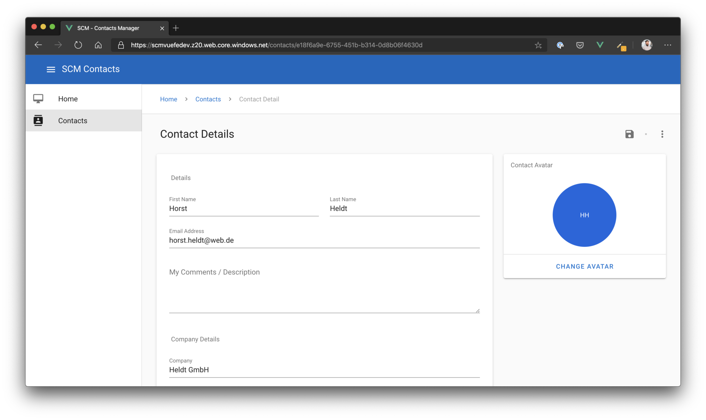

# Day 2 Azure Development

- [Challenge 0 - Setup your system](challenges/challenge-0.md)
- [Challenge 1 - Azure Web Applications](challenges/challenge-1.md)
- :small_orange_diamond: *[Breakout! - Deploy the Azure Dev College sample application to Azure](challenges/challenge-bo-1.md)* :small_orange_diamond:
- [Challenge 2 - Serverless](challenges/challenge-2.md)
- [Challenge 3 - Messaging](challenges/challenge-3.md)
- :small_orange_diamond: *[Breakout! - Add a serverless microservice to our sample app and include messaging](challenges/challenge-bo-2.md)* :small_orange_diamond:
- [Challenge 4 - Azure Resource Manager (ARM) Templates](challenges/challenge-4.md)
- :small_orange_diamond: *[Breakout! - Create an Azure Web App and Storage Account with ARM templates](challenges/challenge-bo-2.md)* :small_orange_diamond:

# Day 2 - Goal #

## Architecture ##

## Application ##

