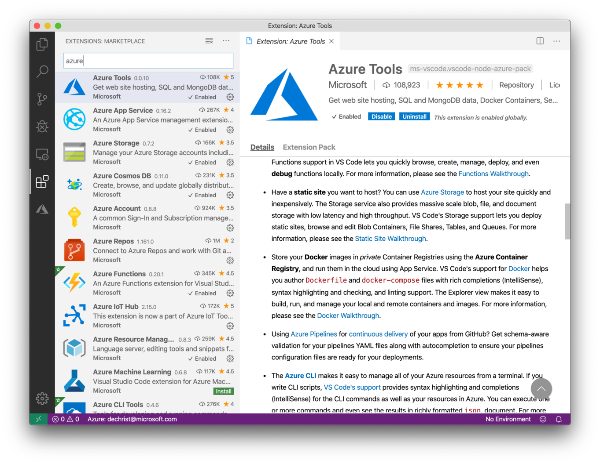

# Challenge 0 - Setup your System #

To be able to follow all the challenges provided in this workshop, you need a few prerequisites on your machine. This challenge is for setting up your system.

## dotnet SDK ##

Download and install dotnet core SDK from <https://dotnet.microsoft.com/download>


After the installation, check if everything works as expected. Open a command prompt and execute the dotnet CLI.

```shell
$ dotnet

Usage: dotnet [options]
Usage: dotnet [path-to-application]

Options:
  -h|--help         Display help.
  --info            Display .NET Core information.
  --list-sdks       Display the installed SDKs.
  --list-runtimes   Display the installed runtimes.

path-to-application:
  The path to an application .dll file to execute.
```

## Node JS ##

Download and install the current LTS version (12.y.z) of Node JS from <https://nodejs.org/en/download/>


Again, after the installtion is complete, check from the command line that everything works as expected.

```shell
$ node --version

v12.14.1

$ npm

Usage: npm <command>

where <command> is one of:
    access, adduser, audit, bin, bugs, c, cache, ci, cit,
    clean-install, clean-install-test, completion, config,
    create, ddp, dedupe, deprecate, dist-tag, docs, doctor,
    edit, explore, fund, get, help, help-search, hook, i, init,
    install, install-ci-test, install-test, it, link, list, ln,
    login, logout, ls, org, outdated, owner, pack, ping, prefix,
    profile, prune, publish, rb, rebuild, repo, restart, root,
    run, run-script, s, se, search, set, shrinkwrap, star,
    stars, start, stop, t, team, test, token, tst, un,
    uninstall, unpublish, unstar, up, update, v, version, view,
    whoami

npm <command> -h  quick help on <command>
npm -l            display full usage info
npm help <term>   search for help on <term>
npm help npm      involved overview
```

## Vue CLI ##


We will be using VueJS as our frontend framework. Install it from the command line:

```shell
$ npm install -g @vue/cli

[...]
[...]
[...]

$ vue --version

3.8.4
```

## Visual Studio Code ##

To work with all the smaples provided in this workshop, you will need an IDE. To target a wide range of developers/architects, we will be using Visual Stduio Code as it runs cross-platform. 

Therefore, go to <https://code.visualstudio.com/docs/setup/setup-overview> and install it on your machine.

### Useful Extensions ###

After the setup is complete. Open Visual Studio an open the "Extensions" sidebar:



Search and install the following extensions:

- Azure Tools <https://marketplace.visualstudio.com/items?itemName=ms-vscode.vscode-node-azure-pack>
- Azure Functions <https://marketplace.visualstudio.com/items?itemName=ms-azuretools.vscode-azurefunctions>
- Azure Resource Manager (ARM) Tools <https://marketplace.visualstudio.com/items?itemName=msazurermtools.azurerm-vscode-tools>
- C# <https://marketplace.visualstudio.com/items?itemName=ms-vscode.csharp>
- Debugger for Chrome <https://marketplace.visualstudio.com/items?itemName=msjsdiag.debugger-for-chrome>
