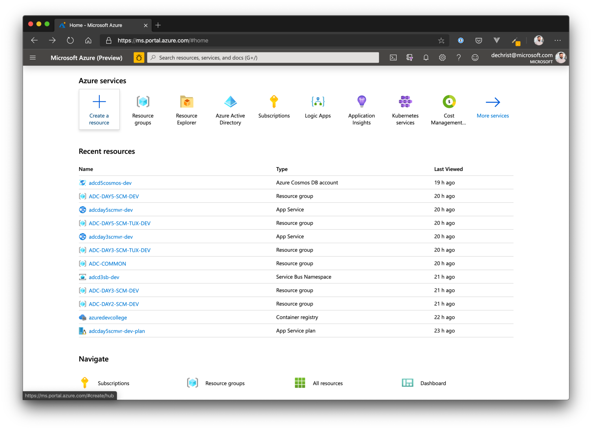

# Challenge 1 - Azure Web Apps #

## Here is what you will learn ##

- Create an AppService Plan / Azure Web App
- Create and deploy an ASP.NET Core Web App to Azure
- Create and configure WebApp slots
- Use slots to deploy new versions of your web application with near-zero downtime

## Create an Azure Web App ##

### Option 1: Azure Portal ###

To create an Azure Web App, go to the Azure Portal and click on **"Create a resource"**, in the next view choose **"Web App"**.



When you reached the "Create Web App" wizard, follow the steps below:

- Choose the correct subscription
- Create a new resource group, name it "myFirstWebApps-rg"
- Under instance details, enter a name for your Web App (be careful: this must be a global unique name!)
- Publish: Code
- Runtime: .NET Core 3.1 LTS
- Operation System: Windows
- Region: West Europe
- SKU and Size: S1
  - To get familiar with other sizes, click "Change size"

Click "Next: Monitoring".

- Enable AppInsights
- Create a new AppInsights instance for it

When done, proceed to the "Review + create" screen.


Again, check that all the properties are filled with the expected values and click "Create".

When the deployment has finished, got to the resource and get familiar with all the configuration options discussed in the introduction talk.


Open the web app in your browser.


### Option 2: Azure CLI ###

If you have created the web application already with option 1, got to the portal and delete the resource group - including all the newly created resources. We will be creating the exact same resources now with the Azure CLI.

First, let's create the resource group.

```shell
$ az group create --name myFirstWebApps-rg --location westeurope

{
  "id": "/subscriptions/xxxxxxxx-xxxx-xxxx-xxxx-xxxxxxxxxxxx/resourceGroups/myFirstWebApps-rg",
  "location": "westeurope",
  "managedBy": null,
  "name": "myFirstWebApps-rg",
  "properties": {
    "provisioningState": "Succeeded"
  },
  "tags": null,
  "type": "Microsoft.Resources/resourceGroups"
}
```

Next, add an App Service Plan.

```shell
$ az appservice plan create -g myFirstWebApps-rg -n myFirstWebAppsPlan --sku S1

{
  "freeOfferExpirationTime": null,
  "geoRegion": "West Europe",
  "hostingEnvironmentProfile": null,
  "hyperV": false,
  "id": "/subscriptions/xxxxxxxx-xxxx-xxxx-xxxx-xxxxxxxxxxxx/resourceGroups/myFirstWebApps-rg/providers/Microsoft.Web/serverfarms/myFirstWebAppsPlan",
  "isSpot": false,
  "isXenon": false,
  "kind": "app",
  "location": "West Europe",
  "maximumElasticWorkerCount": 1,
  "maximumNumberOfWorkers": 10,
  "name": "myFirstWebAppsPlan",
  "numberOfSites": 0,
  "perSiteScaling": false,
  "provisioningState": "Succeeded",
  "reserved": false,
  "resourceGroup": "myFirstWebApps-rg",
  "sku": {
    "capabilities": null,
    "capacity": 1,
    "family": "S",
    "locations": null,
    "name": "S1",
    "size": "S1",
    "skuCapacity": null,
    "tier": "Standard"
  },
  "spotExpirationTime": null,
  "status": "Ready",
  "subscription": "xxxxxxxx-xxxx-xxxx-xxxx-xxxxxxxxxxxx",
  "tags": null,
  "targetWorkerCount": 0,
  "targetWorkerSizeId": 0,
  "type": "Microsoft.Web/serverfarms",
  "workerTierName": null
}
```

When the App Service Plan has been created, we can now add the Web App.

```shell
$ az webapp create -g myFirstWebApps-rg -p myFirstWebAppsPlan -n myFirstWebAppDevCollege
{
  "availabilityState": "Normal",
  "clientAffinityEnabled": true,
  "clientCertEnabled": false,
  "clientCertExclusionPaths": null,
  "cloningInfo": null,
  "containerSize": 0,
  "dailyMemoryTimeQuota": 0,
  "defaultHostName": "myfirstwebappdevcollege.azurewebsites.net",
  "enabled": true,
  "enabledHostNames": [
    "myfirstwebappdevcollege.azurewebsites.net",
    "myfirstwebappdevcollege.scm.azurewebsites.net"
  ],
  "ftpPublishingUrl": "ftp://waws-prod-am2-291.ftp.azurewebsites.windows.net/site/wwwroot",
  "geoDistributions": null,
  "hostNameSslStates": [
    {
      "hostType": "Standard",
      "ipBasedSslResult": null,
      "ipBasedSslState": "NotConfigured",
      "name": "myfirstwebappdevcollege.azurewebsites.net",
      "sslState": "Disabled",
      "thumbprint": null,
      "toUpdate": null,
      "toUpdateIpBasedSsl": null,
      "virtualIp": null
    },
    {
      "hostType": "Repository",
      "ipBasedSslResult": null,
      "ipBasedSslState": "NotConfigured",
      "name": "myfirstwebappdevcollege.scm.azurewebsites.net",
      "sslState": "Disabled",
      "thumbprint": null,
      "toUpdate": null,
      "toUpdateIpBasedSsl": null,
      "virtualIp": null
    }
  ],
  "hostNames": [
    "myfirstwebappdevcollege.azurewebsites.net"
  ],
  "hostNamesDisabled": false,
  "hostingEnvironmentProfile": null,
  "httpsOnly": false,
  "hyperV": false,
  "id": "/subscriptions/xxxxxxxx-xxxx-xxxx-xxxx-xxxxxxxxxxxx/resourceGroups/myFirstWebApps-rg/providers/Microsoft.Web/sites/myFirstWebAppDevCollege",
  "identity": null,
  "inProgressOperationId": null,
  "isDefaultContainer": null,
  "isXenon": false,
  "kind": "app",
  "lastModifiedTimeUtc": "2020-01-10T13:43:01.480000",
  "location": "West Europe",
  "maxNumberOfWorkers": null,
  "name": "myFirstWebAppDevCollege",
  "outboundIpAddresses": "13.69.68.20,168.63.5.211,40.118.61.62,23.97.145.200,40.114.195.244",
  "possibleOutboundIpAddresses": "13.69.68.20,168.63.5.211,40.118.61.62,23.97.145.200,40.114.195.244,40.113.154.23,40.115.42.0,13.94.147.210,168.63.14.190,40.113.142.137",
  "redundancyMode": "None",
  "repositorySiteName": "myFirstWebAppDevCollege",
  "reserved": false,
  "resourceGroup": "myFirstWebApps-rg",
  "scmSiteAlsoStopped": false,
  "serverFarmId": "/subscriptions/xxxxxxxx-xxxx-xxxx-xxxx-xxxxxxxxxxxx/resourceGroups/myFirstWebApps-rg/providers/Microsoft.Web/serverfarms/myFirstWebAppsPlan",
  "siteConfig": null,
  "slotSwapStatus": null,
  "state": "Running",
  "suspendedTill": null,
  "tags": null,
  "targetSwapSlot": null,
  "trafficManagerHostNames": null,
  "type": "Microsoft.Web/sites",
  "usageState": "Normal"
}
```

## Create a sample application ##

```shell
$ dotnet new mvc -o myFirstCoreApp
```

Open VS Code: code .
Get familiar with the environment
Have a look at the controller HomeController
Set a breakpoint (F9) on method public IActionResult Index() in Controllers/HomeController.cs

Press F5 - if VS Code asks you about the environment, choose .NET Core

Open th Debug Tools

When the breakpoint gets hit, get familiar with the tools of the debugger.
Open Views/Home/Index.cshtml and change the welcome text to "Welcome to your first WebApp".
Run it again locally and check, if the changes appear.

Now let's deploy the webapp to Azure.
Add Azure App Service Extension: https://marketplace.visualstudio.com/items?itemName=ms-azuretools.vscode-azureappservice
Find your webapp in the extension and right-click --> Deploy to Web App…
After a few seconds the browser will show you your first web app running in Azure


PORTAL

Open your web app in the portal
Got to "Deployment Slots" and create a new slot called "Staging" (Clone settings from your production slot)
When finished, go back to VS Code

LOCAL/VS CODE

Open Views/Home/Index.cshtml again and change the welcome text to "Welcome to your first WebApp - this time with slots!".
Find your webapp in the Azure AppService extension, drill down to slots and right-click --> Deploy to Slot…

PORTAL

Click on the newly created slot "Staging" and copy the URL in the overview blade.
Open your browser, point it to the URL and check, if the headline contains the new text.
Also check the production slot (URL without "-staging")

Now if everything works as expected, go back to "Deployment Slots" and click on "Swap" (selecting the staging slot as source). 
Click "Swap" at the bottom of the screen.

Now check, that the production slot serves the new version of the website.

## House Keeping ##

xxx