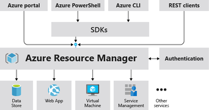

# Azure Resource Manager (ARM) Templates #

## Here is what you will learn ##

- get to know the Azure Resource Manager and Resource Providers
- learn about how ARM templates are structured and what you can do with them
- create a basic template and deploy them via the Azure Portal
- deploy a complex infrastructure via ARM templates and Azure CLI

## Just to be on the same page... ##

Before we can get into Azure Resource Manager and the related templates, we need to clarify some terms:

- **Resource** – an element manageable via Azure. For example: a virtual machine, a database, a web app etc.
- **Resource Group** – a container for resources. A resource can not exist in Azure without a ResourceGroup (RG). Deployments of resources are always executed on an RG. Typically, resources with the same lifecycle are grouped into one resource group.
- **Resource Provider** – an Azure service for creating a resource through the Azure Resource Manager. For example, “Microsoft.Web” to create a web app, “Microsoft.Storage” to create a storage account etc.
- **Azure Resource Manager (ARM) Templates** – a JSON file that describes one or more resources that are deployed into a Resource Group. The template can be used to consistently and repeatedly provision the resources.

One great advantage when using ARM templates, is the **traceability** of changes to your infrastructure. Templates can be stored together with the **source code** of your application in the code repository (***Infratructure as Code***). If you have established Continuous Integration / Deployment in your development process (which we will do on ***Day 4***), you can execute the deployment of the infrastructure from Jenkins, TeamCity or Azure DevOps. No one has to worry about an update of the environment – web apps, databases, caches etc. will be created and configured automatically – no manual steps are necessary (which can be error-prone, as we all know :)).

## Azure Resource Manager ##

The Azure Resource Manager is the deployment and management service for Azure. It provides a management layer that enables you to create, update, and delete resources in your Azure subscription. 

You can access the resource manager by several ways:

- Azure Portal
- Azure Powershell
- Azure CLI
- plain REST Calls
- SDKs



As you can see in the picture above, the Resource Manager is made of several **Resource Providers** (RP) that are ultimately responsible for provisioning the requested service. Resource providers can be independently enabled or disabled. To see, what RPs are active in your subscription, you can either check the Portal (Subscription --> Resource Providers) or use Azure CLI to query the resource manager:

```shell
$ az provider list -o table

Namespace                               RegistrationPolicy    RegistrationState
--------------------------------------  --------------------  -------------------
Microsoft.ChangeAnalysis                RegistrationRequired  Registered
Microsoft.EventGrid                     RegistrationRequired  Registered
Microsoft.Logic                         RegistrationRequired  Registered
Microsoft.Security                      RegistrationRequired  Registered
Microsoft.PolicyInsights                RegistrationRequired  Registered
Microsoft.AlertsManagement              RegistrationRequired  Registered
Microsoft.Advisor                       RegistrationRequired  Registered
Microsoft.Web                           RegistrationRequired  Registered
microsoft.insights                      RegistrationRequired  Registered
Microsoft.KeyVault                      RegistrationRequired  Registered
Microsoft.Storage                       RegistrationRequired  Registered
Microsoft.Portal                        RegistrationFree      Registered
Microsoft.DocumentDB                    RegistrationRequired  Registered
Microsoft.Search                        RegistrationRequired  Registered
Microsoft.Cdn                           RegistrationRequired  Registered
Microsoft.Cache                         RegistrationRequired  Registered
Microsoft.ResourceHealth                RegistrationRequired  Registered
Microsoft.Sql                           RegistrationRequired  Registered
...
...
...
```

### Sample ###

If you deploy e.g. a Storage Account, the template for it looks like that:

```json
"resources": [
  {
    "type": "Microsoft.Storage/storageAccounts",
    "apiVersion": "2016-01-01",
    "name": "mystorageaccount",
    "location": "westus",
    "sku": {
      "name": "Standard_LRS"
    },
    "kind": "Storage",
    "properties": {}
  }
]
```

If you use the portal or Azure CLI to apply that template, it will be converted to this:

``` 
PUT
https://management.azure.com/subscriptions/{subscriptionId}/resourceGroups/{resourceGroupName}/providers/Microsoft.Storage/storageAccounts/mystorageaccount?api-version=2016-01-01
REQUEST BODY
{
  "location": "westus",
  "sku": {
    "name": "Standard_LRS"
  },
  "kind": "Storage",
  "properties": {}
}
``` 

As you can see, deployments in Azure will always be executed against a **resource group**! In this sample, the template will be ultimately picked-up by the **Microsoft.Storage** resource provider, which then will be responsible to create a Storage Account for you.

## ARM Templates ##

So, you already now had a brief look how an ARM template looks like. Let's make a step back and show you how these templates are structured.

An ARM Template usually consists of several parts:

- **parameters** – Parameters that are passed from the outside to the template. Typically, from the commandline or your deployment tool (e.g. Azure DevOps, Jenkins...)
- **variables** – variables for internal use. Typically, parameters are “edited”, e.g. names are concatenated and stored in variables for later use.
- **resources** – the actual resources to be created
- **outputs** – Output parameters that are returned to the caller after the resources are created. With *outputs* you can achieve multi-stage deployments by passing outputs to the next ARM template in your deployment chain.

```json
{
    "$schema": "https://schema.management.azure.com/schemas/2015-01-01/deploymentTemplate.json#",
    "contentVersion": "1.0.0.0",
    "parameters": {},
    "variables": {},
    "resources": [],
    "outputs": {}
}
```

## A Basic Template ##

So, to stick to our sample from above (Storage Account), let's create a basic template that will create a Storage Account and makes use of some very neat features (*Template Functions*). Here it is:

```json
{
    "$schema": "https://schema.management.azure.com/schemas/2015-01-01/deploymentTemplate.json#",
    "contentVersion": "1.0.0.0",
    "parameters": {
        "storageAccountName": {
            "type": "string",
            "metadata": {
                "description": "The name of the storage account to be created."
            }
        },
        "storageAccountType": {
            "type": "string",
            "defaultValue": "Standard_LRS",
            "allowedValues": [
                "Standard_LRS",
                "Standard_GRS",
                "Standard_ZRS",
                "Premium_LRS"
            ],
            "metadata": {
                "description": "Storage Account type"
            }
        }
    },
    "variables": {
    },
    "resources": [
        {
            "name": "[parameters('storageAccountName')]",
            "type": "Microsoft.Storage/storageAccounts",
            "apiVersion": "2015-06-15",
            "location": "[resourceGroup().location]",
            "tags": {
                "displayName": "[parameters('storageAccountName')]"
            },
            "properties": {
                "accountType": "[parameters('storageAccountType')]"
            }
        }
    ],
    "outputs": {
        "storageAccountConnectionString": {
            "type": "string",
            "value": "[listKeys(resourceId('Microsoft.Storage/storageAccounts', parameters('storageAccountName')), providers('Microsoft.Storage', 'storageAccounts').apiVersions[0]).keys[0].value]"
        }
    }
}
```

Some notes on the template above:

As you can see, we are able to use functions to do dynamic stuff within a template, e.g. reading keys (```listKeys()```) or using parameter (```parameters()```). The are of course other functions e.g. for string manipulation (*concatenate*, *padLeft*, *split*...), numeric functions, comparison functions, conditionals etc. You can find all available template functions and their documentation here: <https://docs.microsoft.com/en-us/azure/azure-resource-manager/templates/template-functions>

Please make yourself familiar with the list!

So now, let's deploy the template and see what we will receive as output.

```shell
$ az group create -n basicarm-rg -l westeurope

$ az group deployment create -g basicarm-rg -n firsttemplate --template-file=./azuredeploy.json
Please provide string value for 'storageAccountName' (? for help): <ENTER_A_VALUE>
 - Running ...

 ```

 When the deployment has finished, you will receive a pretty large JSON output. But what's interesting, in the outputs section, you will receive the primary Storage Account Key (Note: all other parts have been omitted in terms of readability. Note2: the key is not valid anymore, so save yourself some time and don't even try ;)).

 ```json
 {
  "properties": {
    "outputs": {
      "storageAccountConnectionString": {
        "type": "String",
        "value": "TSYOb3JdAe6iBls6l3I73XIs4KfBVENARbs8IDzkTqVVVCgElH5wOtCJ61JN7AKBI/o0OkqBG0wkQWZy3FbHUg=="
      }
    }
  }
}
```

You sure have noticed that you were promted to enter a value for the parameter *storageAccountName*. In a fully automated deployment, this is not really acceptable. You can set the parameters either via CLI...

```shell 
$ az group deployment create -g basicarm-rg -n firsttemplate --template-file=./azuredeploy.json --parameters storageAccountName=adcmyarmsa
```

...or use a dedicated parameters file:

```json
{
    "$schema": "https://schema.management.azure.com/schemas/2015-01-01/deploymentParameters.json#",
    "contentVersion": "1.0.0.0",
    "parameters": {
        "storageAccountName": {
            "value": "adcmyarmsa"
        }
    }
}
```

You can supply the parameters file via the ```@```syntax:

```shell
az group deployment create -g basicarm-rg -n firsttemplate --template-file=./azuredeploy.json --parameters=@azuredeploy.params.json
```

Some prefer the *parameters file*-approach, because you can set up parameter files for different environments, e.g. azuredeploy.params.**DEV**.json, azuredeploy.params.**TEST**.json, azuredeploy.params.**PROD**.json.

## Deploying a Complex Infrastructure ##

