# Azure (Cognitive) Search #

## Here is what you will learn ##

- Create an Azure Search Service in the Portal
- Add Cognitive Skills to Azure Search
- Integrate Azure Search in an Node JS application
- Optional: Create an Azure Cognitive Search index in Python using Jupyter notebooks

## What is Azure Cognitive Search? ##

Azure Cognitive Search is a search-as-a-service cloud solution that gives developers APIs and tools for adding a rich search experience over private, heterogeneous content in web, mobile and enterprise applications. Your code or a tool invokes data ingestion (indexing) to create and load an index. Optionally, you can add cognitive skills to apply Artificial Intelligence processes during indexing. Doing so, you can add new information and structures useful for search and other scenarios.

Regarding your application, your code issues query requests and handles responses from Azure Search. The search experience is defined in your client using functionality from Azure Cognitive Search, with query execution over a persisted index that you create, own, and store in your service.

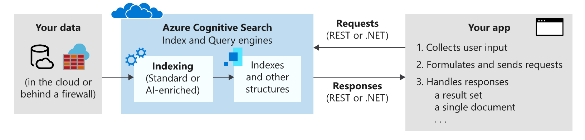

## What are the Features of Azure Cognitive Search? ##

| Core Search  | Features |
| --- | --- |
|Free-form text search | [**Full-text search**](https://docs.microsoft.com/en-us/azure/search/search-lucene-query-architecture) is a primary use case for most search-based apps. Queries can be formulated using a supported syntax. <br/><br/>[**Simple query syntax**](https://docs.microsoft.com/en-us/rest/api/searchservice/simple-query-syntax-in-azure-search) provides logical operators, phrase search operators, suffix operators, precedence operators.<br/><br/>[**Lucene query syntax**](https://docs.microsoft.com/en-us/rest/api/searchservice/lucene-query-syntax-in-azure-search) includes all operations in simple syntax, with extensions for fuzzy search, proximity search, term boosting, and regular expressions.|
| Filters and facets | [**Faceted navigation**](https://docs.microsoft.com/en-us/azure/search/search-faceted-navigation) is enabled through a single query parameter. Azure Cognitive Search returns a faceted navigation structure you can use as the code behind a categories list, for self-directed filtering (for example, to filter catalog items by price-range or brand). <br/><br/> [**Filters**](https://docs.microsoft.com/en-us/azure/search/search-filters-facets) can be used to incorporate faceted navigation into your application's UI, enhance query formulation, and filter based on user- or developer-specified criteria. Create filters using the OData syntax. 

### Facet Filters in a Search App ###

Faceted navigation is used for self-directed filtering on query results in a search app, where your application offers UI controls for scoping search to groups of documents (for example, categories or brands), and Azure Cognitive Search provides the data structure to back the experience. 

In code, a query that specifies all parts of a valid query, including search expressions, facets, filters, scoring profiles– anything used to formulate a request, can look like the following example: 

```csharp
var sp = new SearchParameters()
{
    ...
    // Add facets
    Facets = new[] { "businessTitle" }.ToList()
};
```

This example builds a request that creates facet navigation based on the business title information.

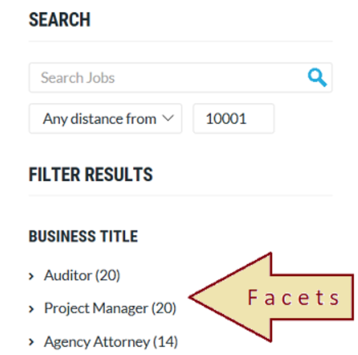

Facets are dynamic and returned on a query. Search responses bring with them the facet categories used to navigate the results.

You can find more details here: [Search-Filters-Facets](https://docs.microsoft.com/en-us/azure/search/search-filters-facets)

In the SCM Application, we are using the Lucene query syntax ([Lucene Query Syntax Examples](https://docs.microsoft.com/en-us/azure/search/search-query-lucene-examples)).

View the full Azure Cognitive Search Feature list here:
[Azure Cognitive Search Feature list](https://docs.microsoft.com/en-us/azure/search/search-what-is-azure-search#feature-descriptions)


## Create an Azure Search Service in the Portal ##

1. Create a new resource group, e.g. **adc-azsearch-db-rg** and add a service of type **Azure Cognitive Search**

1. First, create a `Azure Search` instance in the Azure Portal

1. For our purposes, the `Free Tier` is sufficient

However, the `Free Tier` does not support additional replicas, scaling and is only able to index documents with up to 32000 characters/document. If we want to index larger documents, we need to go to a bigger tier (64000 for `Basic`, 4m for `Standard` and above).

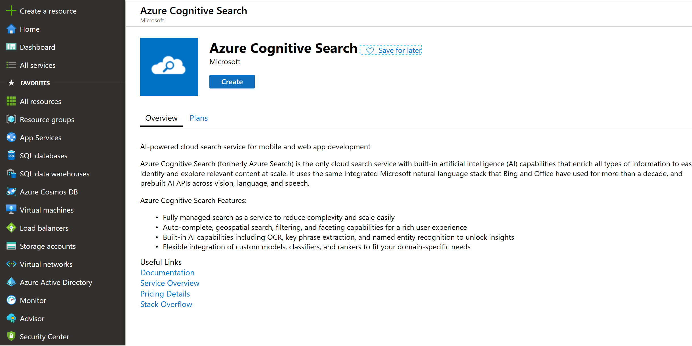

View the Details of Creating an Azure Search Service in the Portal:

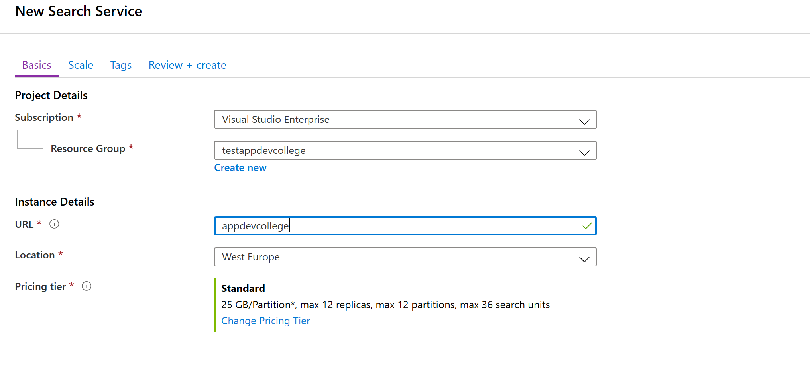

Once provisioned, our service will be reachable via `https://xxxxxxx.search.windows.net`

Azure Search [can index](https://docs.microsoft.com/en-us/azure/search/search-indexer-overview) data from a variety of sources:

- Azure SQL Database or SQL Server on an Azure virtual machine
- Azure Cosmos DB
- Azure Blob Storage
- Azure Table Storage
- Indexing CSV blobs using the Azure Search Blob indexer
- Indexing JSON blobs with Azure Search Blob indexer

In general, you can upload your data to one of the sources and let Azure Search index it from there. You can do this completely through the Azure Portal, use [Storage Explorer](https://azure.microsoft.com/en-us/features/storage-explorer/) or use the API/CLI.

In our case, we'll choose a sample dataset called **hotel-sample**

1. Open your Azure Search instance and go to `Import Data`

2. Next, we need to define the `Data Source` and choose Samples and select `hotels-sample` dataset

 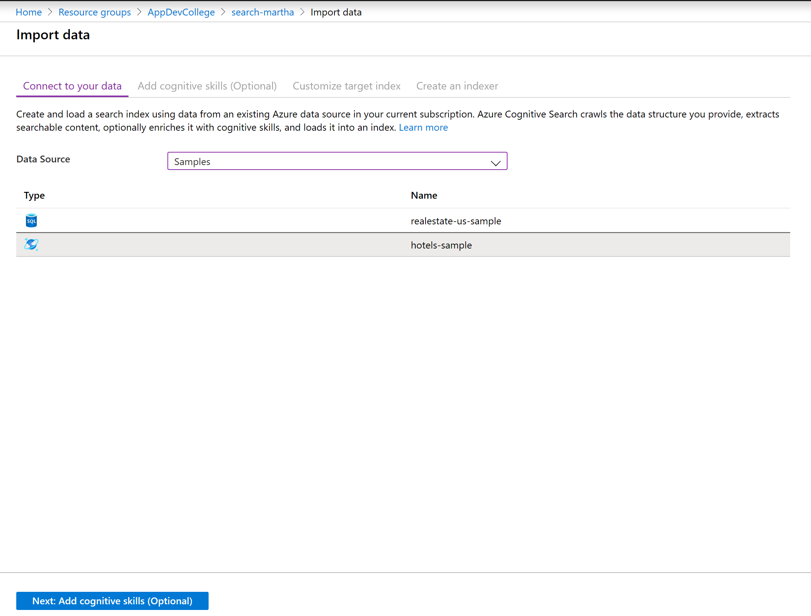

3. We'll skip `Cognitive Search` for this example.

4. Now let's proceed to creating an index. Minimally, an index requires a name and a fields collection; one of the fields should be marked as the **document key** to uniquely identify each document. Additionally, you can specify language analyzers or suggesters (*type-as-you-go* services), if you want autocomplete or suggested queries.

Fields have data types and attributes. The check boxes above the list are **index attributes**, controlling how the field is used.

* **Retrievable** means that it shows up in search results list. You can mark individual fields as off limits for search results by clearing this checkbox, for example for fields used only in filter expressions or **security-related** fields.
* **Key** is the unique document identifier. It's always a string, and it is required.
* **Filterable**, **Sortable**, and **Facetable** determine whether fields are used in a filter, sort, or faceted navigation structure.
* **Searchable** means that a field is included in full text search. Strings are searchable. Numeric fields and Boolean fields are often marked as not searchable.

Storage requirements do not vary as a result of your selection. For example, if you set the **Retrievable** attribute on multiple fields, storage requirements do not rise.

By default, the wizard scans the data source for unique identifiers as the basis for the key field. *Strings* are attributed as **Retrievable** and **Searchable**. *Integers* are attributed as **Retrievable**, **Filterable**, **Sortable**, and **Facetable**.

1. Accept the defaults. 

   If you rerun the wizard a second time using an existing hotels data source, the index won't be configured with default attributes. You'll have to manually select attributes on future imports. 

   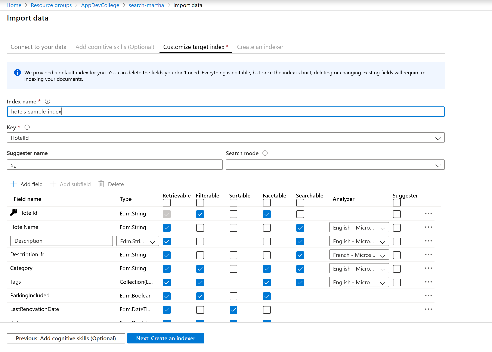

2. Continue to the next page.

Still in the **Import data** wizard, click **Indexer** > **Name**, and type a name for the indexer.

This object defines an executable process. You could put it on recurring schedule, but for now use the default option to run the indexer once, immediately.

Click **Submit** to create and simultaneously run the indexer.

  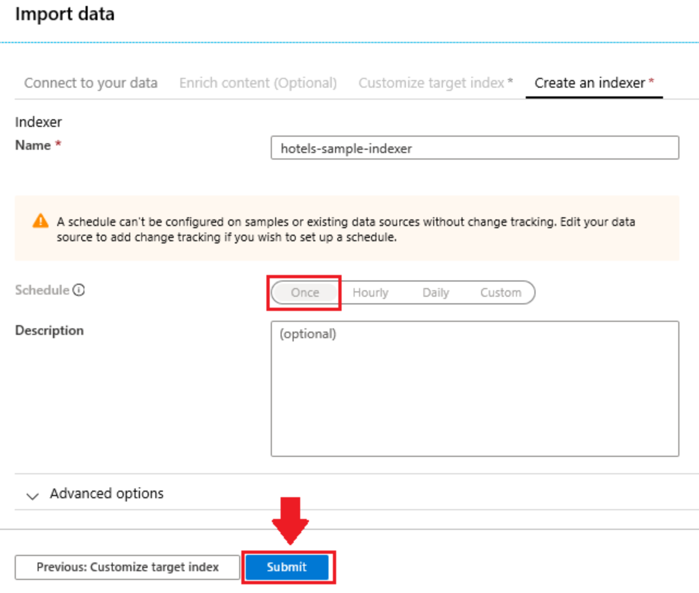

5. After a minute or two, our Indexer will have indexed the hotel dataset and we should be able to query them.

## Querying Content

Open the Search Explorer in the Azure Portal, copy the queries (see below) and get familiar with the results of the queries:

### Simple query with top N results

#### String Query: `search=spa`

* The **search** parameter is used to input a keyword search for full text search, in this case, returning hotel data for those containing *spa* in any searchable field in the document.

* **Search explorer** returns results. You see that results are returned in **OData** notation making them easily readable by any language/other service.

* Documents are composed of all fields marked as "retrievable" in the index. To view index attributes in the portal, click *hotels-sample* in the **Indexes** list.

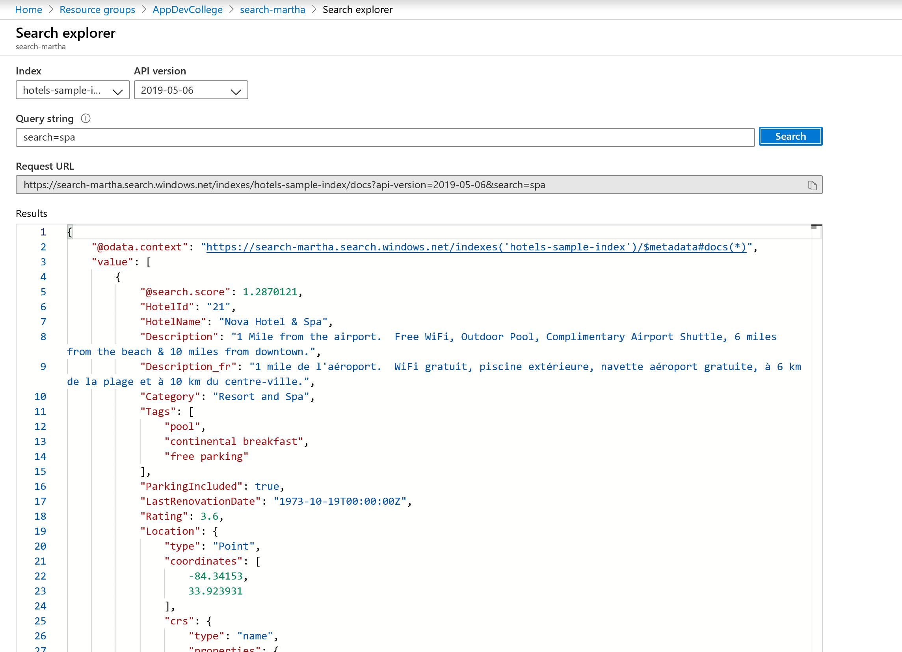

#### Parameterized Query: `search=spa&$count=true&$top=10`

* The **&** symbol is used to append search parameters, which can be specified in any order.

* The **$count=true** parameter returns the total count of all documents **available/found** in the Azure Search index - not **returned**. You can verify filter queries by monitoring changes reported by **$count=true**. Smaller counts indicate your filter is working.

* The **$top=10** returns the highest ranked 10 documents out of the total (**$count**). By default, Azure Cognitive Search returns the first 50 best matches. You can increase or decrease the amount via **$top** parameter.

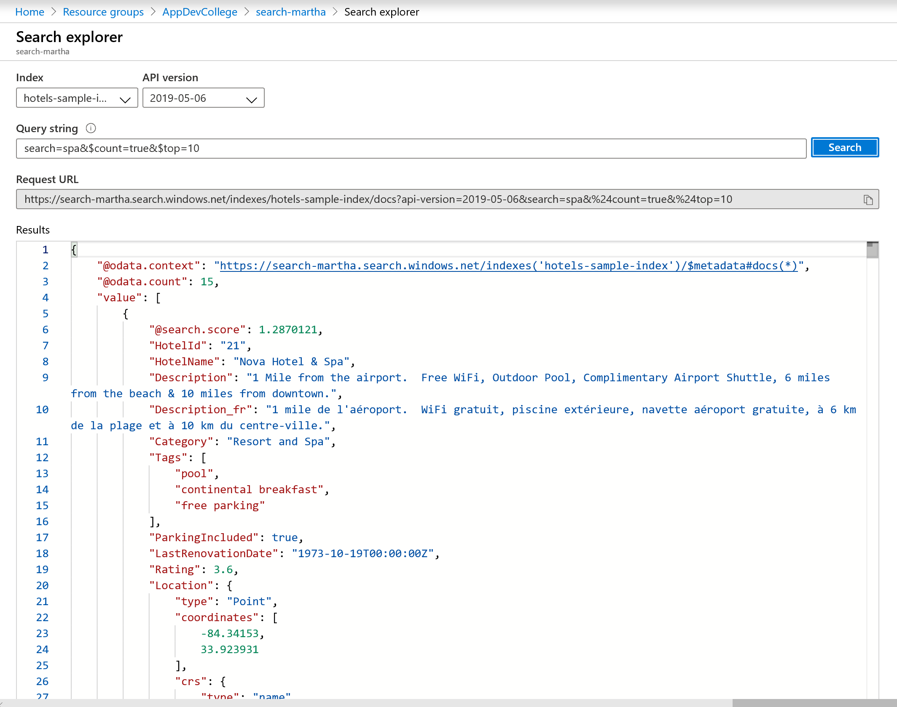

### <a name="filter-query"></a> Filter the query

Filters are included in search requests when you append the **$filter** parameter. 

#### Filtered Query: `search=beach&$filter=Rating gt 4`

* The **$filter** parameter returns results matching the criteria you provided. In this case: *ratings greater than 4*.

* Filter syntax is an OData expression. For more information, see [Filter OData syntax](https://docs.microsoft.com/rest/api/searchservice/odata-expression-syntax-for-azure-search).

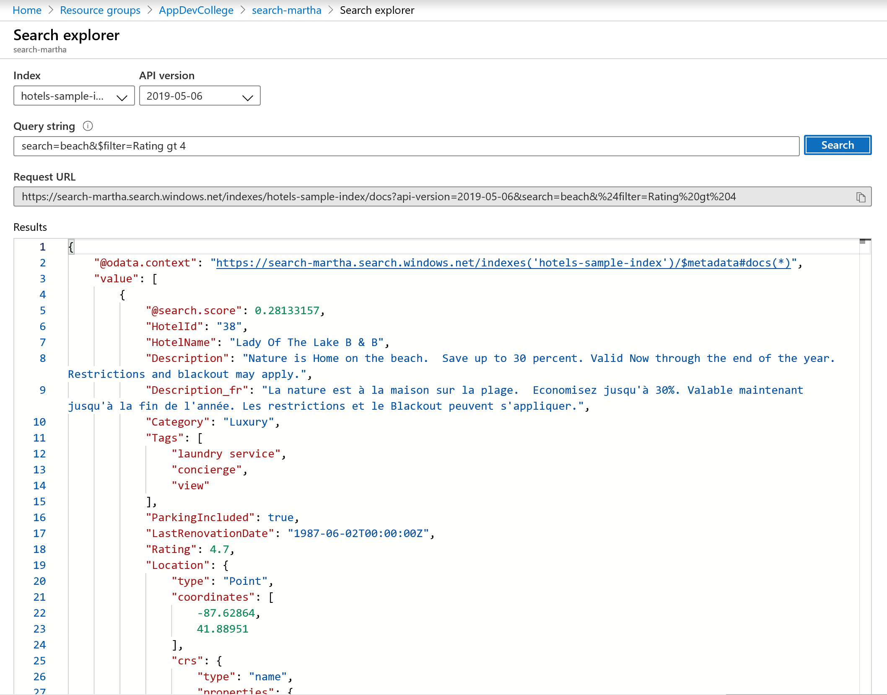

#### Linguistic Analysis Query: `search=beaches&highlight=Description`

* Full text search recognizes basic variations in word forms. In this case, search results contain highlighted text for "beach", for hotels that have that word in their searchable fields, in response to a keyword search on "beaches". Different forms of the same word can appear in results because of linguistic analysis. 

> Highlighting works by inserting HTML tags ```<em></em>´´´. You have to add the corresponding CSS (or functionality), to handle the highlighting in your application.

* Azure Cognitive Search supports 56 analyzers from both Lucene and Microsoft (including the same that are used in Office 365). The default used by Azure Cognitive Search is the standard Lucene analyzer.

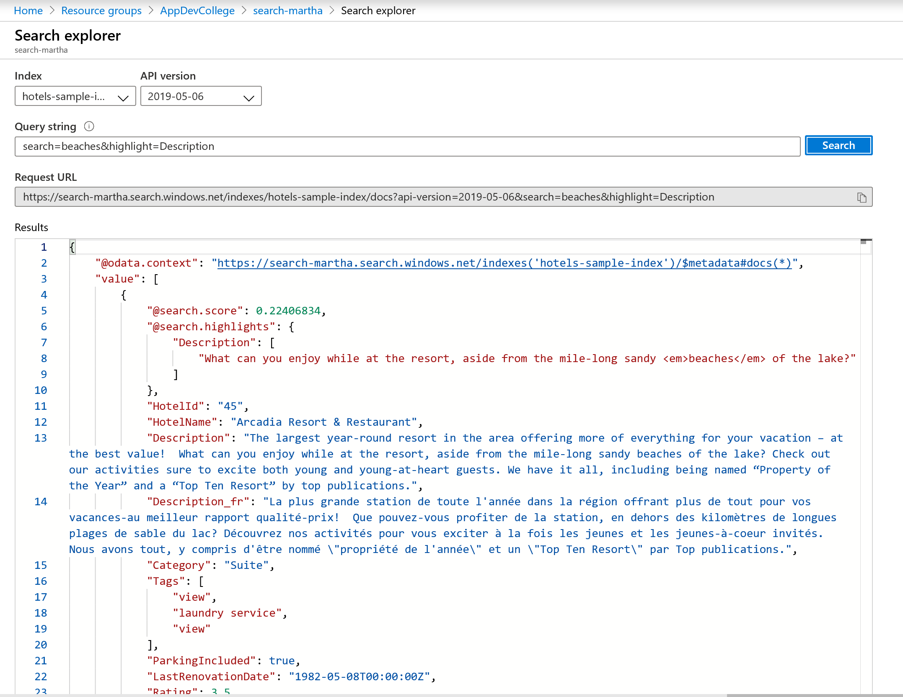

### Try fuzzy search

By default, misspelled query terms, like *seatle* for "Seattle", fail to return matches in a typical search. The following example returns no results.

#### Example (misspelled term, unhandled): `search=seatle`

To handle misspellings, you can use fuzzy search. Fuzzy search is enabled when you use the full Lucene query syntax, which occurs when you do two things: set **queryType=full** on the query, and append the **~** to the search string.

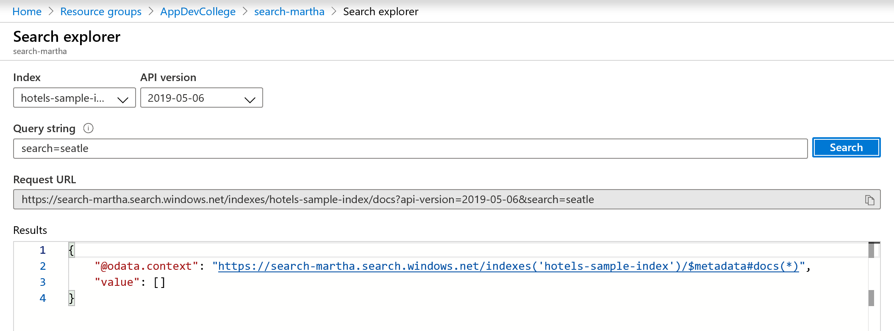

#### Example (misspelled term, handled): `search=seatle~&queryType=full`

This example now returns documents that include matches on "Seattle".

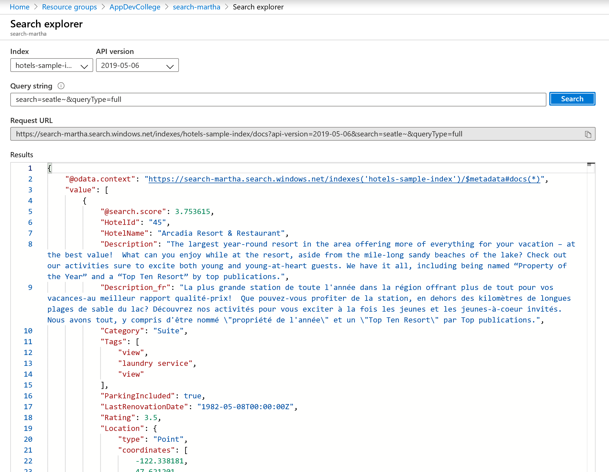

When **queryType** is unspecified, the default **simple query parser** is used. The **simple query parser** is faster, but if you require fuzzy search, regular expressions, proximity search or other advanced query types, you will need the full syntax.

# Add Cognitive Skills to Azure Search - to index unstructured content (e.g. images, audio, etc.)

[Azure Cognitive Search](https://docs.microsoft.com/en-us/azure/search/cognitive-search-concept-intro) allows us to also index unstructured data. More precisely, it add capabilities for data extraction, natural language processing (NLP), and image processing to Azure Search indexing pipeline (for more see [here](https://docs.microsoft.com/en-us/azure/search/cognitive-search-concept-intro#key-features-and-concepts)). In Azure Cognitive Search, a skillset is responsible for the pipeline of the data and consists of multiple skills. Some skills have been pre-included, but it is also possible for us to write our own skills.

[Azure Cognitive Search](https://docs.microsoft.com/en-us/azure/search/cognitive-search-quickstart-blob)

Let's see it in action. As before, let's choose a sample dataset and choose the SQL DB `realestate-us-sample`. Go to the Azure Search Service an click on **Import Data**.

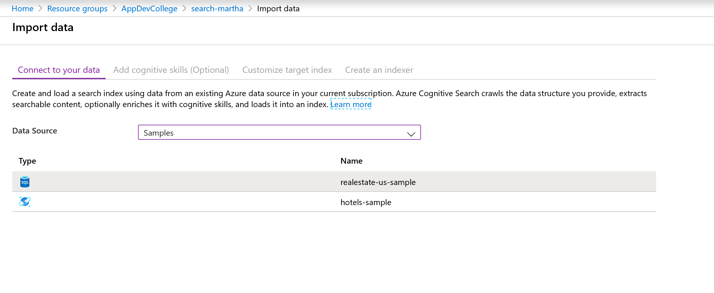

Once we're done, we'll repeat the steps from before, `Import Dataset`, walk through the wizard, but this time, we'll configure the `Cognitive Search` part in the second tab.

So, we need to define the skillset. In our case, we'll enable all features under **Add enrichments**):

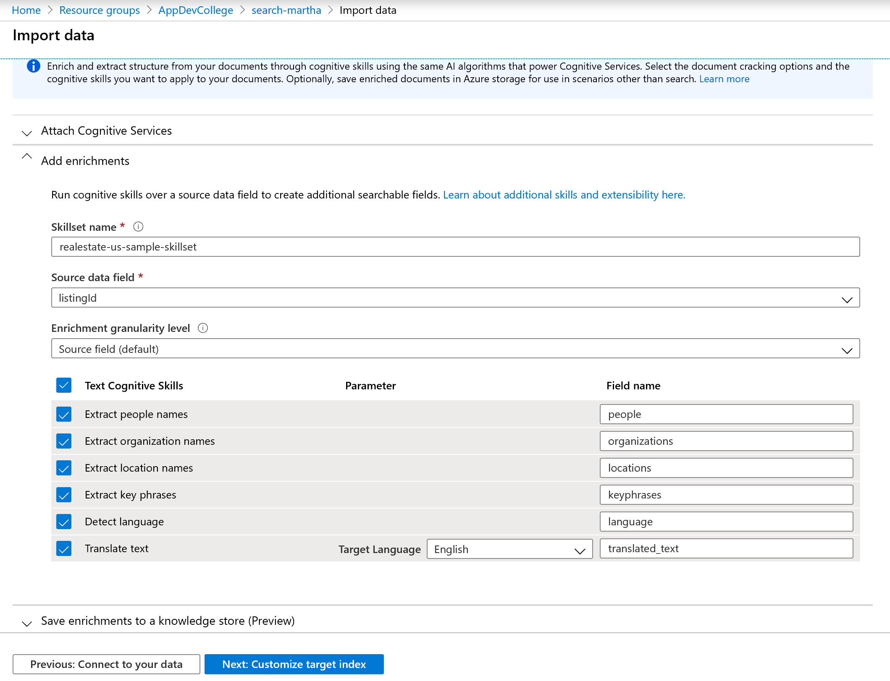

Once we have finished the next two tabs, Azure Cognitive Search will start indexing our data (this will take a bit longer, as it needs to run image recognition, OCR, etc. on the files).

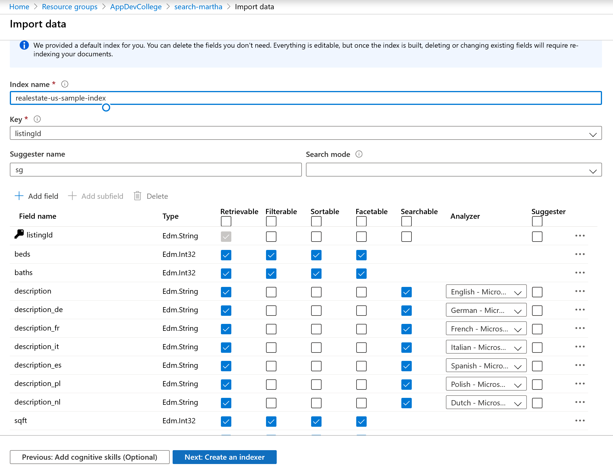

In the following JSON we can see that the cognitive skills are enabled and that the Translate Skill has a result:

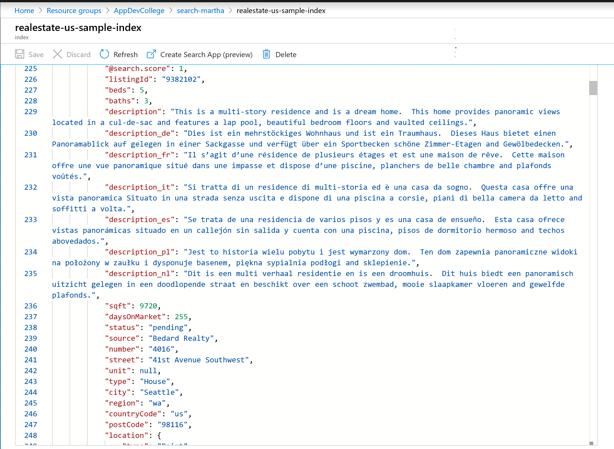

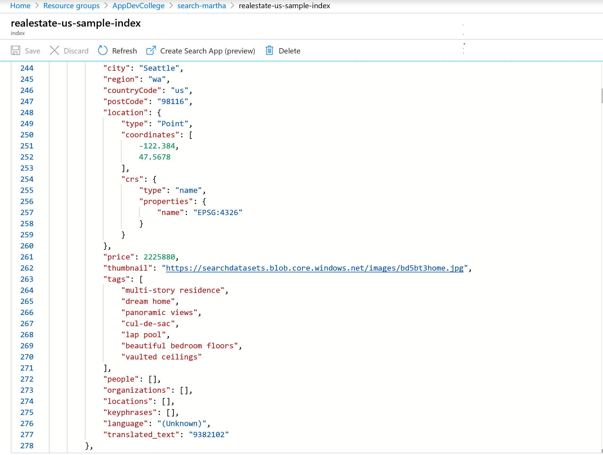

* [Simple Query Syntax](https://docs.microsoft.com/en-us/rest/api/searchservice/simple-query-syntax-in-azure-search)
* [Lucene Query Syntax](https://docs.microsoft.com/en-us/rest/api/searchservice/lucene-query-syntax-in-azure-search)

## Using the API

We've been lazy and did everything through the portal - obviously not the way we want to work in the real world. Especially data ingestion and search should (and most likely needs) to be performed through the API:

* [Create an index](https://docs.microsoft.com/en-us/azure/search/search-create-index-rest-api)
* [Import Data](https://docs.microsoft.com/en-us/azure/search/search-import-data-rest-api)
* [Search](https://docs.microsoft.com/en-us/azure/search/search-query-rest-api)

# Integrate Azure Search in an Node JS Application

Now let's jump into code. We will create a Node.js application that that creates, loads, and queries an Azure Cognitive Search index. This article demonstrates how to create the application step-by-step. 

## Set up your environment

Begin by opening the Cloud Shell in the Browser, a Bash console, Powershell console or other environment in which you've installed Node.js.

1. Create a development directory, giving it the name `adv-search` :

    ```bash
    md adv-search
    cd adv-search
    git clone https://github.com/Azure-Samples/azure-search-javascript-samples.git
    cd azure-search-javascript-samples/quickstart
    code .
    ```
    Open Terminal in VS Code and run npm init

1. Insert your search service data in the file **azure_search_config.json**:
    ```json
    {
        "serviceName" : "[SEARCH_SERVICE_NAME]",
        "adminKey" : "[SEARCH_SERVICE_ADMIN_KEY]",
        "queryKey" : "[SEARCH_SERVICE_QUERY_KEY]",
        "indexName" : "hotels-quickstart"
    }
    ```
    Replace the `[SEARCH_SERVICE_NAME]` value with the name of your search service. Replace `[SEARCH_SERVICE_ADMIN_KEY]` and `[SEARCH_SERVICE_QUERY_KEY]` with the key values you recorded earlier.  
    If your endpoint URL were https://mydemo.search.windows.net, your service name would be **mydemo**. 
    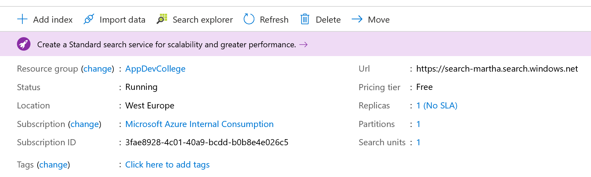
    In **Settings > Keys**, get the primary admin key for full rights on the service. 
    
    > There are two interchangeable admin keys, provided for business continuity in case you need to roll one over. You can use either the primary or secondary key on requests for adding, modifying, and deleting objects.
    
    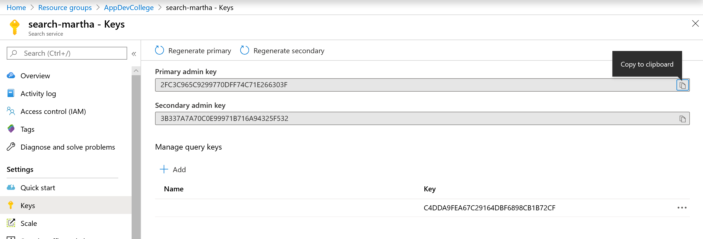

    > Get the query key as well. It's a best practice to issue query requests with read-only access.

## Important Parts of the Quickstart Application

Find the file **hotels_quickstart_index.json**. This file defines how Azure Cognitive Search works with the documents you'll be loading in the next step. Each field will be identified by a `name` and has a specified `type`. Each field also has a series of index attributes that specify whether Azure Cognitive Search can *search*, *filter*, *sort*, and *facet* upon the field. 

> Most of the fields are simple data types, but some, like `AddressType` are complex types that allow you to create rich data structures in your index. You can read more about [supported data types](https://docs.microsoft.com/rest/api/searchservice/supported-data-types) and [index attributes](https://docs.microsoft.com/azure/search/search-what-is-an-index#index-attributes). 

Have a look at the **hotels_quickstart_index.json** and get familiar with its setup/content. 

```json
{
    "name": "hotels-quickstart",
    "fields": [
        {
            "name": "HotelId",
            "type": "Edm.String",
            "key": true,
            "filterable": true
        },
        {
            "name": "HotelName",
            "type": "Edm.String",
            "searchable": true,
            "filterable": false,
            "sortable": true,
            "facetable": false
        },
        {
            "name": "Description",
            "type": "Edm.String",
            "searchable": true,
            "filterable": false,
            "sortable": false,
            "facetable": false,
            "analyzer": "en.lucene"
        },
        {
            "name": "Description_fr",
            "type": "Edm.String",
            "searchable": true,
            "filterable": false,
            "sortable": false,
            "facetable": false,
            "analyzer": "fr.lucene"
        },
        {
            "name": "Category",
            "type": "Edm.String",
            "searchable": true,
            "filterable": true,
            "sortable": true,
            "facetable": true
        },
        {
            "name": "Tags",
            "type": "Collection(Edm.String)",
            "searchable": true,
            "filterable": true,
            "sortable": false,
            "facetable": true
        },
        {
            "name": "ParkingIncluded",
            "type": "Edm.Boolean",
            "filterable": true,
            "sortable": true,
            "facetable": true
        },
        {
            "name": "LastRenovationDate",
            "type": "Edm.DateTimeOffset",
            "filterable": true,
            "sortable": true,
            "facetable": true
        },
        {
            "name": "Rating",
            "type": "Edm.Double",
            "filterable": true,
            "sortable": true,
            "facetable": true
        },
        {
            "name": "Address",
            "type": "Edm.ComplexType",
            "fields": [
                {
                    "name": "StreetAddress",
                    "type": "Edm.String",
                    "filterable": false,
                    "sortable": false,
                    "facetable": false,
                    "searchable": true
                },
                {
                    "name": "City",
                    "type": "Edm.String",
                    "searchable": true,
                    "filterable": true,
                    "sortable": true,
                    "facetable": true
                },
                {
                    "name": "StateProvince",
                    "type": "Edm.String",
                    "searchable": true,
                    "filterable": true,
                    "sortable": true,
                    "facetable": true
                },
                {
                    "name": "PostalCode",
                    "type": "Edm.String",
                    "searchable": true,
                    "filterable": true,
                    "sortable": true,
                    "facetable": true
                },
                {
                    "name": "Country",
                    "type": "Edm.String",
                    "searchable": true,
                    "filterable": true,
                    "sortable": true,
                    "facetable": true
                }
            ]
        }
    ],
    "suggesters": [
        {
            "name": "sg",
            "searchMode": "analyzingInfixMatching",
            "sourceFields": [
                "HotelName"
            ]
        }
    ]
}
```

Now, have a look at the file **AzureSearchClient.js** and take your time to understand what happens here. You will find methods to check, if an index exists, to create and delete an index as well as methods to add data to the index (```postDataAsync```) and - of course - query data (```queryAsync```).

> If you have any questions regarding the code, feel free to reach out to one of the proctors.

## Prepare and run the sample

Use a terminal window for the following commands.

1. Navigate to the source code folder *azure-search-javascript-samples/quickstart*.
1. Install the packages for the sample with `npm install`.  This command will download the packages upon which the code depends.


Now back in Visual Studio Code, set a breakpoint in method ```doQueriesAsync``` (in **index.js** - the place where queries are sent to Azure Search and the corresponding response will be readable) and hit **F5** (if VS Code asks you, select *Node.JS App* as your environment).

You should see a series of messages describing the actions being taken by the program and after some time, your breakpoint will be hit. Have a look at the ```body``` property in the method mentioned above...there you see the OData response from Azure Search. 

If you want to see more detail of the requests, you can uncomment the [lines at the beginning of the `AzureSearchClient.request()` method](https://github.com/Azure-Samples/azure-search-javascript-samples/blob/master/quickstart/AzureSearchClient.js#L21-L27) in **AzureSearchClient.js**.

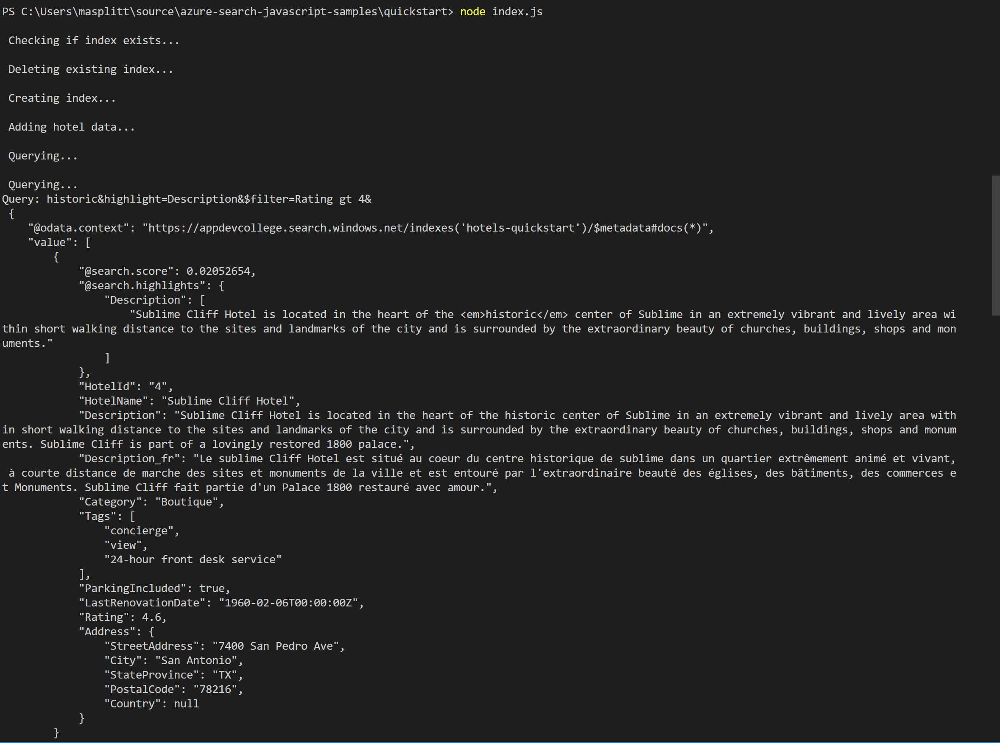

# House Keeping: Lab Cleanup

Remove the sample resource group.

```shell
$ az group delete -n adc-azsearch-db-rg
```

# Optional: Want to get to know Python in combination with Azure Cognitive Search? ##

Here you go :)

## Create an Azure Cognitive Search index in Python using Jupyter notebooks ##

## Get a key and URL ##

REST calls require the service URL and an access key on every request. A search service is created with both, so if you added Azure Cognitive Search to your subscription, follow these steps to get the necessary information:

1. [Sign in to the Azure portal](https://portal.azure.com/), and in your search service **Overview** page, get the URL. An example endpoint might look like `https://mydemo.search.windows.net`.

2. In **Settings** > **Keys**, get an admin key for full rights on the service. There are two interchangeable admin keys, provided for business continuity in case you need to roll one over. You can use either the primary or secondary key on requests for adding, modifying, and deleting objects.

All requests require an api-key on every request sent to your service. Having a valid key establishes trust, on a per request basis, between the application sending the request and the service that handles it.

## Connect to Azure Cognitive Search

In this task, start a Jupyter notebook and verify that you can connect to Azure Cognitive Search. You'll do this by requesting a list of indexes from your service. On Windows with Anaconda3, you can use Anaconda Navigator to launch a notebook.

0. Register here [Azure Notebooks](https://notebooks.azure.com)
1. Create a project 
    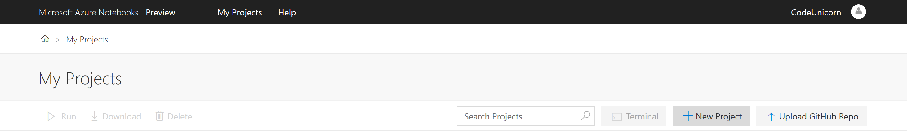

    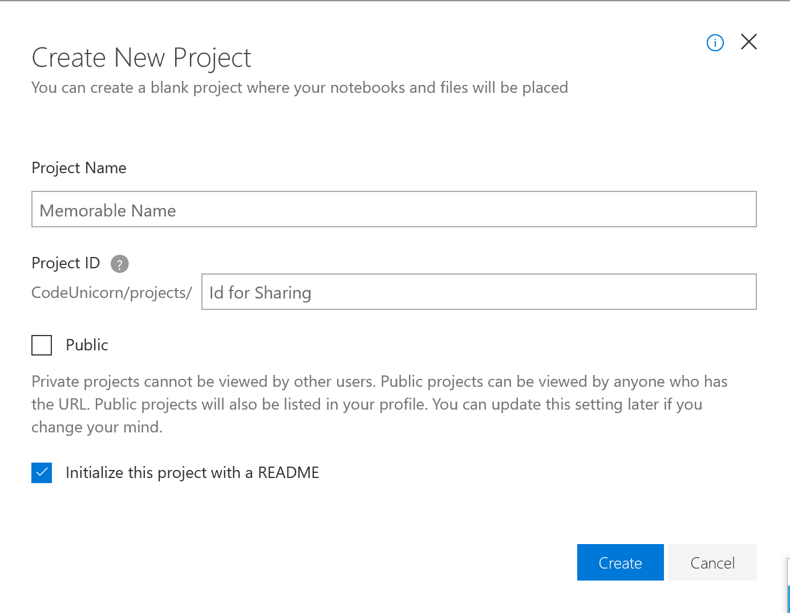

2. Create a notebook
   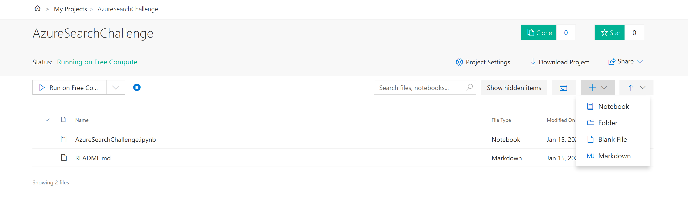

3. Create a new Python3.6 notebook.
   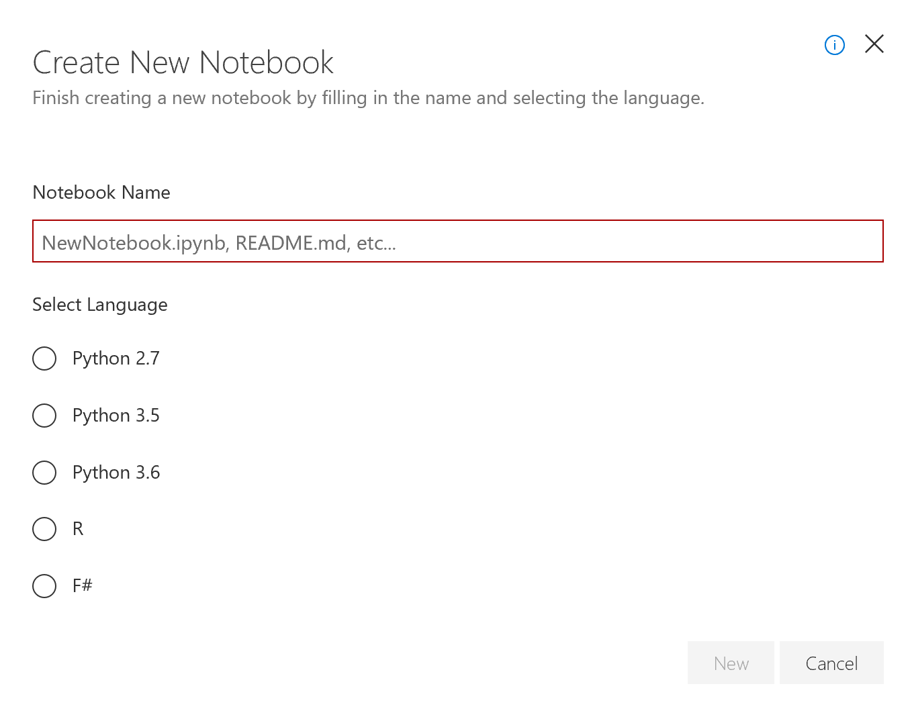

4. In the first cell, load the libraries used for working with JSON and formulating HTTP requests.

   ```python
   import json
   import requests
   from pprint import pprint
   ```

5. In the second cell, input the request elements that will be constants on every request. Replace the search service name (YOUR-SEARCH-SERVICE-NAME) and admin API key (YOUR-ADMIN-API-KEY) with valid values. 

   ```python
   endpoint = 'https://<YOUR-SEARCH-SERVICE-NAME>.search.windows.net/'
   api_version = '?api-version=2019-05-06'
   headers = {'Content-Type': 'application/json',
           'api-key': '<YOUR-ADMIN-API-KEY>' }
   ```

   If you get ConnectionError `"Failed to establish a new connection"`, verify that the api-key is a primary or secondary admin key, and that all leading and trailing characters (`?` and `/`) are in place.

6. In the third cell, formulate the request. This GET request targets the indexes collection of your search service and selects the name property of existing indexes.

   ```python
   url = endpoint + "indexes" + api_version + "&$select=name"
   response  = requests.get(url, headers=headers)
   index_list = response.json()
   pprint(index_list)
   ```

7. Run each step. If indexes exist, the response contains a list of index names. In the screenshot below, the service already has an azureblob-index and a realestate-us-sample index.

   In contrast, an empty index collection returns this response: `{'@odata.context': 'https://mydemo.search.windows.net/$metadata#indexes(name)', 'value': []}`

## 1 - Create an index

Unless you are using the portal, an index must exist on the service before you can load data. This step uses the [Create Index REST API](https://docs.microsoft.com/rest/api/searchservice/create-index) to push an index schema to the service.

Required elements of an index include a name, a fields collection, and a key. The fields collection defines the structure of a *document*. Each field has a name, type, and attributes that determine how the field is used (for example, whether it is full-text searchable, filterable, or retrievable in search results). Within an index, one of the fields of type `Edm.String` must be designated as the *key* for document identity.

This index is named "hotels-quickstart" and has the field definitions you see below. It's a subset of a larger [Hotels index](https://github.com/Azure-Samples/azure-search-sample-data/blob/master/hotels/Hotels_IndexDefinition.JSON) used in other walkthroughs. We trimmed it in this quickstart for brevity.

1. In the next cell, paste the following example into a cell to provide the schema. 

    ```python
    index_schema = {
       "name": "hotels-quickstart",  
       "fields": [
         {"name": "HotelId", "type": "Edm.String", "key": "true", "filterable": "true"},
         {"name": "HotelName", "type": "Edm.String", "searchable": "true", "filterable": "false", "sortable": "true", "facetable": "false"},
         {"name": "Description", "type": "Edm.String", "searchable": "true", "filterable": "false", "sortable": "false", "facetable": "false", "analyzer": "en.lucene"},
         {"name": "Description_fr", "type": "Edm.String", "searchable": "true", "filterable": "false", "sortable": "false", "facetable": "false", "analyzer": "fr.lucene"},
         {"name": "Category", "type": "Edm.String", "searchable": "true", "filterable": "true", "sortable": "true", "facetable": "true"},
         {"name": "Tags", "type": "Collection(Edm.String)", "searchable": "true", "filterable": "true", "sortable": "false", "facetable": "true"},
         {"name": "ParkingIncluded", "type": "Edm.Boolean", "filterable": "true", "sortable": "true", "facetable": "true"},
         {"name": "LastRenovationDate", "type": "Edm.DateTimeOffset", "filterable": "true", "sortable": "true", "facetable": "true"},
         {"name": "Rating", "type": "Edm.Double", "filterable": "true", "sortable": "true", "facetable": "true"},
         {"name": "Address", "type": "Edm.ComplexType", 
         "fields": [
         {"name": "StreetAddress", "type": "Edm.String", "filterable": "false", "sortable": "false", "facetable": "false", "searchable": "true"},
         {"name": "City", "type": "Edm.String", "searchable": "true", "filterable": "true", "sortable": "true", "facetable": "true"},
         {"name": "StateProvince", "type": "Edm.String", "searchable": "true", "filterable": "true", "sortable": "true", "facetable": "true"},
         {"name": "PostalCode", "type": "Edm.String", "searchable": "true", "filterable": "true", "sortable": "true", "facetable": "true"},
         {"name": "Country", "type": "Edm.String", "searchable": "true", "filterable": "true", "sortable": "true", "facetable": "true"}
        ]
       }
      ]
    }
    ```

2. In another cell, formulate the request. This PUT request targets the indexes collection of your search service and creates an index based on the index schema you provided in the previous cell. Check that the indentation is correct as shown below.

   ```python
   url = endpoint + "indexes" + api_version
   response  = requests.post(url, headers=headers, json=index_schema)
   index = response.json()
   pprint(index)
   ```

3. Run each step.

   The response includes the JSON representation of the schema. 

- Another way to verify index creation is to check the Indexes list in the portal.

<a name="load-documents"></a>

## 2 - Load documents

To push documents, use an HTTP POST request to your index's URL endpoint. The REST API is [Add, Update, or Delete Documents](https://docs.microsoft.com/rest/api/searchservice/addupdate-or-delete-documents). Documents originate from [HotelsData](https://github.com/Azure-Samples/azure-search-sample-data/blob/master/hotels/HotelsData_toAzureSearch.JSON) on GitHub.

1. In a new cell, provide four documents that conform to the index schema. Specify an upload action for each document.

    ```python
    documents = {
        "value": [
        {
        "@search.action": "upload",
        "HotelId": "1",
        "HotelName": "Secret Point Motel",
        "Description": "The hotel is ideally located on the main commercial artery of the city in the heart of New York. A few minutes away is Time's Square and the historic centre of the city, as well as other places of interest that make New York one of America's most attractive and cosmopolitan cities.",
        "Description_fr": "L'hôtel est idéalement situé sur la principale artère commerciale de la ville en plein cœur de New York. A quelques minutes se trouve la place du temps et le centre historique de la ville, ainsi que d'autres lieux d'intérêt qui font de New York l'une des villes les plus attractives et cosmopolites de l'Amérique.",
        "Category": "Boutique",
        "Tags": [ "pool", "air conditioning", "concierge" ],
        "ParkingIncluded": "false",
        "LastRenovationDate": "1970-01-18T00:00:00Z",
        "Rating": 3.60,
        "Address": {
            "StreetAddress": "677 5th Ave",
            "City": "New York",
            "StateProvince": "NY",
            "PostalCode": "10022",
            "Country": "USA"
            }
        },
        {
        "@search.action": "upload",
        "HotelId": "2",
        "HotelName": "Twin Dome Motel",
        "Description": "The hotel is situated in a  nineteenth century plaza, which has been expanded and renovated to the highest architectural standards to create a modern, functional and first-class hotel in which art and unique historical elements coexist with the most modern comforts.",
        "Description_fr": "L'hôtel est situé dans une place du XIXe siècle, qui a été agrandie et rénovée aux plus hautes normes architecturales pour créer un hôtel moderne, fonctionnel et de première classe dans lequel l'art et les éléments historiques uniques coexistent avec le confort le plus moderne.",
        "Category": "Boutique",
        "Tags": [ "pool", "free wifi", "concierge" ],
        "ParkingIncluded": "false",
        "LastRenovationDate": "1979-02-18T00:00:00Z",
        "Rating": 3.60,
        "Address": {
            "StreetAddress": "140 University Town Center Dr",
            "City": "Sarasota",
            "StateProvince": "FL",
            "PostalCode": "34243",
            "Country": "USA"
            }
        },
        {
        "@search.action": "upload",
        "HotelId": "3",
        "HotelName": "Triple Landscape Hotel",
        "Description": "The Hotel stands out for its gastronomic excellence under the management of William Dough, who advises on and oversees all of the Hotel’s restaurant services.",
        "Description_fr": "L'hôtel est situé dans une place du XIXe siècle, qui a été agrandie et rénovée aux plus hautes normes architecturales pour créer un hôtel moderne, fonctionnel et de première classe dans lequel l'art et les éléments historiques uniques coexistent avec le confort le plus moderne.",
        "Category": "Resort and Spa",
        "Tags": [ "air conditioning", "bar", "continental breakfast" ],
        "ParkingIncluded": "true",
        "LastRenovationDate": "2015-09-20T00:00:00Z",
        "Rating": 4.80,
        "Address": {
            "StreetAddress": "3393 Peachtree Rd",
            "City": "Atlanta",
            "StateProvince": "GA",
            "PostalCode": "30326",
            "Country": "USA"
            }
        },
        {
        "@search.action": "upload",
        "HotelId": "4",
        "HotelName": "Sublime Cliff Hotel",
        "Description": "Sublime Cliff Hotel is located in the heart of the historic center of Sublime in an extremely vibrant and lively area within short walking distance to the sites and landmarks of the city and is surrounded by the extraordinary beauty of churches, buildings, shops and monuments. Sublime Cliff is part of a lovingly restored 1800 palace.",
        "Description_fr": "Le sublime Cliff Hotel est situé au coeur du centre historique de sublime dans un quartier extrêmement animé et vivant, à courte distance de marche des sites et monuments de la ville et est entouré par l'extraordinaire beauté des églises, des bâtiments, des commerces et Monuments. Sublime Cliff fait partie d'un Palace 1800 restauré avec amour.",
        "Category": "Boutique",
        "Tags": [ "concierge", "view", "24-hour front desk service" ],
        "ParkingIncluded": "true",
        "LastRenovationDate": "1960-02-06T00:00:00Z",
        "Rating": 4.60,
        "Address": {
            "StreetAddress": "7400 San Pedro Ave",
            "City": "San Antonio",
            "StateProvince": "TX",
            "PostalCode": "78216",
            "Country": "USA"
            }
        }
    ]
    }
    ```   

2. In another cell, formulate the request. This POST request targets the docs collection of the hotels-quickstart index and pushes the documents provided in the previous step.

   ```python
   url = endpoint + "indexes/hotels-quickstart/docs/index" + api_version
   response  = requests.post(url, headers=headers, json=documents)
   index_content = response.json()
   pprint(index_content)
   ```

3. Run each step to push the documents to an index in your search service. Results should look similar to the following example. 

    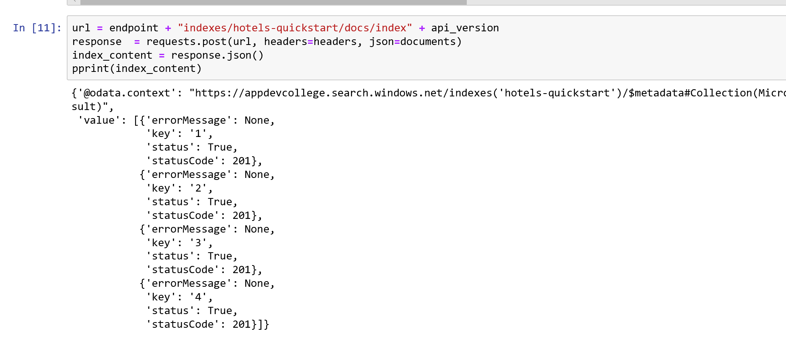

## 3 - Search an index

This step shows you how to query an index using the [Search Documents REST API](https://docs.microsoft.com/rest/api/searchservice/search-documents).

1. In a cell, provide a query expression that executes an empty search (search=*), returning an unranked list (search score  = 1.0) of arbitrary documents. By default, Azure Cognitive Search returns 50 matches at a time. As structured, this query returns an entire document structure and values. Add $count=true to get a count of all documents in the results.

   ```python
   searchstring = '&search=*&$count=true'
   ```

2. In a new cell, provide the following example to search on the terms "hotels" and "wifi". Add $select to specify which fields to include in the search results.

   ```python
   searchstring = '&search=hotels wifi&$count=true&$select=HotelId,HotelName'
   ```

3. In another cell, formulate a request. This GET request targets the docs collection of the hotels-quickstart index, and attaches the query you specified in the previous step.

   ```python
   url = endpoint + "indexes/hotels-quickstart/docs" + api_version + searchstring
   response  = requests.get(url, headers=headers, json=searchstring)
   query = response.json()
   pprint(query)
   ```

4. Run each step. Results should look similar to the following output. 

    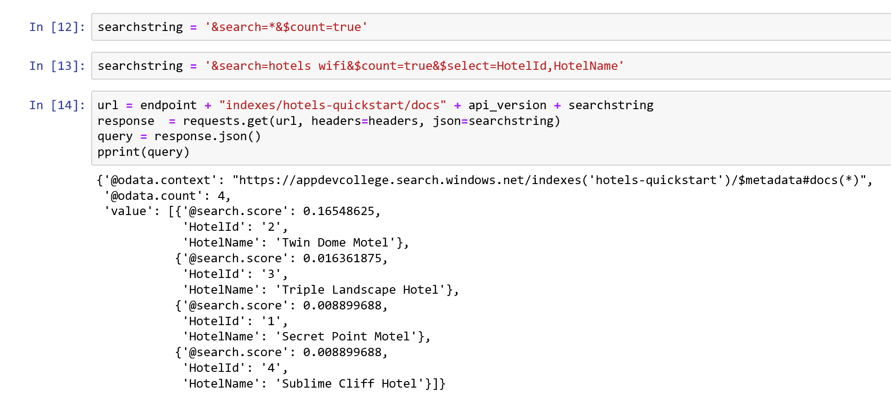

5. Try a few other query examples to get a feel for the syntax. You can replace the `searchstring` with the following examples and then rerun the search request. 

   Apply a filter: 

   ```python
   searchstring = '&search=*&$filter=Rating gt 4&$select=HotelId,HotelName,Description,Rating'
   ```

   Take the top two results:

   ```python
   searchstring = '&search=boutique&$top=2&$select=HotelId,HotelName,Description,Category'
   ```

    Order by a specific field:

   ```python
   searchstring = '&search=pool&$orderby=Address/City&$select=HotelId, HotelName, Address/City, Address/StateProvince, Tags'
   ```


# Optional: Play around a bit with Azure Search 

- https://azjobsdemo.azurewebsites.net/
- https://docs.microsoft.com/en-us/samples/azure-samples/search-dotnet-asp-net-mvc-jobs/search-dotnet-asp-net-mvc-jobs/
