# Cognitive Services #

## Here is what you will learn ##

- Create and use a Text Analysis Service
- Install and run Sentiment Analysis Service as Container
- Create and use a Computer Vision Services
- Create and use a Custom Vision Services
- Find Intent using LUIS

## Create and use a Text Analysis Service ##

You can solve these tasks in a programming language of your choice (some even in `curl` :hammer:). For sake of convenience,we are providing hints in `Python`, which you can easily (and for free) run in [Azure Notebooks](https://notebooks.azure.com). SDK Support for `C#` or `.NET Core` is available for most challenges. Especially Azure Search features an easy-to-use `.NET SDK`. You can find code examples in the Azure documentation for the associated services.

|Azure Cognitive Services|Information|
|---|---|
|[Text Analytics API](https://azure.microsoft.com/en-us/services/cognitive-services/text-analytics/)|https://docs.microsoft.com/en-us/azure/cognitive-services/text-analytics/quickstarts/python|


:triangular_flag_on_post: **Goal:** Leverage Text Analytics API for extracting language, sentiment, key phrases, and entities from text

In the language of your choice (Python solution is provided), write a small scripts that
[Text Analytics Service with Other Programming Languages](https://docs.microsoft.com/en-us/azure/cognitive-services/Text-Analytics/quickstarts/nodejs)

0. Go to the Azure Portal, create in **yourresourcegroup** a Text Analytics Service (in the `West Europe` region):

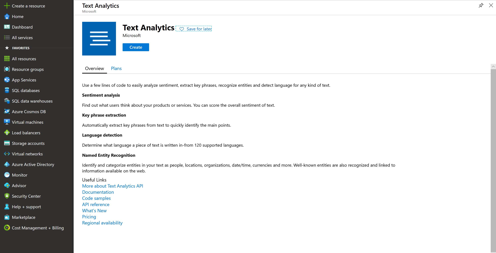

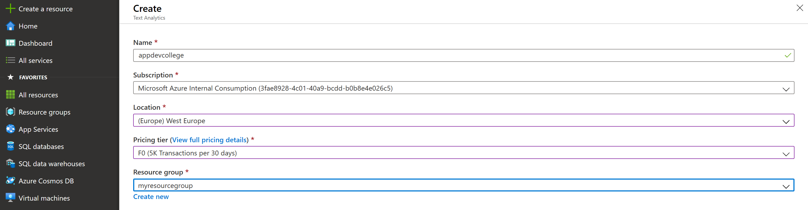

1. Extracts sentiment, key phrases and entities from unstructured text using the [Text Analytics API](https://azure.microsoft.com/en-us/services/cognitive-services/text-analytics/)

:question: **Questions:** 

1. What happens if we do not pass in the `language` parameter while getting the sentiment? 

Create a new Project in [Azure Notebooks](https://notebooks.azure.com/).

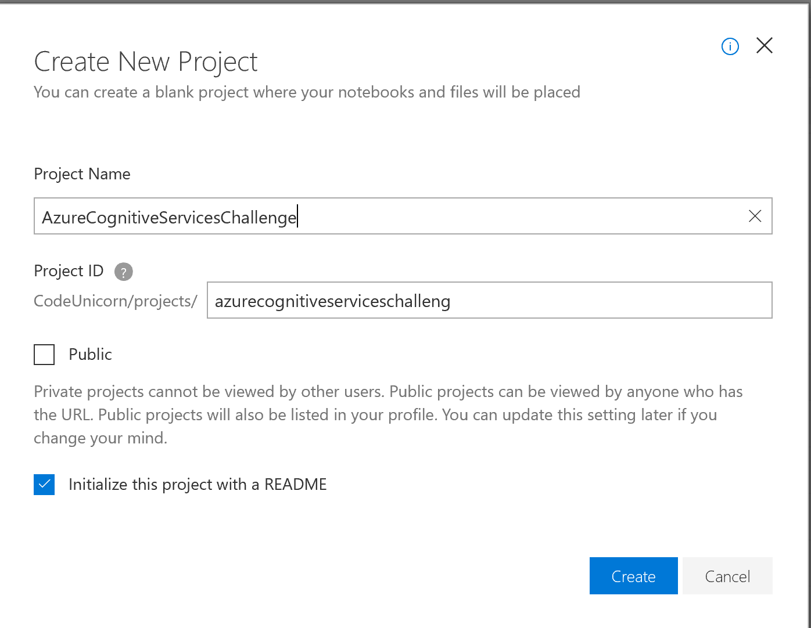

Create a new `Python 3.6 Notebook` in [Azure Notebooks](https://notebooks.azure.com/).

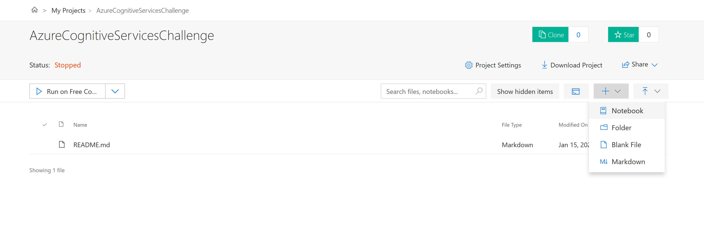

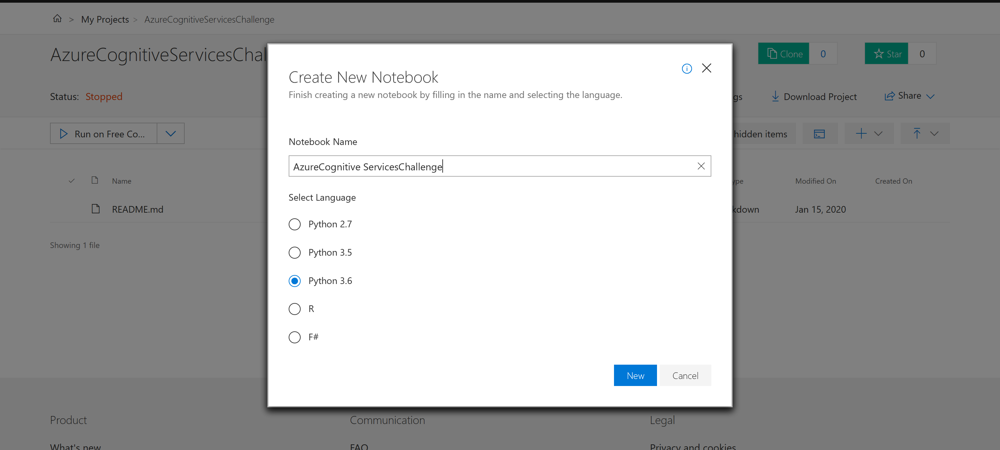

Let's start with :

```python
import requests
from pprint import pprint

subscription_key = "xxx" # Paste your API key here
text_analytics_base_url = "xxx" # Paste your URL in here
headers = {"Ocp-Apim-Subscription-Key": subscription_key}
```
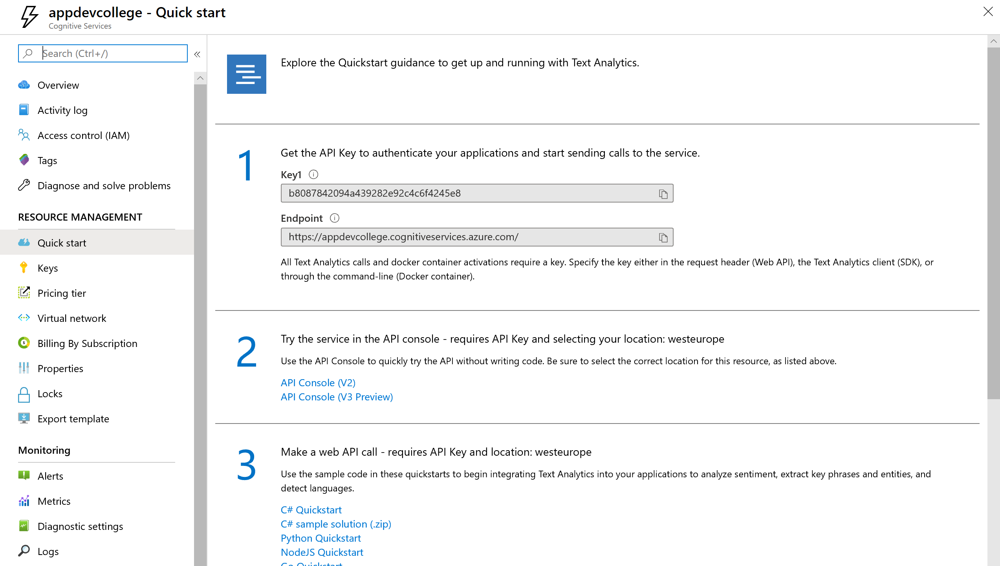

## Detect Language

Firstly, we can extract the language from text:

```python
language_api_url = text_analytics_base_url + "/text/analytics/v2.1/languages"

documents = { "documents": [
    { "id": "1", "text": "This is a document written in English." },
    { "id": "2", "text": "Este es un document escrito en Español." },
    { "id": "3", "text": "这是一个用中文写的文件" }
]}

response  = requests.post(language_api_url, headers=headers, json=documents)
languages = response.json()
pprint(languages)
```
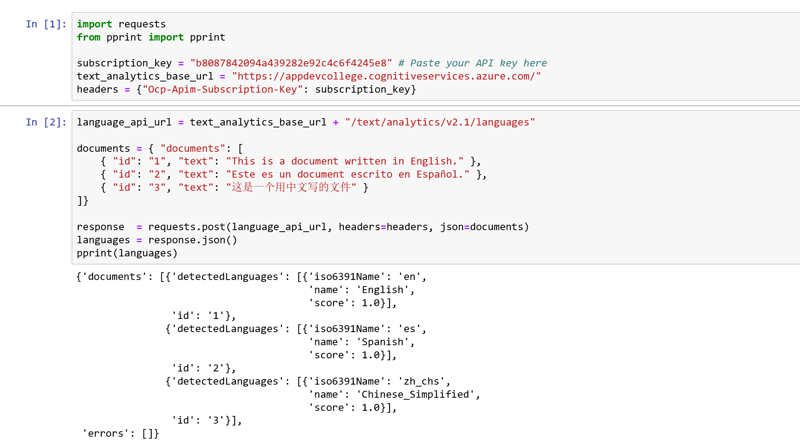

## Detect Sentiment

Secondly, we can detect the sentiment of a given phrase:

```python
sentiment_url = text_analytics_base_url + "/text/analytics/v2.1/sentiment"

documents = {"documents" : [
  {"id": "1", "language": "en", "text": "I had a wonderful experience! The rooms were wonderful and the staff was helpful."},
  {"id": "2", "language": "en", "text": "I had a terrible time at the hotel. The staff was rude and the food was awful."},  
  {"id": "3", "language": "es", "text": "Los caminos que llevan hasta Monte Rainier son espectaculares y hermosos."},  
  {"id": "4", "language": "es", "text": "La carretera estaba atascada. Había mucho tráfico el día de ayer."}
]}

response  = requests.post(sentiment_url, headers=headers, json=documents)
sentiments = response.json()
pprint(sentiments)
```
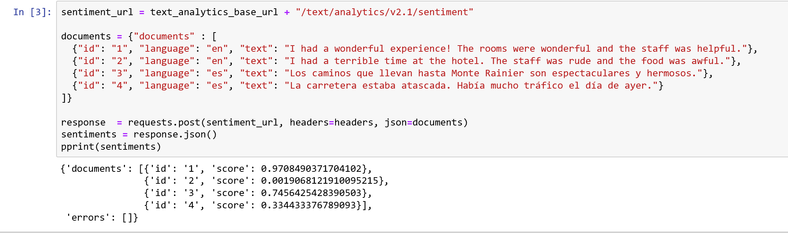

## Detect Key Phrases

Thirdly, we can easily detect key phrases from text:

```python
keyphrase_url = text_analytics_base_url + "/text/analytics/v2.1/keyphrases"

documents = {"documents" : [
  {"id": "1", "language": "en", "text": "I had a wonderful experience! The rooms were wonderful and the staff was helpful."},
  {"id": "2", "language": "en", "text": "I had a terrible time at the hotel. The staff was rude and the food was awful."},  
  {"id": "3", "language": "es", "text": "Los caminos que llevan hasta Monte Rainier son espectaculares y hermosos."},  
  {"id": "4", "language": "es", "text": "La carretera estaba atascada. Había mucho tráfico el día de ayer."}
]}

response  = requests.post(keyphrase_url, headers=headers, json=documents)
key_phrases = response.json()
pprint(key_phrases)
```
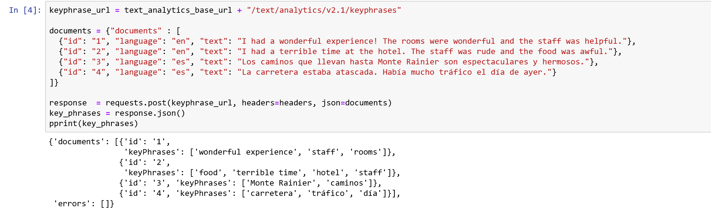

## Detect Entities

And last but not least, we can detect the entities in text:

```python
entities_url = text_analytics_base_url + "/text/analytics/v2.1/entities"

documents = {"documents" : [
  {"id": "1", "text": "Microsoft was founded by Bill Gates and Paul Allen on April 4, 1975, to develop and sell BASIC interpreters for the Altair 8800."}
]}

response  = requests.post(entities_url, headers=headers, json=documents)
entities = response.json()
pprint(entities)
```
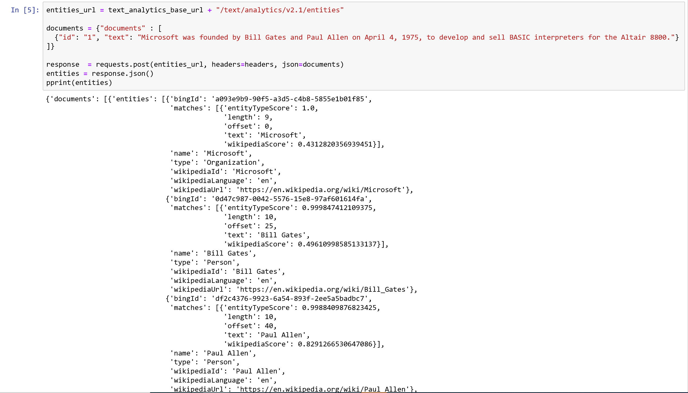

If you want to directly create a dashboard within Power BI from the derived results, have a look at [this tutorial](https://docs.microsoft.com/en-us/azure/cognitive-services/text-analytics/tutorials/tutorial-power-bi-key-phrases).

## Translate Text

First, create a `Translator Text` API Key in the Azure Portal:

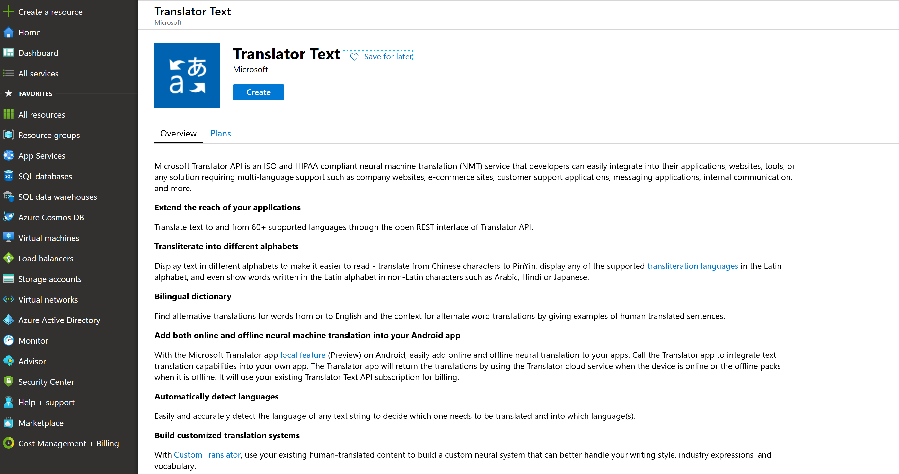

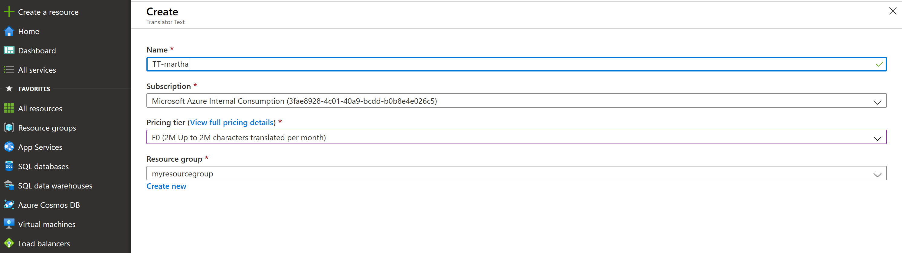

The Translator API  allows to directly access the service by specifying the API key:

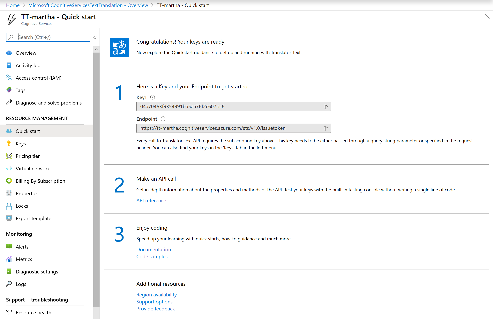

Use the same Notebook as before and copy the following code in a cell below the earlier code in the Notebook.

```python
import requests, json

api_key = "xxx" # Paste your API key here

url = "https://api.cognitive.microsofttranslator.com/translate?api-version=3.0"
headers = {'Ocp-Apim-Subscription-Key': api_key, 'Content-type': 'application/json'}

params = {'to': 'de'}

body = [{'text' : 'I want to order 4 pizza Magarita and 8 beer!'},
        {'text' : 'Please add 42 salads to the order!'}]

response = requests.post(url, headers=headers, params=params, json=body)
print(json.dumps(response.json(), indent=2))
```
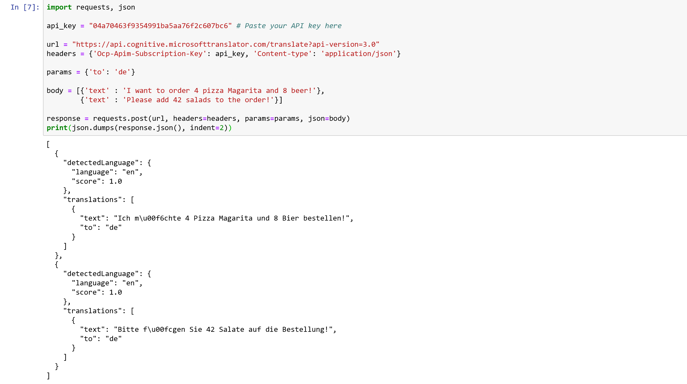

As we can see, we can translate multiple sentences within one API call. The service also automatically detects the input language. If desired, we can even directly translate the input to several output languages concurrently.

## Install and run Sentiment Analysis as Container ##

Docker pull for the Sentiment Analysis container

Use the docker pull command to download a container image from Microsoft Container Registry.
For a full description of available tags for the Text Analytics containers, see the Sentiment Analysis container on the Docker Hub.

```
docker pull mcr.microsoft.com/azure-cognitive-services/sentiment:latest
```
To run the Sentiment Analysis container, execute the following docker run command.
```
docker run --rm -it -p 5000:5000 --memory 4g --cpus 1 \
mcr.microsoft.com/azure-cognitive-services/sentiment \
Eula=accept \
Billing={ENDPOINT_URI_TEXT_ANALYTICS_SERVICE} \
ApiKey={API_KEY_TEXT_ANALYTICS_SERVICE}
```
This command:
- Runs a Sentiment Analysis container from the container image
- Allocates one CPU core and 4 gigabytes (GB) of memory
- Exposes TCP port 5000 and allocates a pseudo-TTY for the container
- Automatically removes the container after it exits. The container image is still available on the host computer.


Query the container's prediction endpoint
- The container provides REST-based query prediction endpoint APIs.
- Use the host, http://localhost:5000, for container APIs.

Stop the container
- To shut down the container, in the command-line environment where the container is running, select Ctrl+C

## Create and use Computer Vision Service and Custom Vision ##

|Azure Cognitive Services|Information|
|---|---|
|[Computer Vision API](https://azure.microsoft.com/en-us/services/cognitive-services/computer-vision)|https://docs.microsoft.com/en-us/azure/cognitive-services/computer-vision/home
|[Custom Vision Service](https://azure.microsoft.com/en-us/services/cognitive-services/custom-vision-service/)|https://docs.microsoft.com/en-us/azure/cognitive-services/custom-vision-service/home


:triangular_flag_on_post: **Goal:** Leverage OCR to make a hand-written or printed text document in images machine-readable

In the language of your choice (Python solution is provided), write two small scripts that

1. Convert hand-written text from an image into text - Test data: [1](https://bootcamps.blob.core.windows.net/ml-test-images/ocr_handwritten_1.jpg), [2](https://bootcamps.blob.core.windows.net/ml-test-images/ocr_handwritten_2.jpg)
1. Convert printed text from an image into text - Test data: [1](https://bootcamps.blob.core.windows.net/ml-test-images/ocr_printed_1.jpg), [2](https://bootcamps.blob.core.windows.net/ml-test-images/ocr_printed_2.jpg)

:question: **Questions:** 

1. How well does the OCR service work with German text? How well with English?
1. What happens when the image is not oriented correctly?

:triangular_flag_on_post: **Goal:** Detect beer glasses in images

1. Use [Custom Vision](https://customvision.ai) to detect beer glasses in images - [Image Dataset for training and testing](https://bootcamps.blob.core.windows.net/ml-test-images/beer_glasses.zip)

:question: **Questions:** 

1. What could we do to increase the detection performance?
1. What happens if the beer glasses are really small in the image?

Create a new `Python 3.6 Notebook` in [Azure Notebooks](https://notebooks.azure.com/).

## Optical Character Recognition - Images to Text - Handwritten content

First, create a `Computer Vision` API Key in the Azure Portal

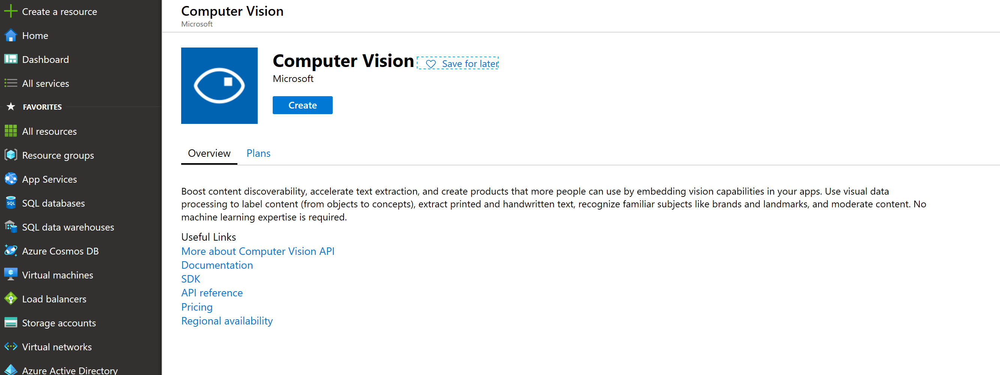

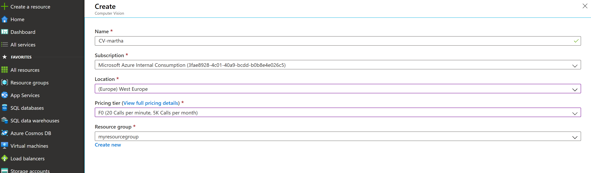

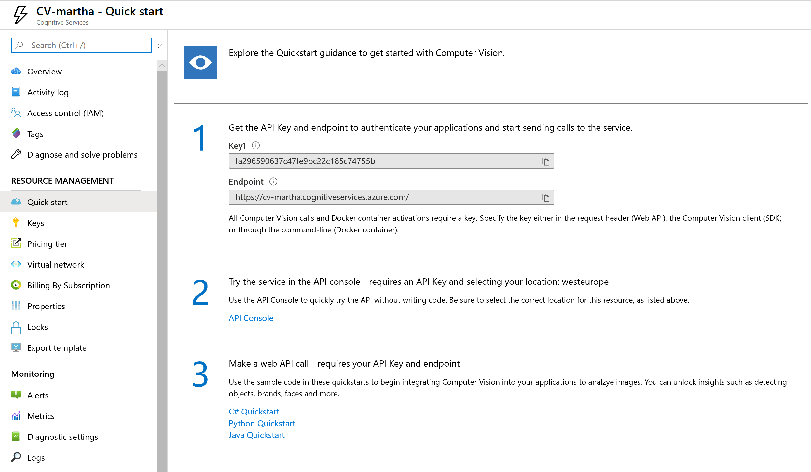


As we're dealing with images, we need a few Python packages to help with this:

```python
import requests, json, time
import matplotlib.pyplot as plt
from matplotlib.patches import Rectangle
from matplotlib.patches import Polygon
from PIL import Image
from io import BytesIO
```

Ok, now we can start recognizing some text. With the Computer Vision API, this is a two-step process:

1. Submit the image
1. Query if the image has been processed

```python
key = "xxxx" # Paste your API Key here!

url = "https://westeurope.api.cognitive.microsoft.com/vision/v2.0/recognizeText"
image_url = "https://upload.wikimedia.org/wikipedia/commons/thumb/d/dd/Cursive_Writing_on_Notebook_paper.jpg/800px-Cursive_Writing_on_Notebook_paper.jpg"

headers = {'Ocp-Apim-Subscription-Key': key}
params  = {'mode': 'Handwritten'}
data    = {'url': image_url}

# Post image URL to the API
response = requests.post(url, headers=headers, params=params, json=data)

# Return query URL for getting the status
operation_url = response.headers["Operation-Location"]

# Poll until we get a result (...or something failed)
recogntion = {}
poll = True
while (poll):
    response_final = requests.get(operation_url, headers=headers)
    recogntion = response_final.json()
    time.sleep(1)
    if ("recognitionResult" in recogntion):
        poll= False 
    if ("status" in recogntion and recogntion['status'] == 'Failed'):
        poll= False

print(json.dumps(recogntion, indent=2))
```
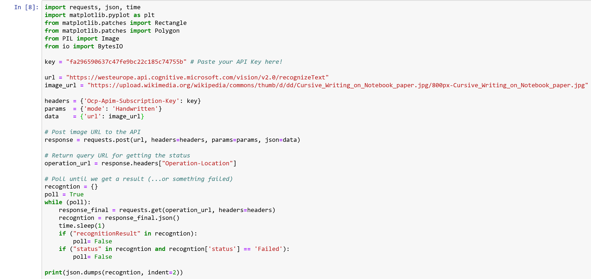

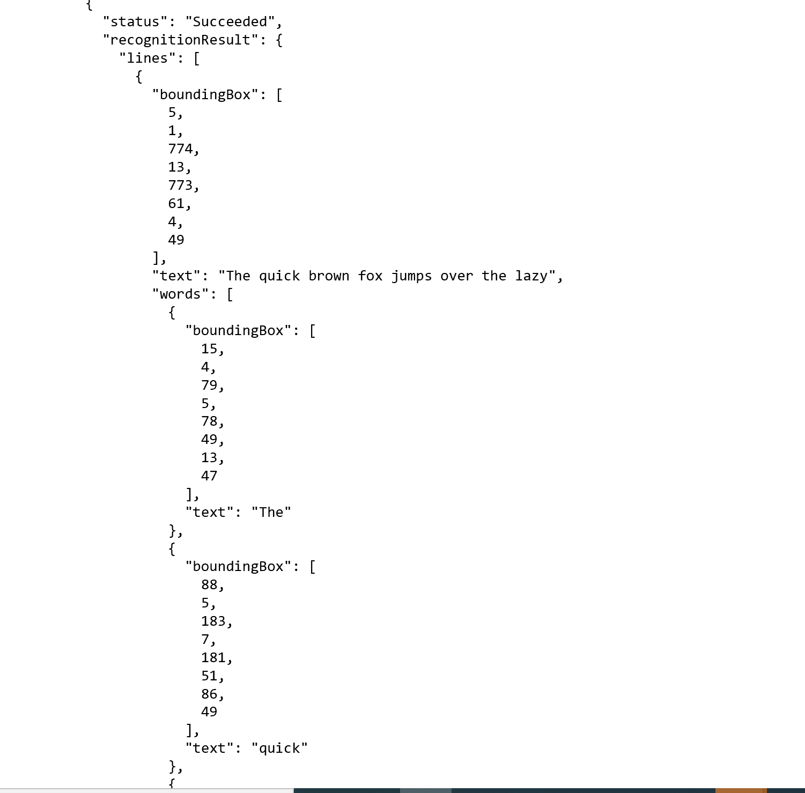

Ok, looks like it recognized something. Let's visualize it:

```python
polygons = []

# Get bounding boxes of the text 
if ("recognitionResult" in recogntion):
    polygons = [(line["boundingBox"], line["text"])
        for line in recogntion["recognitionResult"]["lines"]]

# Display image and overlay text
plt.figure(figsize=(15, 15))
image = Image.open(BytesIO(requests.get(image_url).content))
ax = plt.imshow(image)
for polygon in polygons:
    vertices = [(polygon[0][i], polygon[0][i+1])
        for i in range(0, len(polygon[0]), 2)]
    text = polygon[1]
    patch = Polygon(vertices, closed=True, fill=False, linewidth=2, color='y')
    ax.axes.add_patch(patch)
    plt.text(vertices[0][0], vertices[0][1], text, fontsize=20, va="top")
_ = plt.axis("off")
```

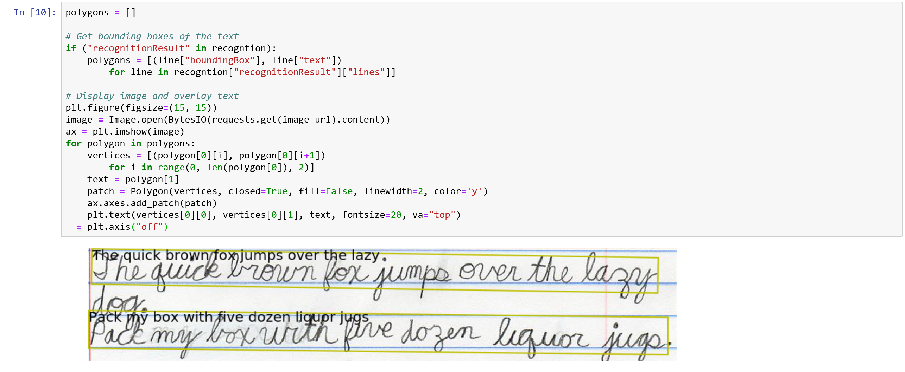

Here are two more images we can test with:

```
https://bootcamps.blob.core.windows.net/ml-test-images/ocr_handwritten_1.jpg
https://bootcamps.blob.core.windows.net/ml-test-images/ocr_handwritten_2.jpg
```

## Optical Character Recognition - Images to Text - Printed content

Extracting text from printed text in images is very similar - except that is a synchronous call, hence we directly get back the recognition result:

```python
key = "xxxx" # Paste your API Key here!

url = "https://westeurope.api.cognitive.microsoft.com/vision/v2.0/ocr"
image_url = "https://bootcamps.blob.core.windows.net/ml-test-images/ocr_printed_1.jpg"

headers = {'Ocp-Apim-Subscription-Key': key}
params  = {'language': 'unk', 'detectOrientation': 'true'}
data    = {'url': image_url}

response = requests.post(url, headers=headers, params=params, json=data)
recognition_result = response.json()

# Extract the word bounding boxes and text
line_infos = [region["lines"] for region in recognition_result["regions"]]
word_infos = []
for line in line_infos:
    for word_metadata in line:
        for word_info in word_metadata["words"]:
            word_infos.append(word_info)
word_infos

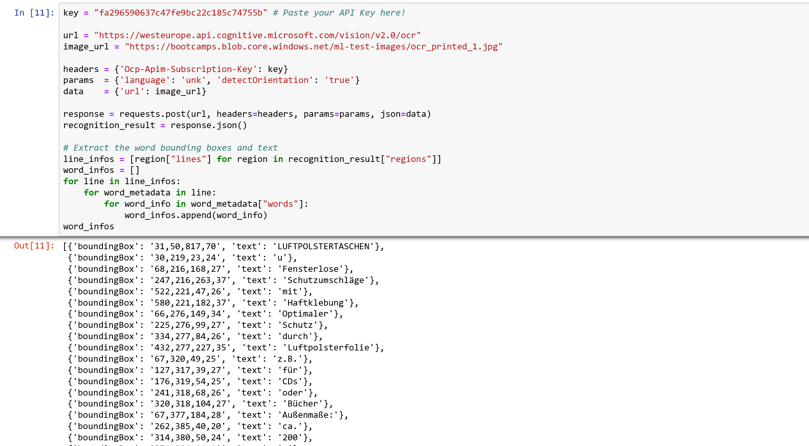

# Display the image and overlay it with the extracted text
plt.figure(figsize=(15, 15))
image = Image.open(BytesIO(requests.get(image_url).content))
ax = plt.imshow(image, alpha=0.5)
for word in word_infos:
    bbox = [int(num) for num in word["boundingBox"].split(",")]
    text = word["text"]
    origin = (bbox[0], bbox[1])
    patch  = Rectangle(origin, bbox[2], bbox[3], fill=False, linewidth=2, color='y')
    ax.axes.add_patch(patch)
    plt.text(origin[0], origin[1], text, fontsize=12, weight="bold", va="top")
plt.axis("off")
```

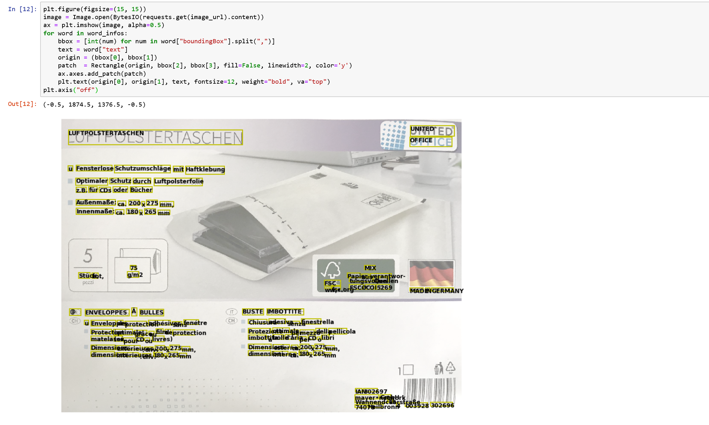

Here are two more images we can test with:

```
https://bootcamps.blob.core.windows.net/ml-test-images/ocr_printed_1.jpg
https://bootcamps.blob.core.windows.net/ml-test-images/ocr_printed_2.jpg
```

## Detecting Objects in Images

First, log in to [Custom Vision](https://www.customvision.ai/) with your Azure credentials.

Next, add all the training images from the [dataset](). Once added, we need to tag all the beer glasses in the images. If there are multiple glasses in one image, tag each one individually:

Once we've tagged all 15 images (that's the minimum), we can hit the `Train` button. After 1-2 minutes, we'll see the training statistics:

Let's briefly look at the results and make sure we understand them:

Sliders - they set the results given certain thresholds
* Probability Threshold: 82% - this means we only count detections with over 82% probability as beer glasses
* Overlap Threshold: 51% - this means we want our detection results overlap at least 51% with the ground truth in the training set

Results:
* Precision: 30% - given a detection, it is 30% correct on average (meaning the algorithm will also detect other objects as glasses)
* Recall: 100% - a recall of 100% means, it will detect all beer glasses (but maybe mistake some other objects as beer glasses too)
* mAP: 83.3% - mean average precision - the average how well our detection algorithm works 

Under `Quick Test`, we can briefly upload our testing images and see what the service will detect. As we only added 15 training images with a lot of variance, the results are not great yet. By adding more images, we could most likely improve the detection performance significantly.

If we go to the `Performance` tab, we can get the `Prediction URL` and the `Prediction-Key`. We can use this endpoint to programmatically access the service.

## Optional Reveal the intention of the text

For retrieving the intent of the text, we'll be using the Language Understanding service in Azure, called LUIS. In many cases, LUIS is used to power chatbots, but it can also be used for "standalone" processing of text. We could even use it for e.g., automatically analyzing emails and categorizing them, or figuring out what products and amounts are on an invoice.

Head to [`eu.luis.ai`](https://eu.luis.ai) and create a new LUIS app. As a base language, fell free to either choose German or English (English supports a few more features as of May 2019).

Quick explanation on how LUIS works:

* Under Intents, we'll define the "actions" we can to detect
* Under Entities, we'll define the "things" we want to extract from the intents
* Utterances are just examples that we'll use to train LUIS

Create two new intents:

* `CreateOrder`
* `DeleteOrder`

Then, add the utterances (our training examples) from the main page of this repository to the three intents.

Hit `Train`.

Once we hit `Test`, we can test if the systems is able to recognize the intent of our text. We'll notice that it is not working that well, hence we can add some more examples and re-train.

Next, we can try to detect `Entities` in our text inputs. For that, goto Entities and add a `Prebuilt Entity` with the type `Number`. This will automatically detect all numbers (e.g. the order number or amount of pizzas) in our text. Secondly, add a normal Entity `Pizza Type` with entity type `Simple` (ideally we could also use an entity and specify all possible Pizzas we sell). Lastly, add an entity of type `Composite` with the name `PizzaOrder` and add `Number` and `Pizza Type` as children.


As we can see, LUIS supports a range of entity types, like regex, lists, etc.

Finally, we can annotate our training examples. Numbers will automatically be detected (as it is a prebuilt type), but we need to tell LUIS, what `PizzaOrder` is. This is a bit tricky, first click the beginning of the composite entity (= the detected number) and select `Wrap as Composite Entity`, then directly click the last part of the entity (= the pizza type) and then select `PizzaOrder`. Then tag all pizza types inside the `PizzaOrder` as `Pizza Type`. The final tagging should look something like this (make sure the green line covers the whole phrase):


Hit `Train` again to give it a final training. Lastly, hit `Publish` and publish it to `Production`. Review the endpoints and copy the endpoint URL (can be found under `Manage` --> `Keys and Endpoints`). It should look something like this:

```
https://westeurope.api.cognitive.microsoft.com/luis/v2.0/apps/xxxxxx-xxxx-xxxx-xxxx-xxxxxxxx?subscription-key=xxxxxxx&timezoneOffset=-360&q=
```

With a bit of Python, we can now get the intent through the API:

```python
import requests, json

# Paste your Endpoint URL here
url = "https://westeurope.api.cognitive.microsoft.com/luis/v2.0/apps/xxxxxx-xxxx-xxxx-xxxx-xxxxxxxx?subscription-key=xxxxxxx&timezoneOffset=-360&q="

query = "ich hätte gerne 9 pizza calzone"

response = requests.get(url + query)
print(json.dumps(response.json(), indent=2))
```

The output should look something like this:

```json
{
  "query": "ich h\u00e4tte gerne 9 pizza calzone",
  "topScoringIntent": {
    "intent": "CreateOrder",
    "score": 0.414687634
  },
  "entities": [
    {
      "entity": "calzone",
      "type": "PizzaType",
      "startIndex": 24,
      "endIndex": 30,
      "score": 0.6114218
    },
    {
      "entity": "9 pizza calzone",
      "type": "PizzaOrder",
      "startIndex": 16,
      "endIndex": 30,
      "score": 0.6957668
    },
    {
      "entity": "9",
      "type": "builtin.number",
      "startIndex": 16,
      "endIndex": 16,
      "resolution": {
        "value": "9"
      }
    }
  ],
  "compositeEntities": [
    {
      "parentType": "PizzaOrder",
      "value": "9 pizza calzone",
      "children": [
        {
          "type": "PizzaType",
          "value": "calzone"
        },
        {
          "type": "builtin.number",
          "value": "9"
        }
      ]
    }
  ]
}
```

Excellent - Now we know what the user wants to order, and the associated quantities. :pizza: :pizza: :pizza:


## Play around with the: Intelligent Kiosk ##

Find the Sample on Github here: [Intelligent Kiosk](https://github.com/microsoft/Cognitive-Samples-IntelligentKiosk)