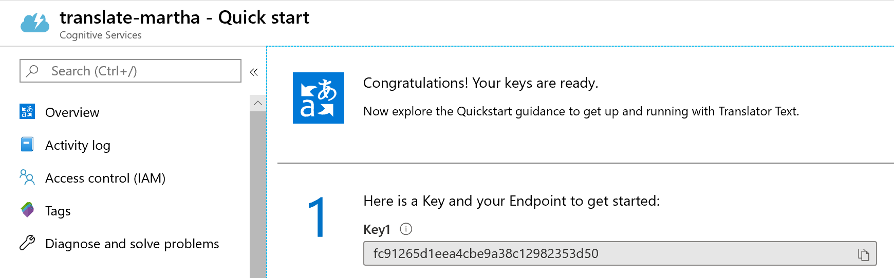

# Cognitive Services #

## Here is what you will learn ##

- Create and use the Text Analysis Cognitive Service
- Create and use the Translate Cognitive Service
- Create and use the  Computer Vision Service and integrate it into an Node.js App
- Create and use the Face Cognitive Service

# Create and use a Text Analysis Cognitive Service 

You can solve these tasks in a programming language of your choice. For sake of convenience, we are providing hints in `Python`, which you can easily (and for free) run in [Azure Notebooks](https://notebooks.azure.com). SDK Support for `C#` or `.NET Core` is available for most challenges. Especially Azure Search features an easy-to-use `.NET SDK`. You can find code examples in the Azure documentation for the associated services.

|Azure Cognitive Services|Information|
|---|---|
|[Text Analytics API](https://azure.microsoft.com/en-us/services/cognitive-services/text-analytics/)|https://docs.microsoft.com/en-us/azure/cognitive-services/text-analytics/quickstarts/python|


:triangular_flag_on_post: **Goal:** Leverage Text Analytics API for extracting language, sentiment, key phrases, and entities from text

In the language of your choice (Python solution is provided), write a small scripts that
[Text Analytics Service with Other Programming Languages](https://docs.microsoft.com/en-us/azure/cognitive-services/Text-Analytics/quickstarts/nodejs)

0. Go to the Azure Portal, create in **yourresourcegroup** a Text Analytics Service (in the `West Europe` region):


1. Extract sentiment, key phrases and entities from unstructured text using the [Text Analytics API](https://azure.microsoft.com/en-us/services/cognitive-services/text-analytics/)

## Detect language

The Language Detection API detects the language of a text document, using the [Detect Language method](https://westcentralus.dev.cognitive.microsoft.com/docs/services/TextAnalytics-v2-1/operations/56f30ceeeda5650db055a3c7).

1. Create a new Node.JS project in your favorite IDE or a folder on your desktop.
1. Add the code provided below to a new `.js` file.
1. Copy your key and endpoint into the code. 
1. Run the program from your IDE or command line, for example `npm start` or `node detect.js`.

```javascript
'use strict';

let https = require ('https');
subscription_key = "<paste-your-text-analytics-key-here>";
endpoint = "<paste-your-text-analytics-endpoint-here>";

let path = '/text/analytics/v2.1/languages';

let response_handler = function (response) {
    let body = '';
    response.on('data', function (d) {
        body += d;
    });
    response.on('end', function () {
        let body_ = JSON.parse(body);
        let body__ = JSON.stringify(body_, null, '  ');
        console.log(body__);
    });
    response.on('error', function (e) {
        console.log('Error: ' + e.message);
    });
};

let get_language = function (documents) {
    let body = JSON.stringify(documents);

    let request_params = {
        method: 'POST',
        hostname: (new URL(endpoint)).hostname,
        path: path,
        headers: {
            'Ocp-Apim-Subscription-Key': subscription_key,
        }
    };

    let req = https.request(request_params, response_handler);
    req.write(body);
    req.end();
}

let documents = {
    'documents': [
        { 'id': '1', 'text': 'This is a document written in English.' },
        { 'id': '2', 'text': 'Este es un document escrito en Español.' },
        { 'id': '3', 'text': '这是一个用中文写的文件' }
    ]
};

get_language(documents);
```

**Language detection response**

A successful response is returned in JSON, as shown in the following example: 

```json

{
   "documents": [
      {
         "id": "1",
         "detectedLanguages": [
            {
               "name": "English",
               "iso6391Name": "en",
               "score": 1.0
            }
         ]
      },
      {
         "id": "2",
         "detectedLanguages": [
            {
               "name": "Spanish",
               "iso6391Name": "es",
               "score": 1.0
            }
         ]
      },
      {
         "id": "3",
         "detectedLanguages": [
            {
               "name": "Chinese_Simplified",
               "iso6391Name": "zh_chs",
               "score": 1.0
            }
         ]
      }
   ],
   "errors": [

   ]
}


```
<a name="SentimentAnalysis"></a>

## Analyze sentiment

The Sentiment Analysis API detects the sentiment of a set of text records, using the [Sentiment method](https://westcentralus.dev.cognitive.microsoft.com/docs/services/TextAnalytics-v2-1/operations/56f30ceeeda5650db055a3c9). Sentiment analysis can be used to find out what customers think of your brand or topic by analyzing raw text for clues about positive or negative sentiment. The following example provides scores for two documents, one in English and another in Spanish.

1. Create a new Node.JS project in your favorite IDE or a folder on your desktop.
1. Add the code provided below to a new `.js` file.
1. Copy your Text Analytics key and endpoint into the code. 
1. Run the program from your IDE or command line, for example `npm start` or `node sentiment.js`.

```javascript
'use strict';

let https = require ('https');

subscription_key = "<paste-your-text-analytics-key-here>";
endpoint = "<paste-your-text-analytics-endpoint-here>";

let path = '/text/analytics/v2.1/sentiment';

let response_handler = function (response) {
    let body = '';
    response.on('data', function (d) {
        body += d;
    });
    response.on('end', function () {
        let body_ = JSON.parse(body);
        let body__ = JSON.stringify(body_, null, '  ');
        console.log(body__);
    });
    response.on('error', function (e) {
        console.log('Error: ' + e.message);
    });
};

let get_sentiments = function (documents) {
    let body = JSON.stringify(documents);

    let request_params = {
        method: 'POST',
        hostname: (new URL(endpoint)).hostname,
        path: path,
        headers: {
            'Ocp-Apim-Subscription-Key': subscription_key,
        }
    };

    let req = https.request(request_params, response_handler);
    req.write(body);
    req.end();
}

let documents = {
    'documents': [
        { 'id': '1', 'language': 'en', 'text': 'I really enjoy the new XBox One S. It has a clean look, it has 4K/HDR resolution and it is affordable.' },
        { 'id': '2', 'language': 'es', 'text': 'Este ha sido un dia terrible, llegué tarde al trabajo debido a un accidente automobilistico.' },
    ]
};

get_sentiments(documents);
```

**Sentiment analysis response**

The result is measured as positive if it's scored closer to 1.0 and negative if it's scored closer to 0.0.
A successful response is returned in JSON, as shown in the following example:

```json
{
   "documents": [
      {
         "score": 0.99984133243560791,
         "id": "1"
      },
      {
         "score": 0.024017512798309326,
         "id": "2"
      },
   ],
   "errors": [   ]
}
```

<a name="KeyPhraseExtraction"></a>

## Extract key phrases

The Key Phrase Extraction API extracts key-phrases from a text document, using the [Key Phrases method](https://westcentralus.dev.cognitive.microsoft.com/docs/services/TextAnalytics-v2-1/operations/56f30ceeeda5650db055a3c6). Key phrase extraction is used to quickly identify the main points of a document or text. The following example extracts key phrases for both English and Spanish documents.

1. Create a new Node.JS project in your favorite IDE or a folder on your desktop.
1. Add the code provided below to a new `.js` file.
1. Copy your Text Analytics key and endpoint into the code. 
1. Run the program from your IDE or command line, for example `npm start` or `node key-phrases.js`.

```javascript
'use strict';

let https = require ('https');

subscription_key = "<paste-your-text-analytics-key-here>";
endpoint = "<paste-your-text-analytics-endpoint-here>";

let path = '/text/analytics/v2.1/keyPhrases';

let response_handler = function (response) {
    let body = '';
    response.on('data', function (d) {
        body += d;
    });
    response.on('end', function () {
        let body_ = JSON.parse(body);
        let body__ = JSON.stringify(body_, null, '  ');
        console.log(body__);
    });
    response.on('error', function (e) {
        console.log('Error: ' + e.message);
    });
};

let get_key_phrases = function (documents) {
    let body = JSON.stringify(documents);

    let request_params = {
        method: 'POST',
        hostname: (new URL(endpoint)).hostname,
        path: path,
        headers: {
            'Ocp-Apim-Subscription-Key': subscription_key,
        }
    };

    let req = https.request(request_params, response_handler);
    req.write(body);
    req.end();
}

let documents = {
    'documents': [
        { 'id': '1', 'language': 'en', 'text': 'I really enjoy the new XBox One S. It has a clean look, it has 4K/HDR resolution and it is affordable.' },
        { 'id': '2', 'language': 'es', 'text': 'Si usted quiere comunicarse con Carlos, usted debe de llamarlo a su telefono movil. Carlos es muy responsable, pero necesita recibir una notificacion si hay algun problema.' },
        { 'id': '3', 'language': 'en', 'text': 'The Grand Hotel is a new hotel in the center of Seattle. It earned 5 stars in my review, and has the classiest decor I\'ve ever seen.' }
    ]
};

get_key_phrases(documents);
```

**Key phrase extraction response**

A successful response is returned in JSON, as shown in the following example: 

```json
{
   "documents": [
      {
         "keyPhrases": [
            "HDR resolution",
            "new XBox",
            "clean look"
         ],
         "id": "1"
      },
      {
         "keyPhrases": [
            "Carlos",
            "notificacion",
            "algun problema",
            "telefono movil"
         ],
         "id": "2"
      },
      {
         "keyPhrases": [
            "new hotel",
            "Grand Hotel",
            "review",
            "center of Seattle",
            "classiest decor",
            "stars"
         ],
         "id": "3"
      }
   ],
   "errors": [  ]
}
```

<a name="Entities"></a>

## Identify linked entities

The Entities API identifies well-known entities in a text document, using the [Entities method](https://westus.dev.cognitive.microsoft.com/docs/services/TextAnalytics-V2-1/operations/5ac4251d5b4ccd1554da7634). [Entities](https://docs.microsoft.com/azure/cognitive-services/text-analytics/how-tos/text-analytics-how-to-entity-linking) extract words from text, like "United States", then give you the type and/or Wikipedia link for this word(s). The type for "United States" is `location`, while the link to Wikipedia is `https://en.wikipedia.org/wiki/United_States`.  The following example identifies entities for English documents.

1. Create a new Node.JS project in your favorite IDE or a folder on your desktop.
1. Add the code provided below to a new `.js` file.
1. Copy your Text analytics key and endpoint into the code
1. Run the program from your IDE or command line, for example `npm start` or `node entities.js`.

```javascript
'use strict';

let https = require ('https');

subscription_key = "<paste-your-text-analytics-key-here>";
endpoint = "<paste-your-text-analytics-endpoint-here>";

let path = '/text/analytics/v2.1/entities';

let response_handler = function (response) {
    let body = '';
    response.on('data', function (d) {
        body += d;
    });
    response.on('end', function () {
        let body_ = JSON.parse(body);
        let body__ = JSON.stringify(body_, null, '  ');
        console.log(body__);
    });
    response.on('error', function (e) {
        console.log('Error: ' + e.message);
    });
};

let get_entities = function (documents) {
    let body = JSON.stringify(documents);

    let request_params = {
        method: 'POST',
        hostname: (new URL(endpoint)).hostname,
        path: path,
        headers: {
            'Ocp-Apim-Subscription-Key': subscription_key,
        }
    };

    let req = https.request(request_params, response_handler);
    req.write(body);
    req.end();
}

let documents = {
    'documents': [
        { 'id': '1', 'language': 'en', 'text': 'Microsoft is an It company.' }
    ]
};

get_entities(documents);
```

**Entity extraction response**

A successful response is returned in JSON, as shown in the following example:

```json
{  
   "documents":[  
      {  
         "id":"1",
         "entities":[  
            {  
               "name":"Microsoft",
               "matches":[  
                  {  
                     "wikipediaScore":0.20872054383103444,
                     "entityTypeScore":0.99996185302734375,
                     "text":"Microsoft",
                     "offset":0,
                     "length":9
                  }
               ],
               "wikipediaLanguage":"en",
               "wikipediaId":"Microsoft",
               "wikipediaUrl":"https://en.wikipedia.org/wiki/Microsoft",
               "bingId":"a093e9b9-90f5-a3d5-c4b8-5855e1b01f85",
               "type":"Organization"
            },
            {  
               "name":"Technology company",
               "matches":[  
                  {  
                     "wikipediaScore":0.82123868042800585,
                     "text":"It company",
                     "offset":16,
                     "length":10
                  }
               ],
               "wikipediaLanguage":"en",
               "wikipediaId":"Technology company",
               "wikipediaUrl":"https://en.wikipedia.org/wiki/Technology_company",
               "bingId":"bc30426e-22ae-7a35-f24b-454722a47d8f"
            }
         ]
      }
   ],
    "errors":[]
}
```

# Create and use the Translate Cognitive Service

## Create a project and import required modules

Create the Translate Service in the Portal:


Create a new project using your favorite IDE or editor, or a new folder with a file named  `translate-text.js` on your desktop. Then copy this code snippet into your project/file:

```javascript
const request = require('request');
const uuidv4 = require('uuid/v4');
```

If you haven't used these modules you'll need to install them before running your program. To install these packages, run: `npm install request uuidv4`.

These modules are required to construct the HTTP request, and create a unique identifier for the `'X-ClientTraceId'` header.

## Set the subscription key and endpoint

This sample will try to read your Translator Text subscription key and endpoint from these environment variables: `TRANSLATOR_TEXT_SUBSCRIPTION_KEY` and `TRANSLATOR_TEXT_ENDPOINT`. If you're not familiar with environment variables, you can set `subscriptionKey` and `endpoint` as strings and comment out the conditional statements.

Copy this code into your project:

```javascript
var key_var = 'TRANSLATOR_TEXT_SUBSCRIPTION_KEY';
if (!process.env[key_var]) {
    throw new Error('Please set/export the following environment variable: ' + key_var);
}
var subscriptionKey = process.env[key_var];
var endpoint_var = 'TRANSLATOR_TEXT_ENDPOINT';
if (!process.env[endpoint_var]) {
    throw new Error('Please set/export the following environment variable: ' + endpoint_var);
}
var endpoint = process.env[endpoint_var];
```

## Configure the request

The `request()` method, made available through the request module, allows us to pass the HTTP method, URL, request params, headers, and the JSON body as an `options` object. In this code snippet, we'll configure the request:

For more information about endpoints, routes, and request parameters, see [Translator Text API 3.0: Translate](https://docs.microsoft.com/azure/cognitive-services/translator/reference/v3-0-translate).

```javascript
let options = {
    method: 'POST',
    baseUrl: endpoint,
    url: 'translate',
    qs: {
      'api-version': '3.0',
      'to': ['de', 'it']
    },
    headers: {
      'Ocp-Apim-Subscription-Key': subscriptionKey,
      'Content-type': 'application/json',
      'X-ClientTraceId': uuidv4().toString()
    },
    body: [{
          'text': 'Hello World!'
    }],
    json: true,
};
```

The easiest way to authenticate a request is to pass in your subscription key as an
`Ocp-Apim-Subscription-Key` header, which is what we use in this sample. As an alternative, you can exchange your subscription key for an access token, and pass the access token along as an `Authorization` header to validate your request.

If you are using a Cognitive Services multi-service subscription, you must also include the `Ocp-Apim-Subscription-Region` in your request headers.

For more information, see [Authentication](https://docs.microsoft.com/azure/cognitive-services/translator/reference/v3-0-reference#authentication).

## Make the request and print the response

Next, we'll create the request using the `request()` method. It takes the `options` object that we created in the previous section as the first argument, then prints the prettified JSON response.

```javascript
request(options, function(err, res, body){
    console.log(JSON.stringify(body, null, 4));
});
```

In this sample, we're defining the HTTP request in the `options` object. However, the request module also supports convenience methods, like `.post` and `.get`. For more information, see [convenience methods](https://github.com/request/request#convenience-methods).

## Put it all together

That's it, you've put together a simple program that will call the Translator Text API and return a JSON response. Now it's time to run your program:

```console
node translate-text.js
```

If you'd like to compare your code against ours, the complete sample is available on [GitHub](https://github.com/MicrosoftTranslator/Text-Translation-API-V3-NodeJS).

## Sample response

```json
[
    {
        "detectedLanguage": {
            "language": "en",
            "score": 1.0
        },
        "translations": [
            {
                "text": "Hallo Welt!",
                "to": "de"
            },
            {
                "text": "Salve, mondo!",
                "to": "it"
            }
        ]
    }
]
```

# Create and use the  Computer Vision Service and integrate it into an Node.js App

## Computer Vision client library for Node.js

Get started with the Computer Vision client library for Node.js. Follow these steps to install the package and try out the example code for basic tasks. 

Use the Computer Vision client library for Node.js to:

* [Analyze an image](#analyze-an-image)
* [Read printed and handwritten text](#read-printed-and-handwritten-text)

[Reference documentation](https://docs.microsoft.com/javascript/api/@azure/cognitiveservices-computervision/?view=azure-node-latest) | [Library source code](https://github.com/Azure/azure-sdk-for-js/tree/master/sdk/cognitiveservices/cognitiveservices-computervision) | [Package (npm)](https://www.npmjs.com/package/azure-cognitiveservices-computervision) | [Samples](https://azure.microsoft.com/resources/samples/?service=cognitive-services&term=vision&sort=0)

## Prerequisites

* Azure subscription - [Create one for free](https://azure.microsoft.com/free/)
* The current version of [Node.js](https://nodejs.org/)

## Setting up

### Create a Computer Vision Azure resource

Azure Cognitive Services are represented by Azure resources that you subscribe to. Create a resource for Computer Vision using the [Azure portal](https://docs.microsoft.com/azure/cognitive-services/cognitive-services-apis-create-account) or [Azure CLI](https://docs.microsoft.com/azure/cognitive-services/cognitive-services-apis-create-account-cli) on your local machine. 

First, create a `Computer Vision` Service in **YourResourceGroup** in the Azure Portal


You can also:

* Get a [trial key](https://azure.microsoft.com/try/cognitive-services/#decision) valid for seven days for free. After you sign up, it will be available on the [Azure website](https://azure.microsoft.com/try/cognitive-services/my-apis/).  
* View your resource on the [Azure portal](https://portal.azure.com/).

After you get a key from your trial subscription or resource, [create environment variables](https://docs.microsoft.com/azure/cognitive-services/cognitive-services-apis-create-account#configure-an-environment-variable-for-authentication) for the key and endpoint URL, named `COMPUTER_VISION_SUBSCRIPTION_KEY` and `COMPUTER_VISION_ENDPOINT` respectively.
 
### Create a new Node.js application

In a console window (such as cmd, PowerShell, or Bash), create a new directory for your app, and navigate to it. 

```console
mkdir myapp && cd myapp
```

Run the `npm init` command to create a node application with a `package.json` file. 

```console
npm init
```

### Install the client library

Install the `ms-rest-azure` and `azure-cognitiveservices-computervision` NPM packages:

```console
npm install @azure/cognitiveservices-computervision
```

Your app's `package.json` file will be updated with the dependencies.

### Prepare the Node.js script

Create a new file, *index.js*, and open it in a text editor. Add the following import statements.

[!code-javascript[](~/cognitive-services-quickstart-code/javascript/ComputerVision/ComputerVisionQuickstart.js?name=snippet_imports)]

Then, define a function `computerVision` and declare an async series with primary function and callback function. You will add your quickstart code into the primary function, and call `computerVision` at the bottom of the script.

[!code-javascript[](~/cognitive-services-quickstart-code/javascript/ComputerVision/ComputerVisionQuickstart.js?name=snippet_functiondef_begin)]

[!code-javascript[](~/cognitive-services-quickstart-code/javascript/ComputerVision/ComputerVisionQuickstart.js?name=snippet_functiondef_end)]

## Object model

The following classes and interfaces handle some of the major features of the Computer Vision Node.js SDK.

|Name|Description|
|---|---|
| [ComputerVisionClient](https://docs.microsoft.com/javascript/api/@azure/cognitiveservices-computervision/computervisionclient?view=azure-node-latest) | This class is needed for all Computer Vision functionality. You instantiate it with your subscription information, and you use it to do most image operations.|
|[VisualFeatureTypes](https://docs.microsoft.com/javascript/api/@azure/cognitiveservices-computervision/visualfeaturetypes?view=azure-node-latest)| This enum defines the different types of image analysis that can be done in a standard Analyze operation. You specify a set of **VisualFeatureTypes** values depending on your needs. |

## Code examples

These code snippets show you how to do the following tasks with the Computer Vision client library for Node.js:

* [Authenticate the client](#authenticate-the-client)
* [Analyze an image](#analyze-an-image)
* [Read printed and handwritten text](#read-printed-and-handwritten-text)

## Authenticate the client

Create variables for your resource's Azure endpoint and key. If you created the environment variable after you launched the application, you will need to close and reopen the editor, IDE, or shell running it to access the variable.

```
/**
 * AUTHENTICATE
 * This single client is used for all examples.
 */
let key = process.env['COMPUTER_VISION_SUBSCRIPTION_KEY'];
let endpoint = process.env['COMPUTER_VISION_ENDPOINT']
if (!key) { throw new Error('Set your environment variables for your subscription key and endpoint.'); }
```

Instantiate a client with your endpoint and key. Create a [ApiKeyCredentials](https://docs.microsoft.com/python/api/msrest/msrest.authentication.apikeycredentials?view=azure-python) object with your key and endpoint, and use it to create a [ComputerVisionClient](https://docs.microsoft.com/javascript/api/@azure/cognitiveservices-computervision/computervisionclient?view=azure-node-latest) object.

```
let computerVisionClient = new ComputerVisionClient(
    new ApiKeyCredentials({inHeader: {'Ocp-Apim-Subscription-Key': key}}), endpoint);
```
## Analyze an image

The code in this section analyzes remote images to extract various visual features. You can do these operations as part of the **analyzeImage** method of the client object, or you can call them using individual methods. See the [reference documentation](https://docs.microsoft.com/javascript/api/@azure/cognitiveservices-computervision/?view=azure-node-latest) for details.


You can also analyze a local image. See the sample code on [GitHub](https://github.com/Azure-Samples/cognitive-services-quickstart-code/blob/master/javascript/ComputerVision/ComputerVisionQuickstart.js) for scenarios involving local images.

### Get image description

The following code gets the list of generated captions for the image. See [Describe images](../concept-describing-images.md) for more details.

First, define the URL of an image to analyze:

```
var describeURL = 'https://moderatorsampleimages.blob.core.windows.net/samples/sample1.jpg';
```
Then add the following code to get the image description and print it to the console.

```
// Analyze URL image
console.log('Analyzing URL image to describe...', describeURL.split('/').pop());
var caption = (await computerVisionClient.describeImage(describeURL)).captions[0];
console.log(`This may be ${caption.text} (${caption.confidence.toFixed(2)} confidence)`);
```

### Get image category

The following code gets the detected category of the image. See [Categorize images](../concept-categorizing-images.md) for more details.

```
const categoryURLImage = 'https://moderatorsampleimages.blob.core.windows.net/samples/sample16.png';

// Analyze URL image
console.log('Analyzing category in image...', categoryURLImage.split('/').pop());
let categories = (await computerVisionClient.analyzeImage(categoryURLImage)).categories;
console.log(`Categories: ${formatCategories(categories)}`);
```

Define the helper function `formatCategories`:

```
// Formats the image categories
function formatCategories(categories) {
  categories.sort((a, b) => b.score - a.score);
  return categories.map(cat => `${cat.name} (${cat.score.toFixed(2)})`).join(', ');
}
```

### Get image tags

The following code gets the set of detected tags in the image. See [Content tags](../concept-tagging-images.md) for more details.

```
console.log('-------------------------------------------------');
console.log('DETECT TAGS');
console.log();

// Image of different kind of dog.
const tagsURL = 'https://moderatorsampleimages.blob.core.windows.net/samples/sample16.png';

// Analyze URL image
console.log('Analyzing tags in image...', tagsURL.split('/').pop());
let tags = (await computerVisionClient.analyzeImage(tagsURL, {visualFeatures: ['Tags']})).tags;
console.log(`Tags: ${formatTags(tags)}`);
```

Define the helper function `formatTags`:

```
// Format tags for display
function formatTags(tags) {
  return tags.map(tag => (`${tag.name} (${tag.confidence.toFixed(2)})`)).join(', ');
}
```

### Detect objects

The following code detects common objects in the image and prints them to the console. See [Object detection](../concept-object-detection.md) for more details.

```
// Image of a dog
const objectURL = 'https://raw.githubusercontent.com/Azure-Samples/cognitive-services-node-sdk-samples/master/Data/image.jpg';

// Analyze a URL image
console.log('Analyzing objects in image...', objectURL.split('/').pop());
let objects = (await computerVisionClient.analyzeImage(objectURL, {visualFeatures: ['Objects']})).objects;
console.log();

// Print objects bounding box and confidence
if (objects.length) {
    console.log(`${objects.length} object${objects.length == 1 ? '' : 's'} found:`);
    for (let obj of objects) { console.log(`    ${obj.object} (${obj.confidence.toFixed(2)}) at ${formatRectObjects(obj.rectangle)}`); }
} else { console.log('No objects found.'); }
```

Define the helper function `formatRectObjects`:

```
// Formats the bounding box
function formatRectObjects(rect) {
  return `top=${rect.y}`.padEnd(10) + `left=${rect.x}`.padEnd(10) + `bottom=${rect.y + rect.h}`.padEnd(12) 
  + `right=${rect.x + rect.w}`.padEnd(10) + `(${rect.w}x${rect.h})`;
}
```

### Detect brands

The following code detects corporate brands and logos in the image and prints them to the console. See [Brand detection](../concept-brand-detection.md) for more details.

```
const brandURLImage = 'https://docs.microsoft.com/en-us/azure/cognitive-services/computer-vision/images/red-shirt-logo.jpg';

// Analyze URL image
console.log('Analyzing brands in image...', brandURLImage.split('/').pop());
let brands = (await computerVisionClient.analyzeImage(brandURLImage, {visualFeatures: ['Brands']})).brands;

// Print the brands found
if (brands.length) {
    console.log(`${brands.length} brand${brands.length != 1 ? 's' : ''} found:`);
    for (let brand of brands) {
        console.log(`    ${brand.name} (${brand.confidence.toFixed(2)} confidence)`);
    }
} else { console.log(`No brands found.`); }
```

### Detect faces

The following code returns the detected faces in the image with their rectangle coordinates and select face attributes. See [Face detection](../concept-detecting-faces.md) for more details.

```
const facesImageURL = 'https://raw.githubusercontent.com/Azure-Samples/cognitive-services-sample-data-files/master/ComputerVision/Images/faces.jpg';

// Analyze URL image.
console.log('Analyzing faces in image...', facesImageURL.split('/').pop());
// Get the visual feature for 'Faces' only.
let faces = (await computerVisionClient.analyzeImage(facesImageURL, {visualFeatures: ['Faces']})).faces;

// Print the bounding box, gender, and age from the faces.
if (faces.length) {
  console.log(`${faces.length} face${faces.length == 1 ? '' : 's'} found:`);
  for (let face of faces) { console.log(`    Gender: ${face.gender}`.padEnd(20) 
    + ` Age: ${face.age}`.padEnd(10) + `at ${formatRectFaces(face.faceRectangle)}`); }
} else { console.log('No faces found.'); }
```
Define the helper function `formatRectFaces`:

```
// Formats the bounding box
function formatRectFaces(rect) {
  return `top=${rect.top}`.padEnd(10) + `left=${rect.left}`.padEnd(10) + `bottom=${rect.top + rect.height}`.padEnd(12) 
    + `right=${rect.left + rect.width}`.padEnd(10) + `(${rect.width}x${rect.height})`;
}
```

### Detect adult, racy, or gory content

The following code prints the detected presence of adult content in the image. See [Adult, racy, gory content](../concept-detecting-adult-content.md) for more details.

Define the URL of the image to use:

```
// The URL image and local images are not racy/adult. 
// Try your own racy/adult images for a more effective result.
const adultURLImage = 'https://raw.githubusercontent.com/Azure-Samples/cognitive-services-sample-data-files/master/ComputerVision/Images/celebrities.jpg';
```

Then add the following code to detect adult content and print the results to the console.

```
// Function to confirm racy or not
const isIt = flag => flag ? 'is' : "isn't";

// Analyze URL image
console.log('Analyzing image for racy/adult content...', adultURLImage.split('/').pop());
var adult = (await computerVisionClient.analyzeImage(adultURLImage, {
  visualFeatures: ['Adult']
})).adult;
console.log(`This probably ${isIt(adult.isAdultContent)} adult content (${adult.adultScore.toFixed(4)} score)`);
console.log(`This probably ${isIt(adult.isRacyContent)} racy content (${adult.racyScore.toFixed(4)} score)`);
```

### Get image color scheme

The following code prints the detected color attributes in the image, like the dominant colors and accent color. See [Color schemes](../concept-detecting-color-schemes.md) for more details.

```
const colorURLImage = 'https://raw.githubusercontent.com/Azure-Samples/cognitive-services-sample-data-files/master/ComputerVision/Images/celebrities.jpg';

// Analyze URL image
console.log('Analyzing image for color scheme...', colorURLImage.split('/').pop());
console.log();
let color = (await computerVisionClient.analyzeImage(colorURLImage, {visualFeatures: ['Color']})).color;
printColorScheme(color);
```

Define the helper function `printColorScheme` to print the details of the color scheme to the console.

```
// Print a detected color scheme
function printColorScheme(colors){
  console.log(`Image is in ${colors.isBwImg ? 'black and white' : 'color'}`);
  console.log(`Dominant colors: ${colors.dominantColors.join(', ')}`);
  console.log(`Dominant foreground color: ${colors.dominantColorForeground}`);
  console.log(`Dominant background color: ${colors.dominantColorBackground}`);
  console.log(`Suggested accent color: #${colors.accentColor}`);
}
```

### Get domain-specific content

Computer Vision can use specialized model to do further analysis on images. See [Domain-specific content](../concept-detecting-domain-content.md) for more details. 

First, define the URL of an image to analyze:

```
const domainURLImage = 'https://raw.githubusercontent.com/Azure-Samples/cognitive-services-sample-data-files/master/ComputerVision/Images/landmark.jpg';
```

The following code parses data about detected landmarks in the image.

```
// Analyze URL image
console.log('Analyzing image for landmarks...', domainURLImage.split('/').pop());
let domain = (await computerVisionClient.analyzeImageByDomain('landmarks', domainURLImage)).result.landmarks;

// Prints domain-specific, recognized objects
if (domain.length) {
  console.log(`${domain.length} ${domain.length == 1 ? 'landmark' : 'landmarks'} found:`);
  for (let obj of domain) {
    console.log(`    ${obj.name}`.padEnd(20) + `(${obj.confidence.toFixed(2)} confidence)`.padEnd(20) + `${formatRectDomain(obj.faceRectangle)}`);
  }
} else {
  console.log('No landmarks found.');
}
```
Define the helper function `formatRectDomain` to parse the location data about detected landmarks.

```
// Formats bounding box
function formatRectDomain(rect) {
  if (!rect) return '';
  return `top=${rect.top}`.padEnd(10) + `left=${rect.left}`.padEnd(10) + `bottom=${rect.top + rect.height}`.padEnd(12) +
    `right=${rect.left + rect.width}`.padEnd(10) + `(${rect.width}x${rect.height})`;
}
```
### Get the image type

The following code prints information about the type of image&mdash;whether it is clip art or line drawing.

```
const typeURLImage = 'https://raw.githubusercontent.com/Azure-Samples/cognitive-services-python-sdk-samples/master/samples/vision/images/make_things_happen.jpg';

 // Analyze URL image
console.log('Analyzing type in image...', typeURLImage.split('/').pop());
let types = (await computerVisionClient.analyzeImage(typeURLImage, {visualFeatures: ['ImageType']})).imageType;
console.log(`Image appears to be ${describeType(types)}`);
```
Define the helper function `describeType`:

```
function describeType(imageType) {
  if (imageType.clipArtType && imageType.clipArtType > imageType.lineDrawingType) return 'clip art';
  if (imageType.lineDrawingType && imageType.clipArtType < imageType.lineDrawingType) return 'a line drawing';
  return 'a photograph';
}
```

## Read printed and handwritten text

Computer Vision can read visible text in an image and convert it to a character stream.

You can also read text from a local image. See the sample code on [GitHub](https://github.com/Azure-Samples/cognitive-services-quickstart-code/blob/master/javascript/ComputerVision/ComputerVisionQuickstart.js) for scenarios involving local images.

### Set up test images

Save a reference of the URL of the images you want to extract text from.

```
// URL images containing printed and handwritten text
 const printedText     = 'https://moderatorsampleimages.blob.core.windows.net/samples/sample2.jpg';
 const handwrittenText = 'https://raw.githubusercontent.com/Azure-Samples/cognitive-services-sample-data-files/master/ComputerVision/Images/handwritten_text.jpg';
```

### Call the Recognize API

Add the code below, which calls the `recognizeText` function for the given images.

```
// Recognize text in printed image
console.log('Recognizing printed text...', printedText.split('/').pop());
var printed = await recognizeText(computerVisionClient, 'Printed', printedText);
printRecText(printed);

// Recognize text in handwritten image
console.log('\nRecognizing handwritten text...', handwrittenText.split('/').pop());
var handwriting = await recognizeText(computerVisionClient, 'Handwritten', handwrittenText);
printRecText(handwriting);
```

Define the `recognizeText` function. This calls the **recognizeText** method on the client object, which returns an operation ID and starts an asynchronous process to read the content of the image. Then it uses the operation ID to check the operation at one-second intervals until the results are returned. It then returns the extracted results.

```
// Perform text recognition and await the result
async function recognizeText(client, mode, url) {
  // To recognize text in a local image, replace client.recognizeText() with recognizeTextInStream() as shown:
  // result = await client.recognizeTextInStream(mode, () => createReadStream(localImagePath));
  let result = await client.recognizeText(mode, url);
  // Operation ID is last path segment of operationLocation (a URL)
  let operation = result.operationLocation.split('/').slice(-1)[0];

  // Wait for text recognition to complete
  // result.status is initially undefined, since it's the result of recognizeText
  while (result.status !== 'Succeeded') { await sleep(1000); result = await client.getTextOperationResult(operation); }
  return result.recognitionResult;
}
```

Then, define the helper function `printRecText`, which prints the results of a Recognize operation to the console.

```
// Prints all text from OCR result
function printRecText(ocr) {
  if (ocr.lines.length) {
      console.log('Recognized text:');
      for (let line of ocr.lines) {
          console.log(line.words.map(w => w.text).join(' '));
      }
  }
  else { console.log('No recognized text.'); }
}
```

## Run the application

Run the application with the `node` command on your quickstart file.

```console
node index.js
```

# Create and run the Face Cognitive Services using Node.js

0. Deploy a Face Api Service in the Portal


1. Copy the following code into Visual Studio Code.
2. Make the following changes in code where needed:
    1. Replace the value of `subscriptionKey` with your subscription key.
    2. Edit the value of `uriBase` to include the endpoint URL for your Face API resource.
    3. Optionally, replace the value of `imageUrl` with the URL of a different image that you want to analyze.
3. Save the code as a file with an `.js` extension. For example, `detect-face.js`.
4. Open a command Terminal window (at the top of Visual Studio Code).

## Set up the Node environment
Then install the `requests` module to this project. This allows your scripts to make HTTP requests.

```shell
npm install request --save
```

## Write the Node.js script in detect-face.js

```javascript
'use strict';

const request = require('request');

// Replace <Subscription Key> with your valid subscription key.
const subscriptionKey = '<Subscription Key>';

// You must use the same location in your REST call as you used to get your
// subscription keys. For example, if you got your subscription keys from
// westus, replace "westcentralus" in the URL below with "westus".
const uriBase = 'https://<My Endpoint String>.com/face/v1.0/detect';

const imageUrl =
    'https://upload.wikimedia.org/wikipedia/commons/3/37/Dagestani_man_and_woman.jpg';
```

Then, add the following code to call the Face API and get face attribute data from the input image. The `returnFaceAttributes` field specifies which face attributes to retrieve. You may wish to change this string depending on your intended use.


```javascript
// Request parameters.
const params = {
    'returnFaceId': 'true',
    'returnFaceLandmarks': 'false',
    'returnFaceAttributes': 'age,gender,headPose,smile,facialHair,glasses,' +
        'emotion,hair,makeup,occlusion,accessories,blur,exposure,noise'
};

const options = {
    uri: uriBase,
    qs: params,
    body: '{"url": ' + '"' + imageUrl + '"}',
    headers: {
        'Content-Type': 'application/json',
        'Ocp-Apim-Subscription-Key' : subscriptionKey
    }
};

request.post(options, (error, response, body) => {
  if (error) {
    console.log('Error: ', error);
    return;
  }
  let jsonResponse = JSON.stringify(JSON.parse(body), null, '  ');
  console.log('JSON Response\n');
  console.log(jsonResponse);
});
```

## Save and run the script

After you've made your changes, open a command prompt and run the file with the `node` command.

```
node detect-face.js
```

You should see the face information displayed as JSON data in the console window. For example:

```json
[
  {
    "faceId": "ae8952c1-7b5e-4a5a-a330-a6aa351262c9",
    "faceRectangle": {
      "top": 621,
      "left": 616,
      "width": 195,
      "height": 195
    },
    "faceAttributes": {
      "smile": 0,
      "headPose": {
        "pitch": 0,
        "roll": 6.8,
        "yaw": 3.7
      },
      "gender": "male",
      "age": 37,
      "facialHair": {
        "moustache": 0.4,
        "beard": 0.4,
        "sideburns": 0.1
      },
      "glasses": "NoGlasses",
      "emotion": {
        "anger": 0,
        "contempt": 0,
        "disgust": 0,
        "fear": 0,
        "happiness": 0,
        "neutral": 0.999,
        "sadness": 0.001,
        "surprise": 0
      },
      "blur": {
        "blurLevel": "high",
        "value": 0.89
      },
      "exposure": {
        "exposureLevel": "goodExposure",
        "value": 0.51
      },
      "noise": {
        "noiseLevel": "medium",
        "value": 0.59
      },
      "makeup": {
        "eyeMakeup": true,
        "lipMakeup": false
      },
      "accessories": [],
      "occlusion": {
        "foreheadOccluded": false,
        "eyeOccluded": false,
        "mouthOccluded": false
      },
      "hair": {
        "bald": 0.04,
        "invisible": false,
        "hairColor": [
          {
            "color": "black",
            "confidence": 0.98
          },
          {
            "color": "brown",
            "confidence": 0.87
          },
          {
            "color": "gray",
            "confidence": 0.85
          },
          {
            "color": "other",
            "confidence": 0.25
          },
          {
            "color": "blond",
            "confidence": 0.07
          },
          {
            "color": "red",
            "confidence": 0.02
          }
        ]
      }
    }
  },
  {
    "faceId": "b1bb3cbe-5a73-4f8d-96c8-836a5aca9415",
    "faceRectangle": {
      "top": 693,
      "left": 1503,
      "width": 180,
      "height": 180
    },
    "faceAttributes": {
      "smile": 0.003,
      "headPose": {
        "pitch": 0,
        "roll": 2,
        "yaw": -2.2
      },
      "gender": "female",
      "age": 56,
      "facialHair": {
        "moustache": 0,
        "beard": 0,
        "sideburns": 0
      },
      "glasses": "NoGlasses",
      "emotion": {
        "anger": 0,
        "contempt": 0.001,
        "disgust": 0,
        "fear": 0,
        "happiness": 0.003,
        "neutral": 0.984,
        "sadness": 0.011,
        "surprise": 0
      },
      "blur": {
        "blurLevel": "high",
        "value": 0.83
      },
      "exposure": {
        "exposureLevel": "goodExposure",
        "value": 0.41
      },
      "noise": {
        "noiseLevel": "high",
        "value": 0.76
      },
      "makeup": {
        "eyeMakeup": false,
        "lipMakeup": false
      },
      "accessories": [],
      "occlusion": {
        "foreheadOccluded": false,
        "eyeOccluded": false,
        "mouthOccluded": false
      },
      "hair": {
        "bald": 0.06,
        "invisible": false,
        "hairColor": [
          {
            "color": "black",
            "confidence": 0.99
          },
          {
            "color": "gray",
            "confidence": 0.89
          },
          {
            "color": "other",
            "confidence": 0.64
          },
          {
            "color": "brown",
            "confidence": 0.34
          },
          {
            "color": "blond",
            "confidence": 0.07
          },
          {
            "color": "red",
            "confidence": 0.03
          }
        ]
      }
    }
  }
]
```

# House Keeping: Lab Cleanup

### Use Azure CLI to Delete Resource Group

1. In the **Cloud Shell** command prompt at the bottom of the portal, type in the following command and press **Enter** to list all resource groups in the subscription:

    ```sh
    az group list
    ```

2. Type in the following command and press **Enter** to delete the **yourResourceGroup** *Resource Group*:

    ```sh
    az group delete --name "yourResourceGroup" --no-wait --yes
    ```

3. Close the **Cloud Shell** prompt at the bottom of the portal.

4. Close your browser application.

# Optional: Play around with the: Intelligent Kiosk 

Find the Sample on Github here: [Intelligent Kiosk](https://github.com/microsoft/Cognitive-Samples-IntelligentKiosk)

# Optional: For those who want to get to know Python 

Sign into [Azure Notebooks](https://notebooks.azure.com/) and create a new Project in:


Create a new `Python 3.6 Notebook` in [Azure Notebooks](https://notebooks.azure.com/).


Let's start with connecting to your Text Analytics Service. Get the Key and the URL from the Azure portal :

```python
import requests
from pprint import pprint

subscription_key = "xxx" # Paste your API key here
text_analytics_base_url = "xxx" # Paste your URL in here
headers = {"Ocp-Apim-Subscription-Key": subscription_key}
```


## Detect Language

Firstly, we can extract the language from text. Run this in your Azure Notebook:

```python
language_api_url = text_analytics_base_url + "/text/analytics/v2.1/languages"

documents = { "documents": [
    { "id": "1", "text": "This is a document written in English." },
    { "id": "2", "text": "Este es un document escrito en Español." },
    { "id": "3", "text": "这是一个用中文写的文件" }
]}

response  = requests.post(language_api_url, headers=headers, json=documents)
languages = response.json()
pprint(languages)
```
Your result should look like this: 


## Detect Sentiment

Secondly, we can detect the sentiment of a given phrase:

```python
sentiment_url = text_analytics_base_url + "/text/analytics/v2.1/sentiment"

documents = {"documents" : [
  {"id": "1", "language": "en", "text": "I had a wonderful experience! The rooms were wonderful and the staff was helpful."},
  {"id": "2", "language": "en", "text": "I had a terrible time at the hotel. The staff was rude and the food was awful."},  
  {"id": "3", "language": "es", "text": "Los caminos que llevan hasta Monte Rainier son espectaculares y hermosos."},  
  {"id": "4", "language": "es", "text": "La carretera estaba atascada. Había mucho tráfico el día de ayer."}
]}

response  = requests.post(sentiment_url, headers=headers, json=documents)
sentiments = response.json()
pprint(sentiments)
```
Example Result: 


## Detect Key Phrases

Thirdly, we can easily detect key phrases from text:

```python
keyphrase_url = text_analytics_base_url + "/text/analytics/v2.1/keyphrases"

documents = {"documents" : [
  {"id": "1", "language": "en", "text": "I had a wonderful experience! The rooms were wonderful and the staff was helpful."},
  {"id": "2", "language": "en", "text": "I had a terrible time at the hotel. The staff was rude and the food was awful."},  
  {"id": "3", "language": "es", "text": "Los caminos que llevan hasta Monte Rainier son espectaculares y hermosos."},  
  {"id": "4", "language": "es", "text": "La carretera estaba atascada. Había mucho tráfico el día de ayer."}
]}

response  = requests.post(keyphrase_url, headers=headers, json=documents)
key_phrases = response.json()
pprint(key_phrases)
```
Example Result: 


## Detect Entities

And last but not least, we can detect the entities in text:

```python
entities_url = text_analytics_base_url + "/text/analytics/v2.1/entities"

documents = {"documents" : [
  {"id": "1", "text": "Microsoft was founded by Bill Gates and Paul Allen on April 4, 1975, to develop and sell BASIC interpreters for the Altair 8800."}
]}

response  = requests.post(entities_url, headers=headers, json=documents)
entities = response.json()
pprint(entities)
```
Example Result: 


If you want to directly create a dashboard within Power BI from the derived results, have a look at [this tutorial](https://docs.microsoft.com/en-us/azure/cognitive-services/text-analytics/tutorials/tutorial-power-bi-key-phrases).

## Translate Text

First, create a `Translator Text` API Key in the Azure Portal:


The Translator API  allows to directly access the service by specifying the API key:



Use the same Notebook as before and copy the following code in a cell below the earlier code in the Notebook.

```python
import requests, json

api_key = "xxx" # Paste your API key here

url = "https://api.cognitive.microsofttranslator.com/translate?api-version=3.0"
headers = {'Ocp-Apim-Subscription-Key': api_key, 'Content-type': 'application/json'}

params = {'to': 'de'}

body = [{'text' : 'I want to order 4 pizza Magarita and 8 beer!'},
        {'text' : 'Please add 42 salads to the order!'}]

response = requests.post(url, headers=headers, params=params, json=body)
print(json.dumps(response.json(), indent=2))
```
Example Result: 


As we can see, we can translate multiple sentences within one API call. The service also automatically detects the input language. If desired, we can even directly translate the input to several output languages concurrently.

## Install and run Sentiment Analysis as Container ##

## Create and run the sample

0. Deploy a Face Api Service in the Portal


1. Copy the following code into Visual Studio Code.
2. Make the following changes in code where needed:
    1. Replace the value of `subscription_key` with your subscription key.
    2. Edit the value of `face_api_url` to include the endpoint URL for your Face API resource.
    3. Optionally, replace the value of `image_url` with the URL of a different image that you want to analyze.
3. Save the code as a file with an `.py` extension. For example, `detect-face.py`.
4. Open a command Terminal window (at the top of Visual Studio Code).
5. In the Terminal, change into the correct directory, use the `python` command to run the sample. For example, `python detect-face.py`.


```python
import requests
import json

# set to your own subscription key value
subscription_key = None
assert subscription_key

# replace <My Endpoint String> with the string from your endpoint URL
face_api_url = 'https://<My Endpoint String>.com/face/v1.0/detect'

image_url = 'https://upload.wikimedia.org/wikipedia/commons/3/37/Dagestani_man_and_woman.jpg'

headers = {'Ocp-Apim-Subscription-Key': subscription_key}

params = {
    'returnFaceId': 'true',
    'returnFaceLandmarks': 'false',
    'returnFaceAttributes': 'age,gender,headPose,smile,facialHair,glasses,emotion,hair,makeup,occlusion,accessories,blur,exposure,noise',
}

response = requests.post(face_api_url, params=params,
                         headers=headers, json={"url": image_url})
print(json.dumps(response.json()))
```

## Examine the response

A successful response is returned in JSON.

```json
[
  {
    "faceId": "e93e0db1-036e-4819-b5b6-4f39e0f73509",
    "faceRectangle": {
      "top": 621,
      "left": 616,
      "width": 195,
      "height": 195
    },
    "faceAttributes": {
      "smile": 0,
      "headPose": {
        "pitch": 0,
        "roll": 6.8,
        "yaw": 3.7
      },
      "gender": "male",
      "age": 37,
      "facialHair": {
        "moustache": 0.4,
        "beard": 0.4,
        "sideburns": 0.1
      },
      "glasses": "NoGlasses",
      "emotion": {
        "anger": 0,
        "contempt": 0,
        "disgust": 0,
        "fear": 0,
        "happiness": 0,
        "neutral": 0.999,
        "sadness": 0.001,
        "surprise": 0
      },
      "blur": {
        "blurLevel": "high",
        "value": 0.89
      },
      "exposure": {
        "exposureLevel": "goodExposure",
        "value": 0.51
      },
      "noise": {
        "noiseLevel": "medium",
        "value": 0.59
      },
      "makeup": {
        "eyeMakeup": true,
        "lipMakeup": false
      },
      "accessories": [],
      "occlusion": {
        "foreheadOccluded": false,
        "eyeOccluded": false,
        "mouthOccluded": false
      },
      "hair": {
        "bald": 0.04,
        "invisible": false,
        "hairColor": [
          {
            "color": "black",
            "confidence": 0.98
          },
          {
            "color": "brown",
            "confidence": 0.87
          },
          {
            "color": "gray",
            "confidence": 0.85
          },
          {
            "color": "other",
            "confidence": 0.25
          },
          {
            "color": "blond",
            "confidence": 0.07
          },
          {
            "color": "red",
            "confidence": 0.02
          }
        ]
      }
    }
  },
  {
    "faceId": "37c7c4bc-fda3-4d8d-94e8-b85b8deaf878",
    "faceRectangle": {
      "top": 693,
      "left": 1503,
      "width": 180,
      "height": 180
    },
    "faceAttributes": {
      "smile": 0.003,
      "headPose": {
        "pitch": 0,
        "roll": 2,
        "yaw": -2.2
      },
      "gender": "female",
      "age": 56,
      "facialHair": {
        "moustache": 0,
        "beard": 0,
        "sideburns": 0
      },
      "glasses": "NoGlasses",
      "emotion": {
        "anger": 0,
        "contempt": 0.001,
        "disgust": 0,
        "fear": 0,
        "happiness": 0.003,
        "neutral": 0.984,
        "sadness": 0.011,
        "surprise": 0
      },
      "blur": {
        "blurLevel": "high",
        "value": 0.83
      },
      "exposure": {
        "exposureLevel": "goodExposure",
        "value": 0.41
      },
      "noise": {
        "noiseLevel": "high",
        "value": 0.76
      },
      "makeup": {
        "eyeMakeup": false,
        "lipMakeup": false
      },
      "accessories": [],
      "occlusion": {
        "foreheadOccluded": false,
        "eyeOccluded": false,
        "mouthOccluded": false
      },
      "hair": {
        "bald": 0.06,
        "invisible": false,
        "hairColor": [
          {
            "color": "black",
            "confidence": 0.99
          },
          {
            "color": "gray",
            "confidence": 0.89
          },
          {
            "color": "other",
            "confidence": 0.64
          },
          {
            "color": "brown",
            "confidence": 0.34
          },
          {
            "color": "blond",
            "confidence": 0.07
          },
          {
            "color": "red",
            "confidence": 0.03
          }
        ]
      }
    }
  }
]
```

## Create and use Computer Vision Service and Custom Vision ##

|Azure Cognitive Services|Information|
|---|---|
|[Computer Vision API](https://azure.microsoft.com/en-us/services/cognitive-services/computer-vision)|https://docs.microsoft.com/en-us/azure/cognitive-services/computer-vision/home
|[Custom Vision Service](https://azure.microsoft.com/en-us/services/cognitive-services/custom-vision-service/)|https://docs.microsoft.com/en-us/azure/cognitive-services/custom-vision-service/home


:triangular_flag_on_post: **Goal:** Leverage OCR to make a hand-written or printed text document in images machine-readable

In the language of your choice (Python solution is provided), write two small scripts that

1. Convert hand-written text from an image into text - Test data: [1](https://bootcamps.blob.core.windows.net/ml-test-images/ocr_handwritten_1.jpg), [2](https://bootcamps.blob.core.windows.net/ml-test-images/ocr_handwritten_2.jpg)
1. Convert printed text from an image into text - Test data: [1](https://bootcamps.blob.core.windows.net/ml-test-images/ocr_printed_1.jpg), [2](https://bootcamps.blob.core.windows.net/ml-test-images/ocr_printed_2.jpg)

:question: **Questions:** 

1. How well does the OCR service work with German text? How well with English?
1. What happens when the image is not oriented correctly?

:triangular_flag_on_post: **Goal:** Detect beer glasses in images

1. Use [Custom Vision](https://customvision.ai) to detect beer glasses in images - [Image Dataset for training and testing](https://bootcamps.blob.core.windows.net/ml-test-images/beer_glasses.zip)

:question: **Questions:** 

1. What could we do to increase the detection performance?
1. What happens if the beer glasses are really small in the image?

Create a new `Python 3.6 Notebook` in [Azure Notebooks](https://notebooks.azure.com/).

## Optical Character Recognition - Images to Text - Handwritten content

First, create a `Computer Vision` API Key in the Azure Portal


As we're dealing with images, we need a few Python packages to help with this:

```python
import requests, json, time
import matplotlib.pyplot as plt
from matplotlib.patches import Rectangle
from matplotlib.patches import Polygon
from PIL import Image
from io import BytesIO
```

Ok, now we can start recognizing some text. With the Computer Vision API, this is a two-step process:

1. Submit the image
1. Query if the image has been processed

```python
key = "xxxx" # Paste your API Key here!

url = "https://westeurope.api.cognitive.microsoft.com/vision/v2.0/recognizeText"
image_url = "https://upload.wikimedia.org/wikipedia/commons/thumb/d/dd/Cursive_Writing_on_Notebook_paper.jpg/800px-Cursive_Writing_on_Notebook_paper.jpg"

headers = {'Ocp-Apim-Subscription-Key': key}
params  = {'mode': 'Handwritten'}
data    = {'url': image_url}

# Post image URL to the API
response = requests.post(url, headers=headers, params=params, json=data)

# Return query URL for getting the status
operation_url = response.headers["Operation-Location"]

# Poll until we get a result (...or something failed)
recogntion = {}
poll = True
while (poll):
    response_final = requests.get(operation_url, headers=headers)
    recogntion = response_final.json()
    time.sleep(1)
    if ("recognitionResult" in recogntion):
        poll= False 
    if ("status" in recogntion and recogntion['status'] == 'Failed'):
        poll= False

print(json.dumps(recogntion, indent=2))
```
Example Notebook and Result: 


Ok, looks like it recognized something. Let's visualize it:

```python
polygons = []

# Get bounding boxes of the text 
if ("recognitionResult" in recogntion):
    polygons = [(line["boundingBox"], line["text"])
        for line in recogntion["recognitionResult"]["lines"]]

# Display image and overlay text
plt.figure(figsize=(15, 15))
image = Image.open(BytesIO(requests.get(image_url).content))
ax = plt.imshow(image)
for polygon in polygons:
    vertices = [(polygon[0][i], polygon[0][i+1])
        for i in range(0, len(polygon[0]), 2)]
    text = polygon[1]
    patch = Polygon(vertices, closed=True, fill=False, linewidth=2, color='y')
    ax.axes.add_patch(patch)
    plt.text(vertices[0][0], vertices[0][1], text, fontsize=20, va="top")
_ = plt.axis("off")
```

Example Result: 


Here are two more images we can test with:

```
https://bootcamps.blob.core.windows.net/ml-test-images/ocr_handwritten_1.jpg
https://bootcamps.blob.core.windows.net/ml-test-images/ocr_handwritten_2.jpg
```

## Optical Character Recognition - Images to Text - Printed content

Extracting text from printed text in images is very similar - except that is a synchronous call, hence we directly get back the recognition result:

```python
key = "xxxx" # Paste your API Key here!

url = "https://westeurope.api.cognitive.microsoft.com/vision/v2.0/ocr"
image_url = "https://bootcamps.blob.core.windows.net/ml-test-images/ocr_printed_1.jpg"

headers = {'Ocp-Apim-Subscription-Key': key}
params  = {'language': 'unk', 'detectOrientation': 'true'}
data    = {'url': image_url}

response = requests.post(url, headers=headers, params=params, json=data)
recognition_result = response.json()

# Extract the word bounding boxes and text
line_infos = [region["lines"] for region in recognition_result["regions"]]
word_infos = []
for line in line_infos:
    for word_metadata in line:
        for word_info in word_metadata["words"]:
            word_infos.append(word_info)
word_infos
```

Example Notebook:


```python
# Display the image and overlay it with the extracted text
plt.figure(figsize=(15, 15))
image = Image.open(BytesIO(requests.get(image_url).content))
ax = plt.imshow(image, alpha=0.5)
for word in word_infos:
    bbox = [int(num) for num in word["boundingBox"].split(",")]
    text = word["text"]
    origin = (bbox[0], bbox[1])
    patch  = Rectangle(origin, bbox[2], bbox[3], fill=False, linewidth=2, color='y')
    ax.axes.add_patch(patch)
    plt.text(origin[0], origin[1], text, fontsize=12, weight="bold", va="top")
plt.axis("off")
```

Example Result:


Here are two more images we can test with:

```
https://bootcamps.blob.core.windows.net/ml-test-images/ocr_printed_1.jpg
https://bootcamps.blob.core.windows.net/ml-test-images/ocr_printed_2.jpg
```

## Detecting Objects in Images

First, log in to [Custom Vision](https://www.customvision.ai/) with your Azure credentials.

Next, add all the training images from the [dataset](). Once added, we need to tag all the beer glasses in the images. If there are multiple glasses in one image, tag each one individually:

Once we've tagged all 15 images (that's the minimum), we can hit the `Train` button. After 1-2 minutes, we'll see the training statistics:

Let's briefly look at the results and make sure we understand them:

Sliders - they set the results given certain thresholds
* Probability Threshold: 82% - this means we only count detections with over 82% probability as beer glasses
* Overlap Threshold: 51% - this means we want our detection results overlap at least 51% with the ground truth in the training set

Results:
* Precision: 30% - given a detection, it is 30% correct on average (meaning the algorithm will also detect other objects as glasses)
* Recall: 100% - a recall of 100% means, it will detect all beer glasses (but maybe mistake some other objects as beer glasses too)
* mAP: 83.3% - mean average precision - the average how well our detection algorithm works 

Under `Quick Test`, we can briefly upload our testing images and see what the service will detect. As we only added 15 training images with a lot of variance, the results are not great yet. By adding more images, we could most likely improve the detection performance significantly.

If we go to the `Performance` tab, we can get the `Prediction URL` and the `Prediction-Key`. We can use this endpoint to programmatically access the service.

## Optional Reveal the intention of the text

For retrieving the intent of the text, we'll be using the Language Understanding service in Azure, called LUIS. In many cases, LUIS is used to power chatbots, but it can also be used for "standalone" processing of text. We could even use it for e.g., automatically analyzing emails and categorizing them, or figuring out what products and amounts are on an invoice.

Head to [`eu.luis.ai`](https://eu.luis.ai) and create a new LUIS app. As a base language, fell free to either choose German or English (English supports a few more features as of May 2019).

Quick explanation on how LUIS works:

* Under Intents, we'll define the "actions" we can to detect
* Under Entities, we'll define the "things" we want to extract from the intents
* Utterances are just examples that we'll use to train LUIS

Create two new intents:

* `CreateOrder`
* `DeleteOrder`

Then, add the utterances (our training examples) from the main page of this repository to the three intents.

Hit `Train`.

Once we hit `Test`, we can test if the systems is able to recognize the intent of our text. We'll notice that it is not working that well, hence we can add some more examples and re-train.

Next, we can try to detect `Entities` in our text inputs. For that, goto Entities and add a `Prebuilt Entity` with the type `Number`. This will automatically detect all numbers (e.g. the order number or amount of pizzas) in our text. Secondly, add a normal Entity `Pizza Type` with entity type `Simple` (ideally we could also use an entity and specify all possible Pizzas we sell). Lastly, add an entity of type `Composite` with the name `PizzaOrder` and add `Number` and `Pizza Type` as children.


As we can see, LUIS supports a range of entity types, like regex, lists, etc.

Finally, we can annotate our training examples. Numbers will automatically be detected (as it is a prebuilt type), but we need to tell LUIS, what `PizzaOrder` is. This is a bit tricky, first click the beginning of the composite entity (= the detected number) and select `Wrap as Composite Entity`, then directly click the last part of the entity (= the pizza type) and then select `PizzaOrder`. Then tag all pizza types inside the `PizzaOrder` as `Pizza Type`. The final tagging should look something like this (make sure the green line covers the whole phrase):


Hit `Train` again to give it a final training. Lastly, hit `Publish` and publish it to `Production`. Review the endpoints and copy the endpoint URL (can be found under `Manage` --> `Keys and Endpoints`). It should look something like this:

```
https://westeurope.api.cognitive.microsoft.com/luis/v2.0/apps/xxxxxx-xxxx-xxxx-xxxx-xxxxxxxx?subscription-key=xxxxxxx&timezoneOffset=-360&q=
```

With a bit of Python, we can now get the intent through the API:

```python
import requests, json

# Paste your Endpoint URL here
url = "https://westeurope.api.cognitive.microsoft.com/luis/v2.0/apps/xxxxxx-xxxx-xxxx-xxxx-xxxxxxxx?subscription-key=xxxxxxx&timezoneOffset=-360&q="

query = "ich hätte gerne 9 pizza calzone"

response = requests.get(url + query)
print(json.dumps(response.json(), indent=2))
```

The output should look something like this:

```json
{
  "query": "ich h\u00e4tte gerne 9 pizza calzone",
  "topScoringIntent": {
    "intent": "CreateOrder",
    "score": 0.414687634
  },
  "entities": [
    {
      "entity": "calzone",
      "type": "PizzaType",
      "startIndex": 24,
      "endIndex": 30,
      "score": 0.6114218
    },
    {
      "entity": "9 pizza calzone",
      "type": "PizzaOrder",
      "startIndex": 16,
      "endIndex": 30,
      "score": 0.6957668
    },
    {
      "entity": "9",
      "type": "builtin.number",
      "startIndex": 16,
      "endIndex": 16,
      "resolution": {
        "value": "9"
      }
    }
  ],
  "compositeEntities": [
    {
      "parentType": "PizzaOrder",
      "value": "9 pizza calzone",
      "children": [
        {
          "type": "PizzaType",
          "value": "calzone"
        },
        {
          "type": "builtin.number",
          "value": "9"
        }
      ]
    }
  ]
}
```

Excellent - Now we know what the user wants to order, and the associated quantities. :pizza: :pizza: :pizza:


## House Keeping: Lab Cleanup

### Use Azure CLI to Delete Resource Group

1. In the **Cloud Shell** command prompt at the bottom of the portal, type in the following command and press **Enter** to list all resource groups in the subscription:

    ```sh
    az group list
    ```

2. Type in the following command and press **Enter** to delete the **yourResourceGroup** *Resource Group*:

    ```sh
    az group delete --name "yourResourceGroup" --no-wait --yes
    ```

3. Close the **Cloud Shell** prompt at the bottom of the portal.

4. Close your browser application.
