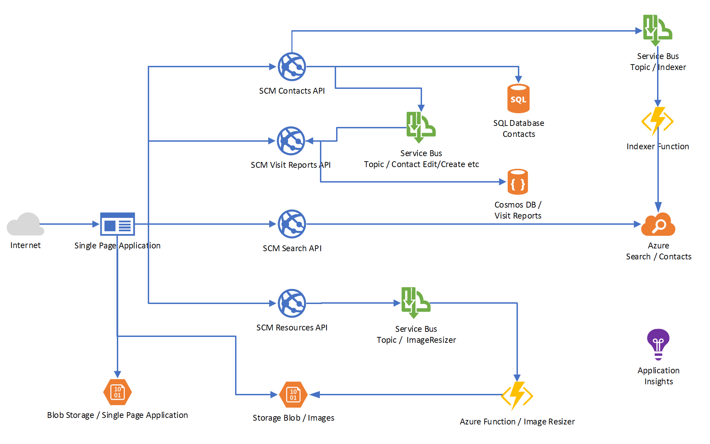
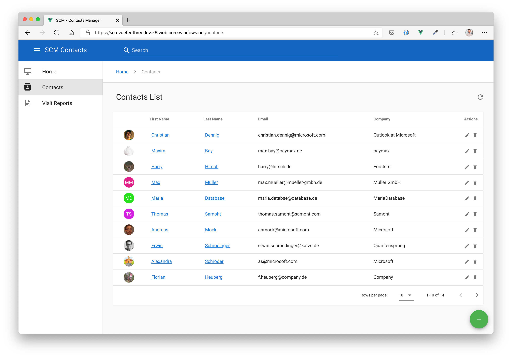
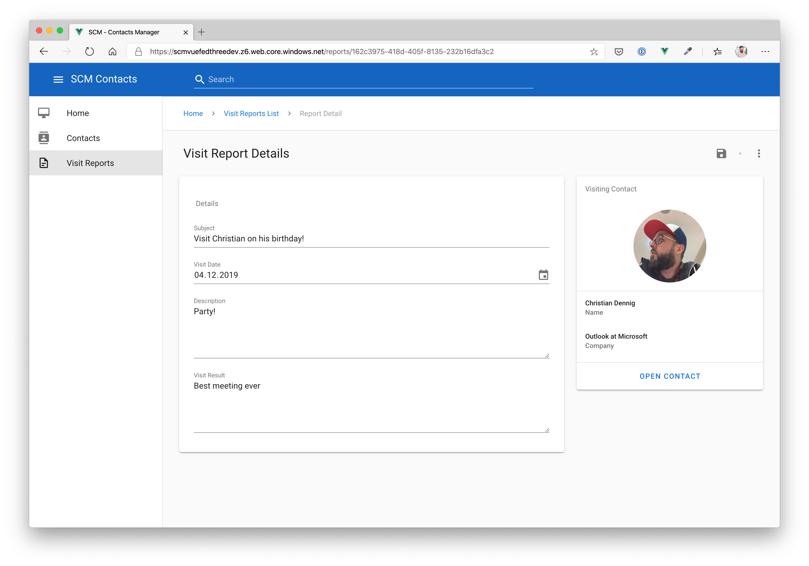
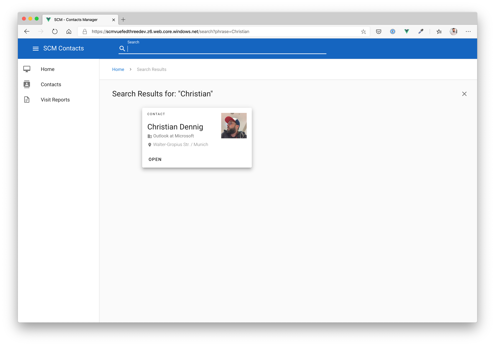
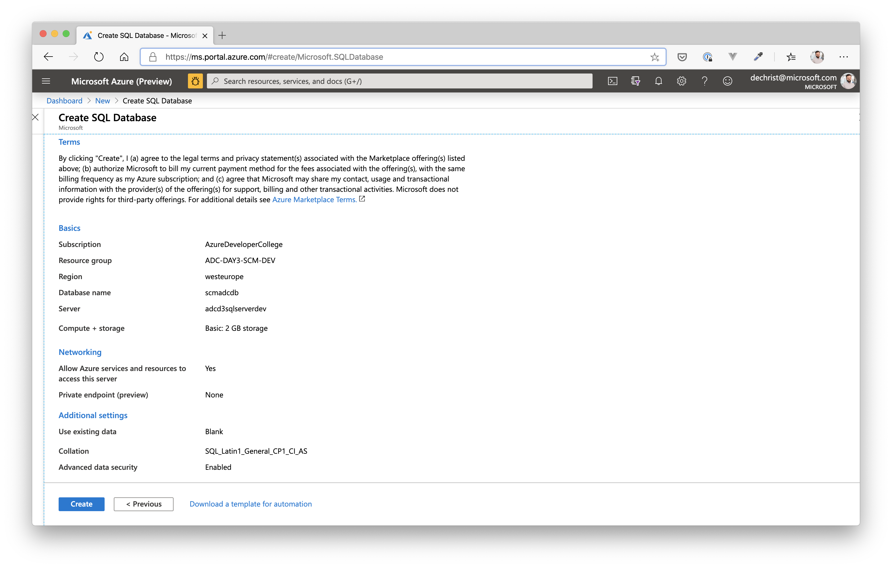
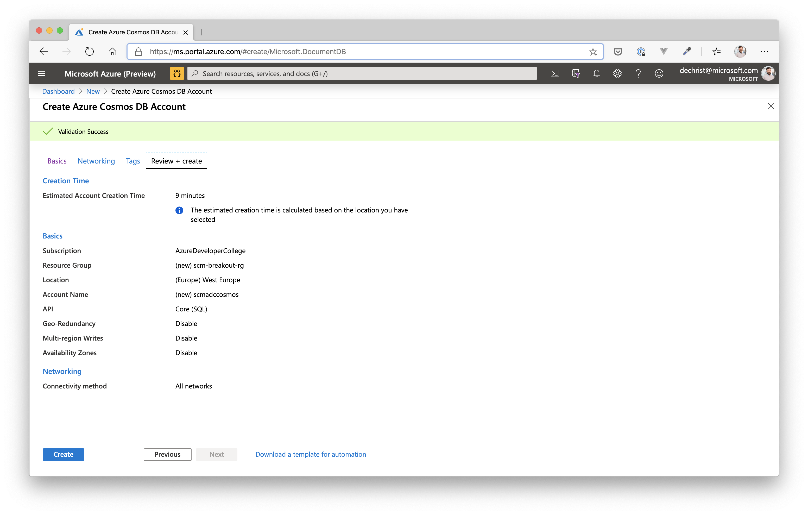
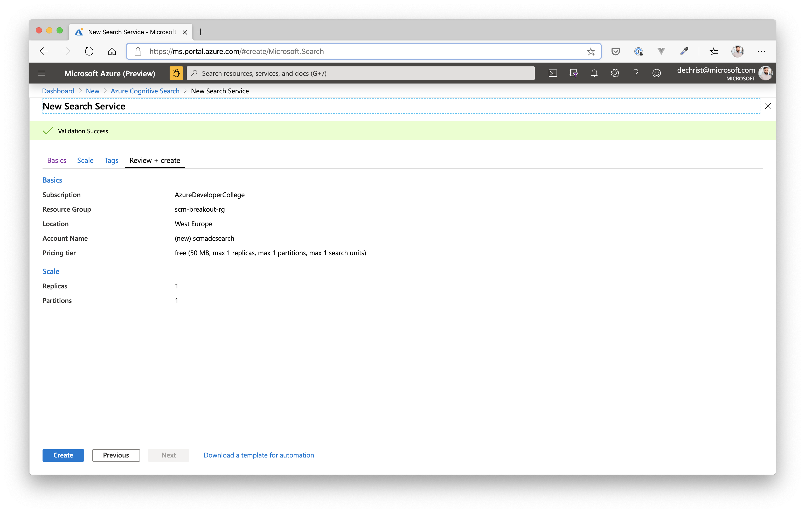
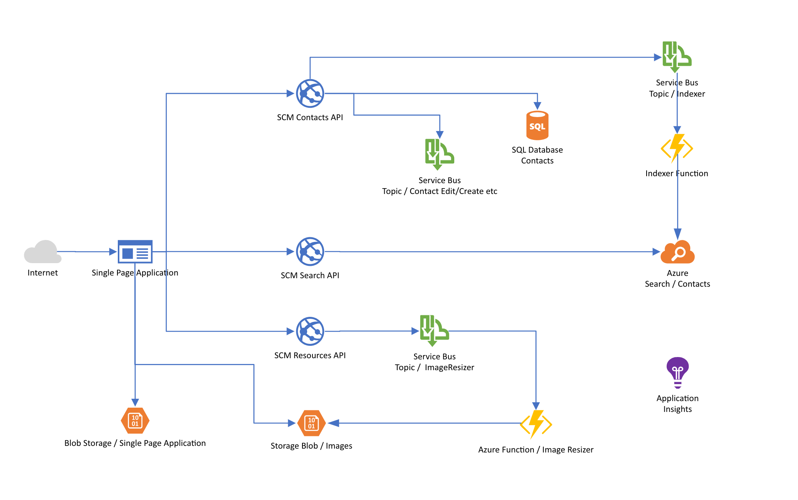

# Break Out #1: Add data storage services to our sample application #

Now that we have made experience with Azure SQL DB, Azure CosmosDB and Azure (Cognitive) Search, it is time to add these services to our sample application. At the end of the day, the architecture will have progressed to this:

As you can see, we will introduce a new microservice (with its own data store - Cosmos DB) called "Visit Reports", that allows us to add visit reports to existing contacts. We will have a *1-to-many* relation between *Contacts* and *Visit Reports*. And, to have the Visit Reports service being able to work on its own, it will also store some data coming from the *Contacts* service. So there will be some kind of duplication of data, which - in a microservice approach - is not an unusual thing.

The services interact via the Azure Service Bus (Producer/Consumer pattern) and exchange data, when events occurs in e.g. the *Contacts* service.

The advantage is, that the services aren't tied together via REST calls and can work and be scaled independently. If we would introduce another service in the future that needs information from a contact, we would simply introduce another consumer for the *Contacts* topic.

In addition, we will also be migrating the the Storage Queue services (for image resizing) to Azure Service Bus Queues so that we only have one messaging component in our architecture.

The Frontend will also change, as we introduce a new service:

## Setup Data Storage Services ##

First of all, we now add an Azure SQL DB, Cosmos DB and an Azure Search service for the application.

### SQL DB ###

Create a new Azure SQL DB either via the Azure Portal or Azure CLI.

Database Properties:

- use your existing resource group: **scm-breakout-rg**
- SKU: Basic
- Location: *West Europe*
- Create a new server in *West Europe*

Leave all other settings as proposed by Azure.

### Cosmos DB / SQL API ###

Create a new Azure Cosmos Account either via the Azure Portal or Azure CLI.

Account Properties:

- use your existing resource group: **scm-breakout-rg**
- Location: *West Europe*
- API: *Core SQL*

Leave all other settings as proposed by Azure.

When the deployment has finished, create a new *Database* and *Container* for the Visis Reports microservice.

Database Properties:

- Database ID: *scmvisitreports*
- Provision Throughput: *true*
- RU/s: *Manual / 400*

Container Properties:

- Database ID: *scmvisitreports*
- Container ID: *visitreports*
- Provision Throughput: *true*
- Partition: */type*

### Azure Search ###

Create a new Azure Search Account either via the Azure Portal or Azure CLI.

Account Properties:

- use your existing resource group: **scm-breakout-rg**
- Location: *West Europe*
- Pricing Tier: *Free* (for development purposes)

Leave all other settings as proposed by Azure.

## Setup Messaging Services ##

Create a new Azure Service Bus either via the Azure Portal or Azure CLI.

Service Bus Properties:

- use your existing resource group: **scm-breakout-rg**
- Pricing Tier: *Standard*
- Location: *West Europe*

Leave all other settings as proposed by Azure.

### Service Bus Queue ###

When the deployment of the new Service Bus has finished, we need to add a Service Bus **Queue**. The queue will replace the Storage Account Queue we used to notify an Azure Function that creates thumbnails of contact images we uploaded.

Service Bus Queue Properties:

- name: *thumbnails*

When successfully added, go to **Shared Access Policies** of the Service Bus Queue and add two policies:

- Name: *thumbnailslisten* (enable checkbox **Listen**)
  - will be used by clients that only need to listen to the Service Bus Queue
- Name: *thumbnailssend* (enable checkbox **Send**)
  - will be used by clients that also need to be able to send messages to the Service Bus Queue

### Service Bus Topic for Contacts ###

We also nee a topic for handling *Contacts* changes (create, update etc.) with corresponding subscriptions. Go back to the Service Bus Namespace in the Portal and add a new topic.

Contacts Topic Properties:

- name: *scmtopic*

Leave all other settings as is and click **Create**. When finished, open the topic and add two subscriptions.

Subscription for Search Service / indexing of contacts:

- name: *scmcontactsearch*

Subscription for Visit Reports Service

- name: *scmcontactvisitreport*

When successfully added, go back to **Shared Access Policies** of the Service Bus Topic **scmtopic** and add two policies:

- Name: *scmtopiclisten* (enable checkbox **Listen**)
  - will be used by clients that only need to listen to the Service Bus Topic
- Name: *scmtopicsend* (enable checkbox **Send**)
  - will be used by clients that also need to be able to send messages to the Service Bus Topic

### Service Bus Topic for Visit Reports ###

We also need a topic for handling *Visit Report* changes (create, update etc.). Go back to the Service Bus Namespace in the Portal and add a new topic.

Visit Reports Topic Properties:

- name: *scmvrtopic*

Leave all other settings as is and click **Create**. 

When successfully added, go back to **Shared Access Policies** of the Service Bus Topic **scmvrtopic** and add two policies:

- Name: *scmvrtopiclisten* (enable checkbox **Listen**)
  - will be used by clients that only need to listen to the Service Bus Topic
- Name: *scmvrtopicsend* (enable checkbox **Send**)
  - will be used by clients that also need to be able to send messages to the Service Bus Topic

We don't add a subscription for the *visit report* topic at the moment. It will be reused later when we integrate further services like Azure Congitive Services.

## Quality Check ##

You should have created the following Azure Services by now:

- Azure SQL DB
- Azure Cosmos DB
- Azure Search
- Azure Service Bus
  - Queue for thumbnail generation
    - Shared Access Policies for *listen* and *send*
  - Topic for Contacts
    - Shared Access Policies for *listen* and *send*
    - subscription for visit reports
    - subscription for search service
  - Topic for Visit Reports
    - Shared Access Policies for *listen* and *send*

If you missed to create of of these services, please go back to the corresponding section.

## Deploy new Contacts/Resources Service and Image Resizer Function ##

Because we refactored the Contacts and Resources APIs to use Azure Service Bus for inter-service communication, we need to deploy new versions of the services and change some of the App Settings we added yesterday.

### Alter App Settings ###

We will reuse the Web Apps for Contacts and Resources as well as the Azure Function for image manipulation we created yesterday. So, first we will adjust the App Configuration for each of the services.

Azure Web App for **Contacts Service**:

Application Settings:
- Name: **EventServiceOptions__ServiceBusConnectionString** / Value: use the Connection String from the Shared Access Policy (**Topic scmtopic**) for sending messages - **scmtopicsend**

Connection Strings:
- Name **DefaultConnectionString** / Value: go to the Azure SQL DB you created and use the ADO.NET connection string (under "**Settings**" / "**Connection strings**")

Azure Web App for **Resources Service**:

Application Settings:
- Name: **ImageStoreOptions__ThumbnailContainer** / Value: *thumbnails*
- Name: **ImageStoreOptions__ImageContainer** / Value: *rawimages*
- Name: **ImageStoreOptions__StorageAccountConnectionString** / Value: use the **Connection String** from your Storage Account created in the Break Out session yesterday (should be the same)
- Name: **ServiceBusQueueOptions__ImageContainer** / Value: *rawimages*
- Name: **ServiceBusQueueOptions__ThumbnailContainer** / Value: *thumbnails*
- Name: **ServiceBusQueueOptions__ThumbnailQueueConnectionString** / Value (send): use the Connection String from the Shared Access Policy (**Queue**) for sending messages - **thumbnailssend**

Azure Function for **Image Manipulation / Resizer Service**:

Configuration / Application Settings:

- Name: **ServiceBusConnectionString** / Value: use the Connection String from the Shared Access Policy (**Queue**) for sending messages - **thumbnailslisten**
- Name: **ImageProcessorOptions__ImageWidth** / Value: *100*
- Name: **ImageProcessorOptions__StorageAccountConnectionString** / Value: use the **Connection String** from your Storage Account created in the Break Out session yesterday (should be the same)

### Redeploy your services for Contacts, Resources and Image Manipulation ###

First of all: as seen in the Break Out session yesterday, everything is pre-created for you...this time in the folder *day3/apps*.

You have deployed web apps and functions several times yesterday, so you should familiar, how to update the forementioned services. 

So please redeploy the Web Apps from folder *day3/apps/dotnetcore/Scm/Adc.Scm.Api* and *day3/apps/dotnetcore/Scm.Resources/Adc.Scm.Resources.Api*. 

Do the same with the Image Manipulation Function in folder *day3/apps/dotnetcore/Scm.Resources/Adc.Scm.Resources.ImageResizer* (**Reminder**: open the functions app source folder as a separate Window when deploying from VS Code!)

### Deploy the Contacts Search Service ###

To be able to run the Contacts Search service (where we leverage the core functionality of Azure Search), we first need an Azure Web App to host it. So, please go to the Portal (or use Azure CLI) and create a basic Azure Web App (with a new Azure AppService Plan) - use SKU / Size **B1**. 

When finished, apply these settings to the Web App Configuration settings:

- Name: **ContactSearchOptions__AdminApiKey** / Value: use the Primary Admin Key from Azure Search (under **Settings / Keys**)
- Name: **ContactSearchOptions__IndexName** / Value: *scmcontacts*
- Name: **ContactSearchOptions__ServiceName** / Value: the nanme of your previously created Azure Search (just the subdomain! So from <https://adcd3search-dev.search.windows.net>, only **adcd3search-dev**)

**Last but not least**, deploy the Contacts Search (folder *day3/apps/dotnetcore/Scm.Search/Adc.Scm.Search.Api*) service from VS Code the the newly created Web App.

## Let's press "Pause" for a moment - What have we done so far? ##

We have just migrated our initial services (Contacts and Resources, Image Manipulation) to Azure Service Bus Queues and Topics. We redeployed new versions of these services to make use of Azure Service Bus. We also added Storage Services to our application. The Contacts Service now uses Azure SQL DB.

In addition, we added an Azure Search service plus an API that is able to talk to Azure Search and query for contacts. The contacts will be added / updated "on-the-fly" whenever a Contact is changed - notification is done via Service Bus Topics.

Regarding our architecture, we are now here:

Now, let's add the Visit Report API. We're on the home stretch :)

## Deploy new Visit Reports Service ##

## Deploy new Frontend ##

# Wrap-Up #

