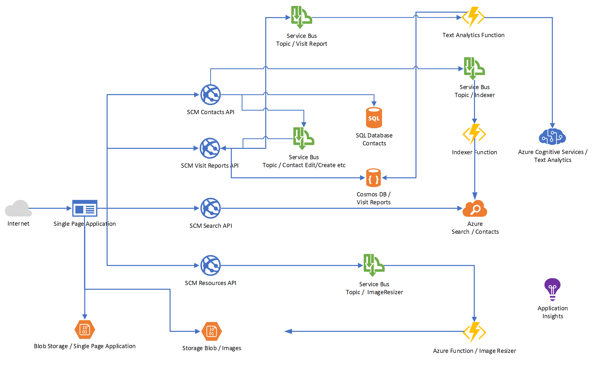

# Break Out #1: Add Congitive Services #

Now it's time to finish our sample application from a services perspective.



## Create a Cognitive Services Account ##


## Create an Azure Function to Analyze Visit Report Results ##

### Deploy the Az Function ###

## Adjust the Frontend ##

Enable stats...

```json
var uisettings = {
    "endpoint": "https://adcday3scmapi-dev.azurewebsites.net/",
    "resourcesEndpoint": "https://adcday3scmresourcesapi-dev.azurewebsites.net/",
    "searchEndpoint": "https://adcday3scmrsearchapi-dev.azurewebsites.net/",
    "reportsEndpoint": "https://adcday3scmvr-dev.azurewebsites.net",
    "enableStats": true,
    "aiKey": ""
}
```

# Wrap-Up #

Congratulations! It was a hard and tough way to get to where you are now standing! You have created a basic, microservice oriented application with multiple backend services (contacts, resources, visit reports, search backend), that work independently, have their own storage, communicate via a Service Bus, can be granularly scaled etc. Ready to run globally!

From a services perspective, we have a full working, modern Cloud application! Hold on for a while a recall, what we have done so far - and celebrate!!

Tomorrow, we will show you how to deploy the application including the Azure infrastructure within minutes! Trust us and be prepared :)
