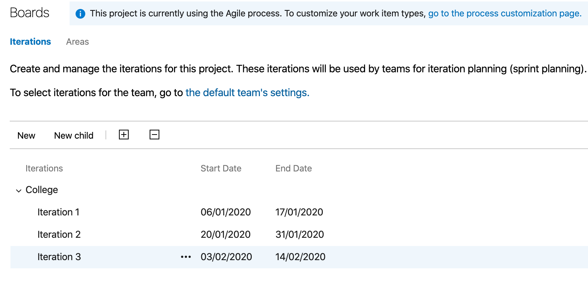
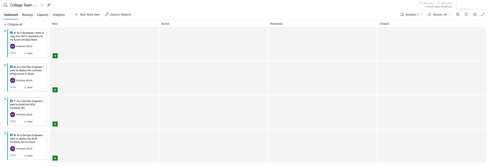

# Challenge-1: Plan your first Project Iteration

## Here is what you will learn
- Configure Iterations for your team
- Plan your work with Azure Boards

In this challenge you will learn how to plan and track your work with Azure Boards. 
In a software development project people with different responsibilities work together. On the one hand side people with a strong business focus and on the other side people with a strong focus on development and operation. Typically the business people are responsible for defining the road map and features that must be shipped within the next release. Developers and operators are responsible to implement the features and to deploy them to the production environment. Hence it makes sense to provide different views of the state of the running project. With Azure Boards the product portfolio team can plan Features for the next release while developers and operators can break down Features into User Stories and implement them within an iteration.

The Agile process provides several work item types—user stories, bugs, features, epics, and tasks.

## Define iteration paths and configure team iterations
Before we start to plan and track our work we need to define iteration paths. To keep it simple we will define three iterations for the next six weeks. Each iteration will run for two weeks.

To get started defining iteration paths take a look at the [documentation](https://docs.microsoft.com/en-gb/azure/devops/organizations/settings/set-iteration-paths-sprints?view=azure-devops)

## Create your first Feature

Now we start to plan our work for the next challenges, but first let us listen to your Product Manager:

*"I've assured our management that the sample application of the Azure Developer College will be available on our company's Azure subscription within the next two weeks. I didn't have a chance to get more time for it because our sales is in hurry to show the customers that we are Cloud Ready."*

### Start with the first Feature
1. Create your first Feature with the title: *"Deploy ADC's sample application to Azure"*.
2. Set the iteration to *"Iteration 1"*
3. Assign a person that is responsible for the Feature, actually this should be your Product Manager

If you need help, take alook at the [documentation](https://docs.microsoft.com/en-gb/azure/devops/boards/backlogs/define-features-epics?view=azure-devops)

### Break the Feature down to UserStories
Create the following UserStories as child items of the Feature, select a person who is responsible for a story and assign all stories to Iteration 1. If you need help, take a look at the [documentation](https://docs.microsoft.com/en-gb/azure/devops/boards/backlogs/define-features-epics?view=azure-devops#add-child-items)

1. Create a UserStory with the title *"S1: As a developer I want to import the ADC's repository to my Azure DevOps Repo and clone the imported repository to my local machine"*
2. Create a UserStory with the title *"S2: As a developer I want to change the title of the ADC's sample application."*
3. Create a UserStory with the title *"S3: As a DevOps Engineer I want to deploy the common infratructure in Azure"*
4. Create a UserStory with the title: *S4: As a DevOps Engineer I want to build the SCM Contacts API*
5. Create a UserStory with the title: *S5: As a DevOps Engineer I want to deploy the SCM Contacts API to Azure*

### Break the UserStories down to Tasks
If you want you can plan your work in more details by breaking down the UserStories to Tasks and assign the Tasks to different membrs of your Team. To do that switch over to the "Sprint" View of Azure Boards and bring up the Taskboard.

If you have setup everything correctly you should see the following:

