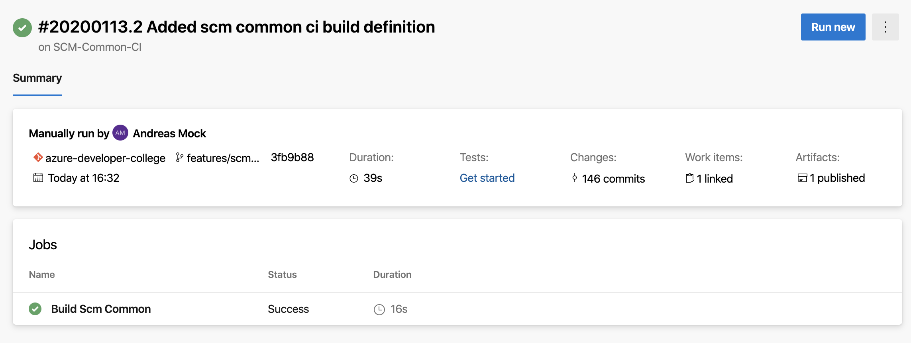

# Work with Azure Pipelines


## Here is what you will learn
- Create a CI build to create and version your deployment artifacts
- Create a CD build to deploy your artifacts to Azure

In this challenge we start to deploy the sample application's common used components to Azure. We create an instance of Azure ServiceBus and an Azure Comsos DB account using an ARM Template. You do not need to create the ARM Template by yourself, it is already available in the repository.

If you have never used Azure Pipelines have a look at the [documentation](https://docs.microsoft.com/azure/devops/pipelines/get-started/what-is-azure-pipelines?view=azure-devops).

Azure Pipelines is a cloud service that you can use to automatically build and test your code project and make it available to other users. It works with just about any language or project type.

Azure Pipelines combines continuous integration (CI) and continuous delivery (CD) to constantly and consistently test and build your code and ship it to any target.

Here is an overview what we want to achieve in this challenge:


## Create your first CI Build

Go to Azure Boards and set the UserStory S3 to active. We create a new build definition that copies the needed ARM template to an artifact location that is managed by Azure DevOps. An artifact location is a storage location where Azure Pipelines copies all files that are needed for a successfull deployment of an application. The artifact location is linked to your build. Every build gets its own unique build number and therefore your artifact is versioned, too.

1. Create a feature branch *"features/scmcommcicd"* and check it out
2. Create a folder "pipelines" under day4/apps
3. Add a file named scm-common-ci.yaml
4. Add the following yaml snippet that defines the build Trigger:
   ```yaml
   pr: none
   trigger:
     branches:
       include:
         - master
     paths:
       include:
         - day4/apps/infrastructure/templates/scm-common.json
         - day4/apps/pipelines/cd-scm-common.yaml

   ```
   Here we specified when the build must be triggered. The build is triggered only if changes were made to the master branch and when the changes were made to either *day4/apps/infrastructure/templates/scm-common.json* or *day4/apps/pipelines/cd-scm-common.yaml*
5. Add the following yaml snippet that defines the build steps:
   ```yaml
   jobs:
     - job: Build
       displayName: Build Scm Common
       pool:
         vmImage: ubuntu-latest
       steps:
         - task: CopyFiles@2
           inputs:
           sourceFolder: day4/apps/infrastructure/templates
           contents: |
            scm-common.json
           targetFolder: $(Build.ArtifactStagingDirectory)
        - task: PublishPipelineArtifact@1
          inputs:
            targetPath: $(Build.ArtifactStagingDirectory)
            artifactName: drop
   ```
   Here we specified to copy the needed ARM Template to our artifact drop location named *"drop"*.
   First we use a copy task to copy the ARM template to the build agent's *"ArtifactStagingDirectory"*. This directory is a temp directory on the build agent. After that we publish the build agents artifacts directory to link the created artifacts to the build.

6. Commit your changes and push the branch to your remote repository.
7. Navigate to your Azure DevOps project
8. In your project navigate to the Pipelines page. Then choose the action to create  new Pipeline
9. Walk through the steps of the wizard by first selecting Azure Repos Git as the location of your source code
10. Select your college repository
11. Select *"Existing Azure Pipelines YAML file"*
12. Select your feature branch and specify the path: *"/day4/apps/pipelines/scm-common-ci.yaml"*
13. Run your CI Build by clicking the action *"Run"*
14. Rename your CI Build to *"SCM-Common-CI"*
15. Navigate to the Pipelines page and open the last run of the build *"SCM-Common-CI"*. You see that the artifact is linked to your build.
    

## Create your first CD Build

Now that we have created the build artifact, we can create a Release build to deploy the common component's Azure infrastructure for the sample application.

1. Navigate to your Azure DevOps project and open the Releases page.
2. Choose the action item to create a new Pipeline and start with an *"Empty job"*.
3. Rename *"Stage1"* to *"Development"*
4. Rename the Release pipeline to *"SCm-Common-CD"*
5. Under Articfacts *"Add an artifact"* and select your *"SCM-Common-CI"* and use always the latest build.
6. Click the *"flash"* icon under artifacts and set the trigger to *"Continuous deployment trigger"*. This will trigger the Release pipeline whenever a new deployment artrifact of the build *"SCM-Common-CI"* is created.
7. Go to the variable section and add the following variables:
   - ResourceGroupName - SCM-DEV-RG
   - ApplicationInsightsName - appinsights-scm-dev
   - ServiceBusnamespaceName - |your prefix|-scm-dev (the namespace name must be globally unique)
   - ServiceBusSKU - Standard
   - CosmosDbAccountName - |your prefix|-scm-dev (the account name must be globally unique)
8. Go to the Tasks section of the *"Development"* stage and add the task *"Azure resource group deployment
"*
    - Select the Azure subscription 
    - Use the variable for the ResourceGroup: $(ResourceGroup)
    - Select a location where you want to deploy the Azure resources
    - Under *Template* select the *"scm-common.json"* ARM template by clicking *"..."*
    - Override parameters: Copy the following line, make sure that you copy the whole line:
      ```
      -applicationInsightsName $(ApplicationInsightsName) -serviceBusNamespaceName $(ServiceBusNamespaceName) -serviceBusSKU $(ServiceBusSku) -cosmosDbAccountName $(CosmosDbAccountName)
      ```
9. Save the definition and run the pipeline by clicking *"Create release"*.