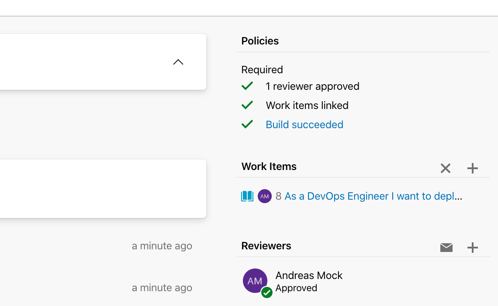
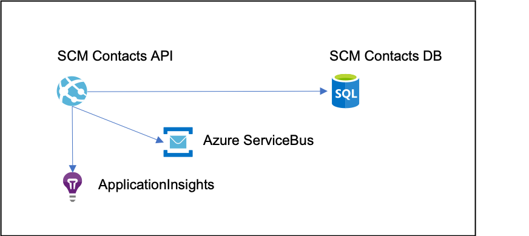

# Challenge-4: Work with Azure Pipelines


## Here is what you will learn

- Create a CI build to create SCM Contacts API's deployment artifacts 
- Create a *PullRequest* validation build, that is triggered to validate a *PullRequest*
- Create a CD Build to deploy SCM Contacts API to the stages *Development* and *Testing*


## Create the CI Build
Go to Azure Boards and set the UserStory S4 and S5 to active. We create a new build definition with the steps as follows:
- Build the SCM Contacts API
- Copy the ARM Template to the artifact location
- Publish the artifacts


1. Create a feature branch *"features/scmcontactscicd"* and check it out
2. Add a file named *scm-contacts-ci.yaml* under *day4/apps/pipelines*
3. Add the following yaml snippet that defines the build Trigger:
   ```yaml
   pr: none
   trigger:
     branches:
       include:
         - master
     paths:
       include:
         - day4/apps/infrastructure/templates/scm-api-dotnetcore.json
         - day4/apps/dotnetcore/Scm/*

   ```
   Here we specified when the build must be triggered. The build is triggered only if changes were made to the master branch and when the changes were made to either *day4/apps/infrastructure/templates/scm-api-dotnetcore.json* or to any files under directory *day4/apps/dotnetcore/Scm/**

4. Add the following yaml snippet to define the needed build steps:
   ```yaml
   steps:
     - task: DotNetCoreCLI@2
      displayName: Restore
      inputs:
        command: restore
        projects: "day4/apps/dotnetcore/Scm/**/*.csproj"
    - task: DotNetCoreCLI@2
      displayName: Build
      inputs:
        projects: "day4/apps/dotnetcore/Scm/**/*.csproj"
        arguments: --configuration Release
    - task: DotNetCoreCLI@2
      displayName: Publish
      inputs:
        command: publish
        publishWebProjects: false
        projects: day4/apps/dotnetcore/Scm/Adc.Scm.Api/Adc.Scm.Api.csproj
        arguments: --configuration Release --output $(build.artifactstagingdirectory)
        zipAfterPublish: True
    - task: CopyFiles@2
      inputs:
        sourceFolder: day4/apps/infrastructure/templates
        contents: |
          scm-api-dotnetcore.json
        targetFolder: $(Build.ArtifactStagingDirectory)
    - task: PublishPipelineArtifact@1
      inputs:
        targetPath: $(Build.ArtifactStagingDirectory)
        artifactName: drop
   ```
5. Commit your changes and push the branch to your remote repository.
6. Navigate to your Azure DevOps project
7. In your project navigate to the Pipelines page. Then choose the action to create a new Pipeline
8. Walk through the steps of the wizard by first selecting Azure Repos Git as the location of your source code
9. Select your college repository
10. Select *"Existing Azure Pipelines YAML file"*
11. Select your feature branch and specify the path: *"/day4/apps/pipelines/scm-contacts-ci.yaml"*
12. Run your CI Build by clicking the action *"Run"*
13. Rename your CI Build to *"SCM-Contacts-CI"*
14. Navigate to the Pipelines page and open the last run of the build *"SCM-Contacts-CI"*. You see that the artifact is linked to your build.

## Create the PullRequest validation Build

In [challenge-2](./challenge-2.md) we configured the master branch's policies to require a *PullRequest* before changes are merged into the master. 
With Azure Pipelines you can define a build that is executed whenever a PullRequest is created in order to validate a merge into the master branch.

1. Add a file named scm-contacts-pr.yaml under *day4/apps/pipelines*
2. Add the following yaml snippet:
   ```yaml
    steps:
      - task: DotNetCoreCLI@2
        displayName: Restore
        inputs:
          command: restore
          projects: "day4/apps/dotnetcore/Scm/**/*.csproj"
      - task: DotNetCoreCLI@2
        displayName: Build
        inputs:
          projects: "day4/apps/dotnetcore/Scm/**/*.csproj"
          arguments: --configuration Release
      - task: DotNetCoreCLI@2
        displayName: Publish
        inputs:
          command: publish
          publishWebProjects: false
          projects: day4/apps/dotnetcore/Scm/Adc.Scm.Api/Adc.Scm.Api.csproj
          arguments: --configuration Release --output $(build.artifactstagingdirectory)
          zipAfterPublish: True
   ```   
3. Commit your changes and push the branch to your remote repository.
4. Navigate to your Azure DevOps project
5. In your project navigate to the Pipelines page. Then choose the action to create a new Pipeline
6. Walk through the steps of the wizard by first selecting Azure Repos Git as the location of your source code
7. Select your college repository
8. Select *"Existing Azure Pipelines YAML file"*
9. Select your feature branch and specify the path: *"/day4/apps/pipelines/scm-contacts-pr.yaml"*
10. Run your PR Build by clicking the action *"Run"*
11. Rename your PR Build to *"SCM-Contacts-PR"*

## Create the CD Build

Now we have created the deployment artifacts with the build *SCM-Contacts-CI*. It is time to create a Release build to deploy the SCM Contacts API to Azure. As in [challenge-3](./challenge-3.md) we deploy the artifacts to the stages *Development* and *Testing* and we create a manual *Pre-deployment condition* to approve the deployment to the *Testing* stage.

1. Create a new release build and name it *SCM-Contacts-CD*
2. Add the SCM-Contacts-CI build's artifacts
3. Create a *Development* stage
4. Add the the following variables and replace __'praefix'__ with your own value:
   
   | Variable | Value | Scope |
   |----------|-------|-------|
   |ResourceGroupName | ADC-DAY4-SCM-DEV | Development |
   |Location| westeurope|Development|
   |ApiAppName|__'praefix'__-day4scmapi-dev|Development|
   |AppServicePlanSKU|B1|Development|
   |Use32BitWorker|false|Development|
   |AlwaysOn|true|Development|
   |ApplicationInsightsName|your ApplicationInsights instance name of stage Development|Development|
   |SqlServerName|__'praefix'__-day4sqlsrv-dev|Development|
   |SqlDatabaseName|scmcontactsdb|Development|
   |SqlAdminUserName|*your Sql Admin's username*|Development|
   |SqlAdminPassword|*your password*|Development|
   |ServiceBusNamespaceName|your ServiceBus namespace name of stage Development|Development|
5. Go to the Tasks section of the *"Development"* stage and add the task *"Azure resource group deployment"*
6. Select your Azure Subscription
7. Set the name of the ResourceGroup, use the variable $(ResourceGroupName)
8. Set the Location, use the variable $(Location)
9.  Select the template from your drop location
10. Override the template parameters as follow:
    ```shell
    -sku $(AppServicePlanSKU) -webAppName $(ApiAppName) -use32bitworker $(Use32BitWorker) -alwaysOn $(AlwaysOn) -applicationInsightsName $(ApplicationInsightsName) -sqlServerName $(SqlServerName) -sqlUserName $(SqlAdminUserName) -sqlPassword $(SqlAdminPassword) -sqlDatabaseName $(SqlDatabaseName) -serviceBusNamespaceName $(ServiceBusNamespaceName)
    ```
    Make sure that you cope the whole line.
11. Add *Azure App Service deploy* task
12. Select your Azure Subscription
13. Choose *API App* as AppService type
14. Add your dotnet core deployment zip file from your artifact location
15. Save the release definition and create a release to check if everything works

### Create the *Testing* stage.

1. Edit the Release definition and go to the task view
2. Clone the *Development* stage and rename the cloned stage to *Testing*
3. Open the Release definition's variable view and add new variables as follow:
   
   | Variable | Value | Scope |
   |----------|-------|-------|
   |ResourceGroupName | ADC-DAY4-SCM-TEST | Testing |
   |Location| westeurope|Testing|
   |ApiAppName|__'praefix'__-day4scmapi-test|Testing|
   |AppServicePlanSKU|B1|Testing|
   |Use32BitWorker|false|Testing|
   |AlwaysOn|true|Testing|
   |ApplicationInsightsName|your ApplicationInsights instance name of stage Testing|Testing|
   |SqlServerName|__'praefix'__-day4sqlsrv-test|Testing|
   |SqlDatabaseName|scmcontactsdb|Testing|
   |SqlAdminUserName|*your Sql Admin's username*|Testing|
   |SqlAdminPassword|*your password*|Testing|
   |ServiceBusNamespaceName|your ServiceBus namespace name of stage Testing|Testing|
4. Save the definition and create a release

## Create a PullRequest

Create a PullRequest and merge all changes into the master branch. Don't forget to link the UserStories S4 and S5.

## Trigger the PR-Build to validate a PullRequest

Now we have to enable the PR-Build to be triggered whenever a PullRequest is created and when files are changed that belongs to the SCM Contacts API.

1. Open the branch policies of the master branch
2. Add a build policy and select your SCM-Contacts-PR build
3. Set the path filter as follow:
   ```Shell
   /day4/apps/infrastructure/templates/scm-api-dotnetcore.json;/day4/apps/dotnetcore/Scm/*
   ```
   With this filter the PR build is only triggered when files were changed that belongs to the SCM Contacts API
4. Save your changes

## See the Build flow in action

Now it's time to see the whole build flow in action. 

1. Checkout the master branch and pull the latest changes
2. Create and checkout a new feature branch *features/scmcontactsflow*
3. Open the file [day4/apps/dotnetcore/scm/Adc.Scm.Api/Startup.cs](../apps/dotnetcore/Scm/Adc.Scm.Api/Startup.cs) and change the name of the API in the Swagger configurations:
   ```C#
   // here
   c.SwaggerDoc("v1", new OpenApiInfo { Title = "ADC Contacts API", Version = "v1" });
   // and here
   c.SwaggerEndpoint("/swagger/v1/swagger.json", "ADC Contacts API v1");
   ```
4. Commit your changes and push the feature branch to your remote repository
5. Create a *PullRequest* to merge the changes into the master branch. Don't forget to link the UserStory S5.
   You will see that the PR-Build is part of the required policies of your PullRequest.
   
6. Complete your PullRequest
7. Navigate to the Pipelines view and you will notice that the SCM-Contacts-CI build is triggered
   
   Wait until the build is finished and the deployment artifacts are available
9. Navigate to the Release view and you will see that the CD Pipeline is triggered and starts to deploy the artifacts to the Development stage.

## Wrap up

__Congratulation__ you have completed the UserStories S4 and S5. Go to Azure Boards and set the stories to completed.
Now you have seen how you can create a PullRequest validation build that protects your master branch from build breaks. After changes are merged into the master branch, the CI build is triggered and it creates the deployment artifacts. The deployment artifacts are then deployed to your stages. After this challenge we have the following architecture deployed to Azure:



Now navigate to the Azure portal, open the SCM Contacts API's API App in the ResourceGroup ADC-DAY4-SCM-TEST and browse to the Swagger UI.
If you want you can test the API.