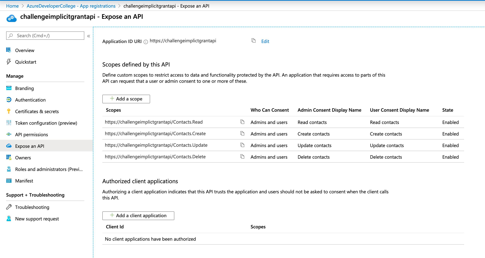

# OAuth 2 Implicit Flow

## Here is what you'll learn

- How to register an Azure AD application and allow the OAuth2 Implicit Grant Flow
- How to register an Azure AD application and expose an API with OAuth2 permissions
- How to authenticate an user and start an OAuth2 implicit flow to acquire an access token for the API

*Important Note:*
The Implicit Grant Flow is less secure than the Code Grant Flow. This is because the generation of the `access_token` for accessing the user's data on a resource server (e.g., the Graph API), is completely happening on the front channel. However, as the flow completely happens in the browser, it is suited for applications that do not have a server backend (e.g., 100% JS-based SPA). 

## Create an Azure AD application and enable Implicit Grant Flow

Before you can authenticate an user and acquire an access token for the API you have to register an application in your Azure AD tenant. 
By default the Implicit Grant Flow for issuing access tokens is disabled.

### Azure CLI

Firstly, create a new Azure AD Application, this time with `oauth2-allow-implicit-flow` enabled:

```shell
az ad app create --display-name challengeimplicitgrant --reply-urls http://localhost:5001/api/tokenechofragment --identifier-uris https://challengeimplicitgrantflow --oauth2-allow-implicit-flow true
```

As before, note down the `appId`. Next, retrieve and note the ID of your current Azure AD tenant via:

```shell
az account show 
```

## Create an Azure AD application and expose an API with OAuth2 permissions

In this sample we create an API that exposes four OAuth2 permissions:
1. Contacts.Read
2. Contacts.Create
3. Contacts.Update
4. Contacts.Delete

### Azure CLI

Firstly, create a new Azure AD application and write the output to a variable:
```Shell
API_APP=$(az ad app create --display-name challengeimplicitgrantapi --identifier-uris https://challengeimplicitgrantapi)
``` 

After that we have created an Azure AD application that contains one default OAuth2 permission which was created by Azure AD.
To make your own OAuth2 permission, the default permission must be disabled first:
```shell
# get the app id
API_APP_ID=$(echo $API_APP | jq -r '.appId')
# disable default exposed scope
DEFAULT_SCOPE=$(az ad app show --id $API_APP_ID | jq '.oauth2Permissions[0].isEnabled = false' | jq -r '.oauth2Permissions')
az ad app update --id $API_APP_ID --set oauth2Permissions="$DEFAULT_SCOPE"
```
Now your own OAuth2 permissions can be added:
```shell
# set needed scopes from file 'oath2-permissions'
az ad app update --id $API_APP_ID --set oauth2Permissions=@oauth2-permissions.json
```
To keep it simple, the needed OAuth2 permissions are defined in a [.json](oauth2-permissions.json) file.

In Azure AD an Application is something like a template with all necessary settings like ReplyUrl, required permissions, OAuth2 Permissions etc.
When a user logs in for the first time and grants consent, an instance of the application is created. The instance is called a __Service Principal__.
All created Service principals can be found in your Azure AD under __Enterprise Applications__.
As no user ever logs on to an API we must create the __Service Principal__ for the API.

```shell
az ad sp create --id $API_APP_ID
```

Go to your Azure AD and have a look at the registered application. The permissions look as follow:


## Run the Token Echo Server

Open another shell and run the `Token Echo Server` from [`apps/token-echo-server`](apps/token-echo-server) in this repository. This helper ASP.NET Core tool is used to echo the token issued by your AAD. The tool is listening on port 5001 on your local machine. Tokens are accepted on the route `http://localhost:5001/api/tokenechofragment`. That's the reason why we initially registered an AAD application with a reply url pointing to `http://localhost:5001/api/tokenechofragment`.

Run the application via:

```
dotnet run
```

## Create the request to directly acquire an `access_token` for the Microsoft Graph API

We can directly request an `access_token` by specifying `token` in the `response_type` field. Adding `token` will allow our app to receive an `access_token` immediately from the authorize endpoint without having to make a second request to the token endpoint. If you use the token in `response_type`, the scope parameter must contain a scope indicating which resource to issue the token for.

Replace `TENANT_ID` with your AAD Tenant Id and `APPLICATION_ID` with your Application Id (this is the id that you received when you created the first application). Open a browser and paste the request:

```HTTP
https://login.microsoftonline.com/TENANT_ID/oauth2/v2.0/authorize?
client_id=APPLICATION_ID
&response_type=id_token+token
&redirect_uri=http%3A%2F%2Flocalhost%3A5001%2Fapi%2Ftokenechofragment
&response_mode=fragment
&scope=openid%20profile%20https%3A%2F%2Fchallengeimplicitgrantapi%2FContacts.Read%20https%3A%2F%2Fchallengeimplicitgrantapi%2FContacts.Create%20https%3A%2F%2Fchallengeimplicitgrantapi%2FContacts.Update%20https%3A%2F%2Fchallengeimplicitgrantapi%2FContacts.Delete
&nonce=1234
```

After executing the request and you have signed in, Azure AD shows you a consent page and you have to grant access for the requested API permissions.
After giving consent, have a look at your browser's address bar. The `access_token` is in the fragment of the url and should look something like this:

```
http://localhost:5001/api/tokenechofragment#access_token=eyJ0eX...&token_type=Bearer&expires_in=3599&scope=openid+profile+User.Read+email&id_token=eyJ0eXAiOi...&session_state=0f76c823-eac5-4ec0-9d4a-edf40b783583
```

Make sure to only copy the `access_token`, not the full remainder of the string!

Go to [https://jwt.ms](http://jwt.ms), paste the token and have a look at the decoded token.

More details on how the OAuth2 Implicit Grant Flow request can be used is documented [here](https://docs.microsoft.com/en-us/azure/active-directory/develop/v2-oauth2-implicit-grant-flow#send-the-sign-in-request).

## Cleanup resources

### Azure CLI

```shell
az ad app delete --id <applicationid>
```

## Summary

This challenge showed how to create a new application in AAD and use the OAuth 2.0 Implicit Grant Flow to request an access token for accessing the Graph API. The full process is described [here](https://docs.microsoft.com/en-us/azure/active-directory/develop/v2-oauth2-implicit-grant-flow).